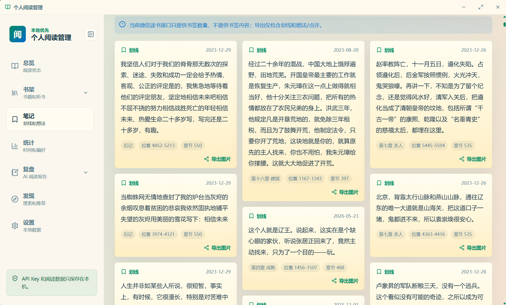
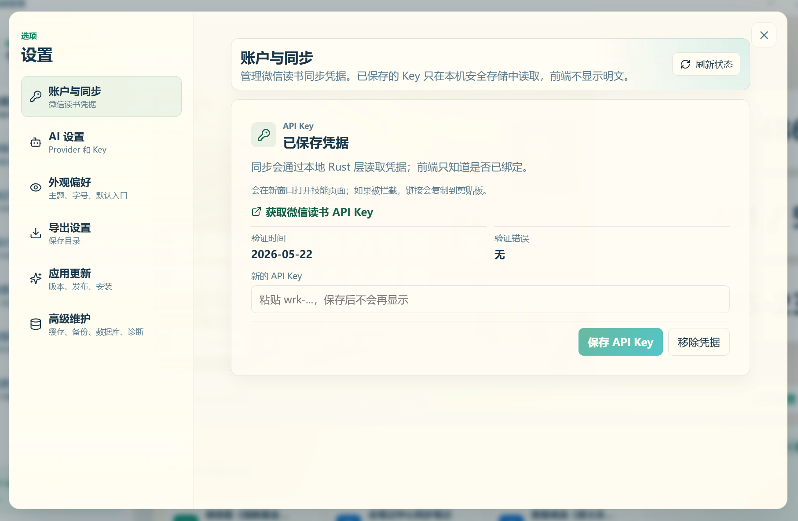

# 微信读书个人阅读管理


把微信读书里的阅读记录，沉淀成你的知识资产。

这是一个本地优先的阅读工作台，统一整理书架、笔记、阅读统计与 AI 复盘，帮助你更清楚地知道接下来读什么、复盘什么、输出什么。

如果你想把微信读书从一个“阅读工具”升级成一个“可整理、可复盘、可导出、可长期积累”的个人阅读资产系统，这就是它。

[](https://github.com/RHZHZ/wereadmaster/releases)
[](https://github.com/RHZHZ/wereadmaster/releases)

## 立即使用

- [查看最新发布](https://github.com/RHZHZ/wereadmaster/releases)
- [查看一键更新说明](docs/github-release-updates.md)
- 当前版本：`v1.0.5`

## 这是什么

WeReadMaster 不是"又一个微信读书工具"——官方 Skills 让 AI 能查你的阅读数据了，但数据是瞬态的、对话式的；这个桌面端把它变成你本地永久持有的结构化资产。

它更像你的私人阅读操作系统：

- 把书架、笔记、统计和复盘收进一个稳定的本地入口。
- 把阅读记录整理成可复盘、可导出、可继续使用的内容。
- 把“下一步读什么、复盘什么、整理什么”讲清楚，而不是只展示更多信息。

## How It Works（官方通道 · 本地优先）

wereadmaster 通过 **微信读书官方 Skills HTTP 接口** 读取你的数据：

```
POST https://i.weread.qq.com/api/agent/gateway
Authorization: Bearer $WEREAD_API_KEY
{ "api_name": "/shelf/sync", "skill_version": "1.0.3" }
```

- 🔑 **API Key 由用户在官方页面扫码获取**（weread.qq.com/r/weread-skills），Key 绑用户身份，不存在账号密码/ cookie 抓取
- 🏠 **所有数据落本地**（本地缓存 + 可选导出目录），即使离线也能浏览已同步的书架/笔记
- 🤖 AI 调用走 **用户自备 Key**（OpenAI 兼容 / 本地模型），本工具不做中转、不收集

> ⚠️ 本工具仅帮助你管理**自己账号**的微信读书数据。不破解、不爬他人数据、不绕过付费内容。

## 你能得到什么

- 把阅读记录沉淀成长期可用的个人阅读资产。
- 把分散的划线、想法、统计和复盘收拢到一套工作流里。
- 把阅读直接连接到 Markdown 导出、写作整理和知识沉淀流程。

## 适合谁

- 想把微信读书当成长期知识库的人。
- 需要整理笔记、统计和复盘的人。
- 希望有一个更稳定、更私密桌面入口的人。

## 为什么值得装

- **本地优先，边界清晰**：缓存、凭据、AI 输出和本地状态尽量留在本机，不做默认上传一切。
- **AI 不做闲聊，只做阅读辅助**：围绕单本复盘、阅读指南、跨书路线和选书决策，直接服务阅读管理。
- **从阅读到输出，闭环完整**：书架、笔记、统计、复盘、行动项和 Markdown 导出连成一条线。
- **长期可用**：支持批量导出、备份恢复和 GitHub Releases 一键更新，更适合持续积累。

## 核心能力

- **统一管理阅读资产**：总览、书架、详情、笔记和统计集中管理，减少跨入口切换。
- **本地图书与微信书架隔离**：支持导入 EPUB、TXT 和 Markdown 本地图书，使用独立的本地书架、阅读进度、划线、想法和 AI 提问记录，不默认合并微信读书同名书数据。
- **本地阅读器**：正文阅读区支持目录、字号、行距、主题、导出和更多工具面板；Markdown 图书支持标题、引用、列表、分隔线和代码块基础渲染；选中文本后可手动划线、写想法或向 AI 提问。
- **把统计变成历史入口**：统计页和阅读报告页支持 `总计 → 年度 → 月度` 下钻，也支持前后切换历史周期，不必停留在“本月/今年”的单点展示。
- **把笔记整理成复盘**：围绕单本书生成结构化复盘，提炼关键观点、行动项、复盘问题和代表性摘录。
- **AI Provider 兼容配置**：设置页支持 OpenAI、DeepSeek、通义千问、Kimi 和自定义 Provider 预设；可测试连通性、测试结构化输出兼容性，也可刷新可用模型并保留手动输入兜底。
- **知道下一步该做什么**：通过阅读指南、跨书路线和选书决策，帮助判断下一本读什么、这本怎么推进、何时值得复盘。
- **把成果带走**：支持 Markdown 导出、批量导出、索引和报告生成，让阅读成果继续进入写作或知识库流程。

## AI 阅读资产

应用把 AI 能力收束成三类可持续保存的阅读资产，不做通用聊天，也不会在后台自动上传内容。

| 能力 | 解决什么问题 | 怎么用 | 如何持续记录 |
| --- | --- | --- | --- |
| AI 复盘 | 把一本书的划线和想法整理成主题、关键观点、行动项和复盘问题。 | 在书籍详情或复盘中心选择书籍，点击“生成复盘”。没有本地缓存时，只有这一步会读取并发送当前书笔记。 | 复盘结果保存在本地缓存；行动项和复盘问题可以持续标记状态，后续还能导出 Markdown。 |
| 阅读指南 | 回答“这本书接下来怎么读、怎么整理、怎么复盘”。 | 在书籍详情点击“本书阅读指南”，默认只基于当前书、本地进度、已有复盘和统计信号生成。 | 指南会按书归档到“复盘 > 阅读指南”，适合在阅读推进、笔记增加或读完后刷新。 |
| 跨书指南 | 回答“围绕当前主题，下一步读哪些书、按什么顺序读”。 | 先把候选书加入候选书架，再在阅读指南里勾选候选书生成跨书路线图。 | 跨书路线会和当前书关联保存，后续可回到阅读指南库查看路线、复盘节点和下一步动作。 |

持续记录的推荐节奏：

1. 同步书架和笔记后，先在书籍详情确认当前书状态。
2. 阅读中期生成或刷新“本书阅读指南”，明确下一段阅读范围和复盘输出。
3. 读完或笔记足够多时生成“AI 复盘”，把行动项和复盘问题留在本地跟踪。
4. 想延展同一主题时，把候选书加入路线，生成“跨书指南”安排下一本。
5. 定期在“复盘 > 阅读指南”和“复盘 > 书籍复盘”查看已沉淀资产，必要时导出 Markdown。

## 核心流程

1. 同步书架、笔记和统计，建立本地阅读资产底座。
2. 在总览、书架和笔记页判断当前应该继续读什么、整理什么。
3. 对关键书籍生成 AI 复盘或阅读指南，把信息收束成结构化结论。
4. 需要延展主题时，用候选书和跨书路线规划下一步阅读顺序。
5. 通过 Markdown 导出、批量导出和报告，把成果带到你的长期知识系统里。

## 页面预览

| 总览 | 书架 | 笔记 | 设置 |
| --- | --- | --- | --- |
|  |  |  |  |

## 快速开始

当前正式发布面向 Windows x64。

1. 从 [GitHub Releases](https://github.com/RHZHZ/wereadmaster/releases) 下载 Windows 安装包。
2. 安装并启动应用。
3. 在设置页完成凭据和更新配置。
4. 如需 AI 复盘或本地阅读器 AI 提问，在“AI 设置”中选择 Provider 预设、填写 Key，并测试连通性与兼容性。
5. 开始同步、导入本地图书、查看和整理你的阅读数据。

## 产品特点

- 本地优先保存缓存、阅读状态和 AI 输出。
- AI 调用全部由用户手动触发，不做后台自动生成。
- AI Provider 配置支持常用预设、兼容模式、模型刷新和手动输入兜底。
- 本地阅读器支持 EPUB、TXT、Markdown 阅读，支持选区划线、想法、AI 提问和 Markdown 导出。
- 支持 Markdown 导出、批量导出、导出报告和索引。
- 支持候选书管理、阅读指南、跨书路线和选书决策。
- 支持备份、恢复、数据目录迁移和应用内更新。

## 本地开发

```powershell
npm run dev
npm test
npm run build
npm run e2e
```

Rust 侧：

```powershell
cargo fmt --check
cargo test --lib
cargo check
```

## 一键更新

正式版本通过 GitHub Releases 分发。应用内“检查并更新”会读取 `latest.json`，验证签名后下载安装包。

发布说明见 [docs/github-release-updates.md](docs/github-release-updates.md)。

## 安全边界

- 前端不直接请求微信读书 API。
- 凭据不进入前端日志和 Markdown 导出。
- 更新包使用签名校验。
- 本工具仅帮助用户**导出/整理自己合法获取的微信读书数据**，不做任何爬取他人数据、破解付费内容、批量盗号类行为。
- AI 功能依赖用户**自备 API Key**，Key 仅用于本地请求，项目不收集、不上传、不托管。
- AI Provider 的模型列表只在用户手动点击刷新时请求；刷新失败不影响手动输入模型名。
- 本地图书与微信读书书架是两个来源版本，划线、想法、AI 提问和阅读进度默认隔离保存。
- 如因平台规则变化导致接口不可用，本项目以“本地已有缓存/已导出 Markdown”作为底线保障（Local-first）。
