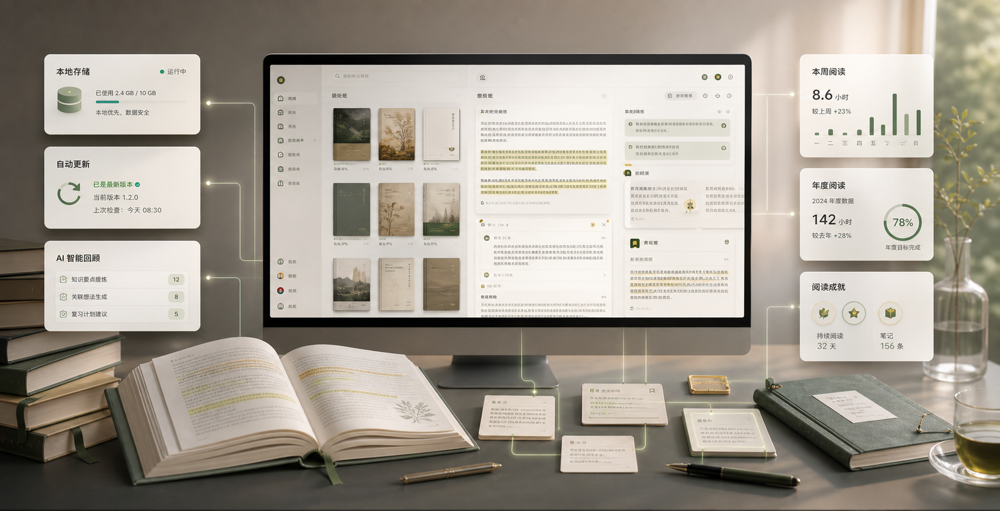
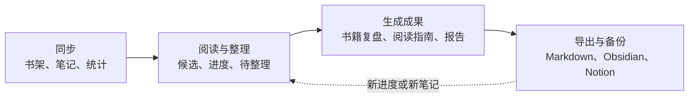
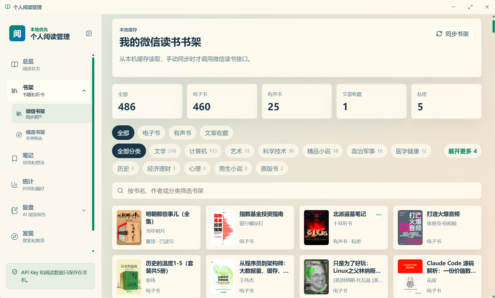
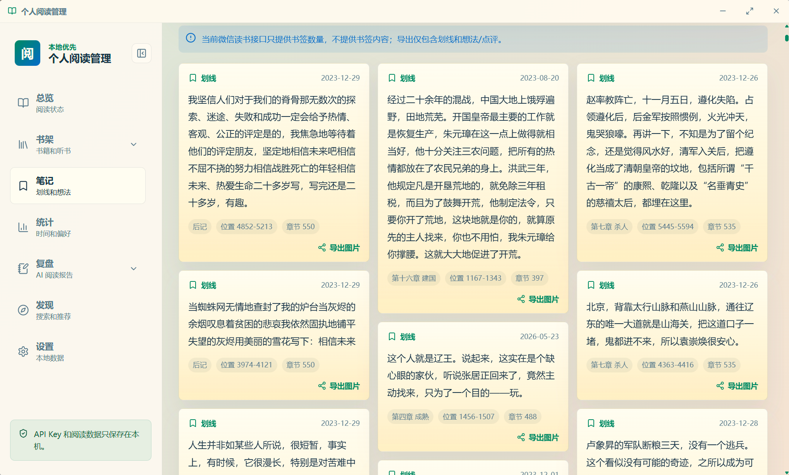
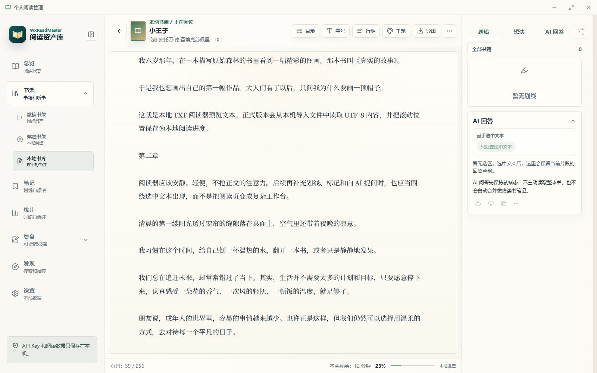

# 微信读书个人阅读管理



> 把微信读书里的阅读记录，整理成可以继续阅读、复盘和导出的本地成果。

这是一个本地优先的阅读工作台：同步微信读书书架、笔记和统计，管理候选书与本地图书，生成书籍复盘、阅读指南和阅读报告，并将成果带到 Markdown、Obsidian 或 Notion。

[](https://github.com/RHZHZ/wereadmaster/releases)
[](https://github.com/RHZHZ/wereadmaster/releases)

## 这是什么

微信读书负责阅读和同步，本项目负责把阅读过程中产生的书架、笔记、进度、统计和 AI 成果收进一个本地工作区。你可以从微信读书数据开始，也可以导入 EPUB、TXT 或 Markdown，在本地阅读器中继续阅读和记录。

它不是账号抓取工具，也不是双向知识库同步服务。它只处理你主动配置并合法获取的数据，并把本地缓存、生成成果和导出结果的边界说清楚。

## 适合谁

- 想长期整理微信读书书架、笔记和统计的人。
- 想把划线和想法整理成书籍复盘、阅读指南或阅读报告的人。
- 想在本地阅读 EPUB、TXT 或 Markdown，并保留独立阅读记录的人。
- 想把阅读成果导出到 Markdown、Obsidian 或 Notion 的人。

## 核心工作流


```mermaid
flowchart LR
  A[同步<br/>书架、笔记、统计] --> B[阅读与整理<br/>候选、进度、待整理]
  B --> C[生成成果<br/>书籍复盘、阅读指南、报告]
  C --> D[导出与备份<br/>Markdown、Obsidian、Notion]
  D -. 新进度或新笔记 .-> B
```

你不需要一次配置所有能力。可以先同步和阅读，之后再配置 AI、Notion 或导出目录。

## 你可以完成什么

### 管理三类阅读来源

- **微信书架**：同步自己账号中的书架、笔记和统计到本机。
- **候选书架**：从发现页或 AI 阅读助手保存想继续了解的书，只保存在本机，不写回微信读书。
- **本地书库**：导入 EPUB、TXT 和 Markdown，与微信书架分开保存阅读进度、划线、想法和本地 AI 提问记录。

### 把阅读过程变成成果

- **书籍复盘**：把单本书的划线和想法整理成主题、关键观点、行动项、代表性摘录和复盘问题。
- **快照式全量笔记归纳**：显式确认后，为当前书创建固定笔记快照并分批归纳；可查看进度、继续中断任务和重试失败批次。
- **阅读指南**：围绕当前书生成下一步阅读和整理建议。
- **阅读路线**：基于当前书和候选书，规划多本书的阅读顺序与关系。
- **阅读报告**：按周度、月度、年度或总计周期查看阅读趋势，并生成报告图片。
- **AI 阅读助手**：在受控的全局、当前书、笔记、统计、候选书或本地选区上下文中主动提问，也可搜索当前书的本地笔记。

### 把成果带走

单项成果支持独立选择 Markdown、Obsidian、Notion 目标；笔记和书籍复盘支持批量导出、目标级结果和失败项精确重试。Notion 当前是单向导出，不是双向同步。

## 当前支持的平台

| 能力 | Windows 桌面端 | Android | Web Preview |
| --- | --- | --- | --- |
| 查看已同步内容 | 支持 | 支持 | 查看已准备数据 |
| 微信读书同步 | 支持 | 支持 | 不支持 |
| 本地书库与阅读器 | 完整能力 | 移动阅读优先 | 只读查看 |
| 主动生成 AI 成果 | 支持 | 以应用实际能力和配置为准 | 不支持 |
| 文档导出与本地备份 | 支持 | 按移动端能力 | 不支持本地写操作 |
| 应用更新 | 应用内更新或下载安装包 | 下载 APK 后按系统安装 | 不适用 |

Web Preview 是安全的只读入口：它不写入阅读状态，不执行桌面导出，不触发 AI，也不调用本地命令。

## v1.0.19 重点更新

- 新增独立的语义索引设置：使用 OpenAI-compatible Embedding Provider 在本机建立笔记向量索引，Key 不复用聊天 AI 配置。
- 普通笔记查询自动融合本地词法与语义召回；精确短语、全量匹配和分页续查优先保持本地词法检索。
- Embedding 不可用、索引失效或配置不匹配时，检索自动降级为本地词法回退，不会中断笔记搜索。
- 支持快照式全量笔记归纳：显式授权后再发送快照笔记，任务可显示进度、取消、继续和失败批次重试。
- 阅读助手会清楚展示混合检索或本地词法回退状态，并保持原始笔记展示的独立授权边界。
- 修复 Android 发布构建与 Gradle 9 的兼容问题，Android 签名 APK 随 `v1.0.19` 发布提供。

完整变化、隐私和兼容边界见 [v1.0.19 Release Notes](docs/release-notes-v1.0.19.json)。

## 快速开始

### 1. 安装

从 [GitHub Releases](https://github.com/RHZHZ/wereadmaster/releases) 下载：

- Windows x64：下载安装包并启动。
- Android：下载签名 APK，按系统安装流程完成安装或升级。

### 2. 配置微信读书

进入 `设置 > 账户与同步`，按官方页面获取并保存微信读书 API Key，然后从 `书架`、`笔记` 或 `统计` 页面主动执行同步。

应用只处理你自己的微信读书数据，不抓取账号密码或 Cookie，不获取他人数据，也不绕过付费内容。

### 3. 配置 AI（可选）

进入 `设置 > AI 设置`，选择 Provider、填写模型和 API Key，先执行连通性或兼容性测试。AI 只在你主动生成成果或发送助手问题时处理对应上下文，不会后台自动生成。

### 4. 配置语义索引（可选）

进入 `设置 > AI 设置 > 语义索引`，填写独立的 OpenAI-compatible Embedding Base URL、模型和 API Key。确认“允许发送笔记正文生成向量”后，先测试连接，再开始构建。

索引构建会将笔记正文分批发送给你配置的 Embedding Provider；向量只保存在本机，默认不进入备份。索引完成后，普通笔记查询会自动使用混合检索。精确短语、全量匹配和分页续查仍优先使用本地词法检索。

### 5. 开始使用

推荐顺序：

1. 同步书架和笔记。
2. 在书架或发现页选择当前要读、要整理或要加入候选的书。
3. 对已有足够笔记的书生成书籍复盘或阅读指南。
4. 在阅读助手中搜索笔记，例如“找出与宽恕有关的笔记”；配置语义索引后，系统会自动选择混合检索或本地词法检索。
5. 在成果页查看生成结果，必要时导出到 Markdown、Obsidian 或 Notion。
6. 定期导出重要内容，并在 `设置 > 高级维护` 执行本地备份。

## 数据与隐私边界

- 微信读书、AI 和 Notion 凭据由你自行配置，应用不把它们写入 Markdown、Obsidian、Notion 导出或诊断信息。
- 本地缓存、阅读状态和已生成成果优先保存在本机。
- 导出只消费本地已有资产，不会因为打开导出窗口或执行导出而自动同步微信读书、调用 AI 或生成缺失成果。
- SQLite 备份包含主数据库以及存在时的 WAL/SHM 文件。
- SQLite 备份不包含 API Key、安全存储文件、语义向量索引，以及本地阅读器浏览器/WebView 存储中的划线、想法、AI 提问、阅读器偏好和人工版本关联；重要的本地阅读器内容请另行导出。
- 语义索引使用独立 Embedding Key 和独立授权。构建索引时会发送笔记正文；日常混合检索只发送查询文本，笔记正文仍从本机读取。
- 本地图书与微信书架是两个来源版本，关联只用于识别同一本书，不会自动合并两边的阅读数据。

## 页面与文档入口

| 目标 | 入口 |
| --- | --- |
| 详细安装、同步、阅读、导出和排障 | [用户指南](docs/user-guide.md) |
| 当前版本变化与升级边界 | [v1.0.19 Release Notes](docs/release-notes-v1.0.19.json) |
| 术语和现行产品命名 | [产品术语表](docs/GLOSSARY.md) |
| 应用更新与发布说明 | [GitHub Releases 更新说明](docs/github-release-updates.md) |
| 阅读器验收和维护资料 | [docs 目录](docs/) |

## 页面预览

| 总览 | 书架 | 笔记 | 本地阅读器 |
| --- | --- | --- | --- |
|  |  |  |  |

## 本地开发

需要 Node.js、Rust 和 Tauri 开发环境。常用命令：

```powershell
npm install
npm run dev
npm test
npm run build
npm run e2e
```

Rust 侧门禁：

```powershell
cargo fmt --check
cargo check
cargo test --lib
```

`npm test` 会运行前端测试和 glossary 检查；完整发布候选还应执行 TypeScript、生产构建、Playwright、Rust 和 `git diff --check` 门禁。

## 安全与使用边界

本项目仅帮助你整理和导出自己合法获取的阅读数据：

- 不抓取他人数据；
- 不破解或绕过付费内容；
- 不批量盗号；
- 不托管你的 API Key；
- 不把 Notion 当作双向同步服务。

如果微信读书接口或平台规则发生变化，本地已经同步的缓存和已经导出的文件仍是可继续使用的底线，但不保证远端接口永久可用。
