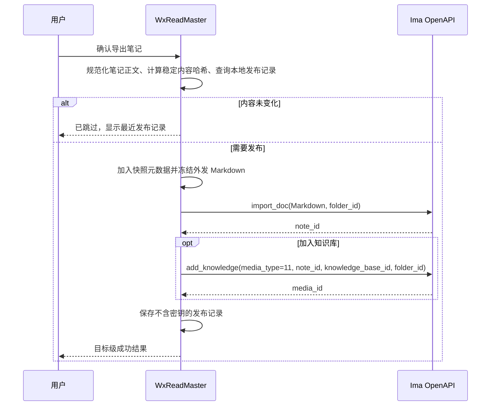

# Ima 笔记与知识库导出设计

> **状态**：一期主链路与总计阅读报告快照导出已实现；真实 IMA 笔记写入已由用户确认（覆盖总计阅读报告快照），知识库路由与权限边界、分块追加、异常恢复和 Android 真机全链路仍待发布前验收
> **范围**：Ima 凭据配置、单本与批量微信读书笔记导出、Ima 笔记和知识库关联、版本记录与结果展示
> **不包含**：Ima -> 本地回写、后台自动同步、远端内容删除、Ima 内置 AI 能力调用、第三方内容抓取
> **总计报告专项规则**：[IMA 总计阅读报告导出改造设计](./ima-overall-reading-report-export-refactor-design.md)；总计报告每次导出创建新快照，覆盖本文件中“阅读统计报告”的通用去重描述；其他资产仍遵循本文件规则。
> **上位依据**：[GLOSSARY.md](./GLOSSARY.md)、[全局导出交互重构设计](./unified-export-interaction-refactor-design.md)
> **外部依据**：Ima 配置中心 `https://ima.qq.com/agent-interface`；随仓库提供的 `ima-skills/ima-skills-1.1.9`
> **产品裁决**：2026-08-17

## 1. 摘要

微信读书笔记是本产品的核心阅读材料。Ima 的公开能力明确包含笔记的读取、写入、检索，以及知识库资料的导入和检索。因此，"导出笔记到 Ima" 应成为正式导出目标，而不是仅导出书籍复盘的附加功能。

一期交付的主路径是：**将一本书的已同步划线和想法生成一篇 Ima Markdown 笔记，再按用户选择关联到 Ima 知识库和文件夹**。单本导出与批量导出均支持此路径。Ima 中可编辑、可检索的笔记承载阅读材料；知识库承载跨书问答和与其他资料的联合检索。

本地数据库仍是唯一事实源。每一次用户主动导出都创建一个不可变快照；内容变化时发布新版本，不尝试自动覆盖或合并 Ima 中已有内容。


## 2. 背景与问题

### 2.1 当前能力

当前产品已经能够同步微信读书笔记、按书组织划线和想法、导出 Markdown，并以多目标编排器导出到 Markdown、Obsidian、Notion：

- `ExportDocument` 是目标无关的导出中间模型。
- `ExternalExportTarget` 和 `MultiTargetExportRequest` 已定义目标选择与结果返回。
- `export_document_targets` 负责按目标派发导出。
- 笔记 Markdown 已按书籍、章节、划线和想法序列化。
- 凭据服务已经使用 Stronghold 存储 Notion 与 Embedding 密钥，可直接沿用边界。

Ima 不应重新实现笔记读取、章节归组或 Markdown 生成，而应消费现有导出模型和文本结果。

### 2.2 Ima 的匹配能力

Ima 配置中心将下列能力标为核心：

- 新建笔记、追加笔记；
- 按标题或正文检索笔记；
- 查询知识库和资料列表；
- 将内容添加到知识库；
- 获取知识库中的文件、网页和笔记资料。

本地 `ima-skills` 的接口说明进一步确认：

- 笔记写入使用 `openapi/note/v1/import_doc`，正文格式为 Markdown；
- 已创建笔记可以用 `media_type=11` 关联到知识库；
- Markdown 文件也是可上传的知识库资料（`media_type=7`）。

这使“笔记 -> 知识库”的路径成为本产品与 Ima 的自然集成点。

### 2.3 现有边界无法支持双向同步

当前 Ima OpenAPI 说明仅提供笔记新建、追加、读取、列表和搜索；没有可用于本产品的更新或删除接口。知识库文件同名时不支持覆盖。若做后台同步，会出现不可判断的重复、过期版本和冲突。

因此，设计采用“本地主导、用户发起、快照发布”的模型，而不实现：

- 后台监听本地笔记变化；
- 定时自动上传；
- 从 Ima 拉回、覆盖或合并本地笔记；
- 修改或删除用户在 Ima 中编辑过的笔记；
- 以远端内容作为本地检索的依赖。

## 3. 产品目标与非目标

### 3.1 目标

- 让用户在单本笔记页和批量笔记导出向导中选择 Ima 作为正式目标。
- 将完整的可导出划线和想法写入一篇可编辑的 Ima 笔记。
- 可选将该 Ima 笔记关联到用户选择的知识库和文件夹。
- 复用本地 Markdown 的书名、作者、章节、来源链接、进度和导出时间。
- 对内容不变的重复导出给出“已发布，无需重复导出”的明确结果。
- 对内容变化的重新导出创建新快照，不改写旧快照。
- 每本书、每个目标独立返回成功、跳过或失败，批量任务允许部分成功。
- 凭据、用户内容和 COS 临时凭据均不写入日志、诊断导出或 Markdown。

### 3.2 非目标

- 双向同步、冲突合并和远端覆盖更新。
- 直接调用 Ima 对话、Agent、定时任务或联网搜索能力。
- 把 Ima 知识库替换为本地词法/语义检索后端。
- 重新实现 Markdown、Obsidian、Notion 的现有导出格式。
- 导出本地阅读器的 AI 对话、浏览器/WebView 存储或未确认的本地草稿。
- 在 Web Preview 中伪造可执行的外部写入能力。

## 4. 产品裁决

### 4.1 一期范围

一期以微信读书笔记为核心，支持：

| 场景 | 一期行为 |
| --- | --- |
| 单本笔记 | 创建 Ima 笔记；可选关联知识库 |
| 批量笔记 | 每本书创建一篇 Ima 笔记；逐书报告结果 |
| 内容未变 | 依据本地内容哈希跳过，并显示最近成功发布记录 |
| 内容变化 | 创建带版本时间的新的 Ima 笔记，并可关联到同一知识库 |
| 无可导出划线或想法 | 不调用 Ima，返回 `Skipped / NO_EXPORTABLE_NOTES` |
| 未设置知识库 | 允许仅创建 Ima 笔记 |
| 导出前已确认知识库配置无效 | 不创建远端内容，报告配置或权限错误 |
| 笔记已创建但知识库关联明确失败 | 保留 Ima 笔记，返回 `Partial`；可重试原目标，或经用户确认后复用该笔记改关联到新目标 |
| 知识库关联请求超时或连接中断 | 保留已知 `note_id`，返回 `Unknown`，禁止自动再次关联 |

书籍复盘、周期复盘、阅读路线和选书决策已在 P1 第一切片加入 Ima 目标。它们复用同一凭据服务、请求客户端、结果模型和设置入口，不改变笔记链路。

### 4.2 目标的语义

导出弹窗中的目标名称为 **Ima**。选中后显示两种发布范围：

- `保存为 Ima 笔记`：创建一篇笔记；
- `保存为 Ima 笔记并加入知识库`：创建笔记后关联到指定知识库。新安装默认选择“仅保存为 Ima 笔记”；只有用户在当前确认页主动选择或已明确保存该发布策略时，才加入知识库。界面可以推荐该能力，但不得通过预选替代用户同意。

不将“直接上传 Markdown 文件”作为一期 UI 选项。笔记对象可在 Ima 中继续编辑，也能被关联到知识库，较符合阅读笔记的使用场景。若后续需要将大量既有 Markdown 档案原样入库，再单独增加“上传 Markdown 文件”能力。

### 4.3 内容边界

用户主动选择“导出笔记”时，默认导出该书所有已同步且可导出的划线与想法。这是导出行为本身，不再额外把原始划线视为默认排除项。

仍遵守以下边界：

- 仅处理用户自己已同步、已在本机可见的内容；
- 不请求微信读书远端接口来补全缺失笔记；
- 不导出 API Key、数据库路径、原始接口响应或诊断信息；
- 书签正文继续遵从现有微信读书接口边界，接口未提供时仅保留数量说明；
- 移除 Markdown 中的本地图片引用；封面不作为 Ima 笔记内容的一部分；
- 从导出预览明确显示“将发送划线 N 条、想法 N 条”。

同步或读取完成后若划线和想法均为零，单本导出返回 `Skipped`，批量导出保留 `BulkExportItemStatus::NoContent`，并为已选择的 Ima 目标生成不含远端资源 ID 的跳过结果。任何情况下都不得为“只有书名和元数据、没有笔记正文”的书创建空 Ima 笔记。

### 4.4 不变快照和版本规则

Ima 不支持本产品所需的稳定覆盖更新，因此每一次导出都是快照：

```text
《深度工作》阅读笔记 · 2026-08-17 14:30:25 · A7F3C2
```

标题中的时间使用用户本地时区并精确到秒，末尾短标识来自本地 `operation_id` 的非敏感随机/唯一部分。该标识不使用 API Key、Client ID 或正文哈希，用于同一分钟多次导出、强制重新发布和 `Unknown` 人工核对。完整 `operation_id` 仍只保存在本地结果中。

重新导出前，应用以“导出源类型 + 书籍 ID + 内容哈希 + 目标范围”查找本地成功记录：

- 命中相同哈希：跳过远端请求，返回“内容未变化”；
- 哈希不同：创建新笔记，标题使用新的导出时间和操作短标识；
- 旧笔记保留，不尝试追加、替换或删除；
- 用户在 Ima 修改旧笔记后，本地不读取、不覆盖也不合并。

本地成功记录只代表“本产品曾确认发布成功”，不代表远端内容永久存在或仍位于原目录。若用户在 Ima 删除、移动笔记或解除知识库关联，普通重复导出仍可能命中本地记录。因此结果页提供“检查远端”入口：它只读分页查找笔记并递归浏览目标知识库，完整读取后报告正常、移动、缺失或多处变化；网络、权限和分页异常统一显示为“无法确认”，不自动重试、不修改本地记录。确认笔记或知识库资料缺失后，结果页可二次确认创建新的不可变快照；设置页历史批量对账和后台定时检查仍不在本切片范围内。

修订已发布的复盘或周期报告时，新快照标题必须包含修订时间或修订序号，并在正文中声明其替代的本地快照时间。由于当前接口不能可靠更新、删除或解除旧资料，旧版本仍可能留在知识库并参与检索；发布确认页必须提示这一点，完成后给出“请在 Ima 人工移除旧版本”的操作说明。本应用不得宣称“已替换远端旧版”，也不得通过标题搜索猜测并删除资料。

### 4.5 阅读报告与知识库分级

Ima 知识库的目标是沉淀可被未来检索、比较和问答复用的阅读结论，而不是复制本地统计面板。因此，后续资产必须按“知识内容”和“运行数据”分级，不能把所有阅读报告统一发布到知识库。

| 资产类型 | Ima 笔记 | 关联知识库 | 默认文件夹建议 | 默认策略 |
| --- | --- | --- | --- | --- |
| 微信读书原始笔记 | 是 | 可选 | `微信读书/笔记` | 延续一期设置 |
| 单书复盘 | 是 | 是 | `阅读/书籍复盘` | 默认推荐关联 |
| 阅读路线 | 是 | 是 | `阅读/阅读路线` | 默认推荐关联 |
| 月度/年度阅读复盘 | 是 | 可选 | `阅读/周期复盘` | 仅发布最终总结版 |
| 选书决策 | 是 | 可选 | `阅读/选书决策` | 默认仅保存为笔记；决策具有时效性 |
| 阅读统计报告 | 可选 | 否 | `阅读/统计报告` | 默认仅本地，用户主动导出时可保存为笔记 |
| 阅读进度、连续天数、排行榜 | 不建议 | 否 | 不配置 | 保留在本地统计页面 |

“阅读报告”需要进一步区分：包含阅读主题、关键收获、判断变化和下一步行动的叙述性总结属于知识内容；只有时长、页数、数量、排名和折线图的统计快照属于运行数据。后者即使导出为 Ima 笔记，也不得默认加入知识库。

默认建议使用一个“微信读书”知识库，并在其中按资产类型使用文件夹，而不是为每本书创建独立知识库。推荐逻辑层级如下；实际目录必须由用户在 Ima 中预先创建并分别选择，本应用不猜测或自动创建：

```text
微信读书
├─ 原始笔记
├─ 书籍复盘
├─ 阅读路线
├─ 周期复盘
└─ 选书决策
```

文件夹只是组织方式，不是权限边界，也不保证 Ima 检索只在该文件夹内进行。若用户需要严格隔离敏感笔记、工作资料与个人阅读内容，或原始划线明显干扰总结类问答，应使用不同知识库，或只把复盘和阅读路线加入知识库。

每类资产都使用独立的路由配置，至少包含：

```text
note_folder_id                  # Ima 笔记本目录
knowledge_base_id               # 可选知识库
knowledge_base_folder_id        # 指定知识库内目录
publish_to_knowledge_base       # 本次类别的默认发布策略
```

`note_folder_id` 与 `knowledge_base_folder_id` 永远不能互换。它们来自两个 API 和两个命名空间，即使显示名称相同也必须分别保存和校验。当前 Ima API 只保证读取已有目录；在没有稳定创建目录接口前，不自动创建或静默替换用户配置的目录。

周期报告和统计报告只能在用户确认生成最终快照后发布。刷新同一周期的草稿、单纯指标变化或图表重绘不得自动创建新的 Ima 知识库资料；每个最终版本仍遵循 4.4 的内容哈希、目标范围和快照规则。

## 5. 用户流程

### 5.1 首次配置

入口：`设置 > 导出设置 > Ima`。

1. 用户按照 Ima 配置中心获取凭据。
2. 输入 Client ID 和 API Key。
3. 点击“测试并读取可写知识库”。
4. 从 Ima 笔记本列表中选择默认笔记本；未选择时省略 `folder_id`，由 Ima 使用默认位置。
5. 从返回的可写知识库中选择默认知识库及其文件夹；该项可留空。
6. 保存配置。

Ima 配置中心的页面文案主要提示获取 API Key；当前随附的 `ima_api.cjs` 实际要求 `Client ID + API Key`，并以 `ima-openapi-clientid`、`ima-openapi-apikey` 发送。因此设置页必须提供两个字段，且在正式开发前依据最新版官方配置流程确认 Client ID 的获取方式。

凭据不得与微信读书、聊天 AI 或 Embedding 凭据复用。

“移除 Ima 凭据”只删除本地 Stronghold 中的 Client ID/API Key、清空发现缓存并停用后续导出；历史发布记录保留为只读审计。该操作不会也不能删除已创建的 Ima 笔记或知识库资料，确认弹窗必须明确提示用户如需删除远端内容，应前往 Ima 手工处理。清理本地数据库同样不得显示成“已删除 Ima 中的数据”。

### 5.2 单本笔记导出

入口：`笔记 > 书籍笔记 > 导出笔记`。

1. 打开统一导出弹窗。
2. 勾选 `Ima`，查看目标状态、默认知识库和将要发送的划线/想法数量。
3. 勾选“我确认：本次导出的划线、想法和相关元数据将发送到 Ima”。确认只对本次打开的弹窗有效，取消 Ima 或关闭弹窗后必须重新确认。
4. 选择“仅保存为 Ima 笔记”或“保存并加入知识库”，后者可更换目标知识库和文件夹。
5. 点击“开始导出”。未确认时按钮不可提交；后端对缺失或非 `true` 的 `confirmBodyExport` 在创建操作、冻结正文和远端请求前返回 `IMA_BODY_EXPORT_CONFIRMATION_REQUIRED`。
6. 完成后在结果态显示 Ima 笔记标题、是否已加入知识库、跳过或失败原因。

### 5.3 批量笔记导出

入口：`笔记 > 批量导出`。

1. 复用既有本地缓存预检、书籍范围、筛选和并发选择。
2. 在目标选择中选择 `Ima`，确认批量目标范围，并勾选“本批次所选书籍的划线、想法和相关元数据将发送到 Ima”。未确认时批量导出按钮不可提交。
3. 每本书独立执行“创建笔记 -> 可选关联知识库”。
4. 结果表按“书籍 x 目标”展示；任一书失败不影响其他书或其他目标。
5. “重试失败项”重新请求 `Failed` 和可恢复的 `Partial`；不重发已成功或已跳过的项。已有 `operation_id` 的项目读取冻结快照精确恢复；因目标级熔断返回 `IMA_BATCH_NOT_SENT`、且没有 `operation_id` 的项目按原书籍 ID 重新执行普通导出并读取当时最新正文。`Unknown` 必须先由用户选择“放弃”或“创建新版本”，不能被当作确定失败直接重试。

### 5.4 配置缺失与只读环境

| 状态 | UI 行为 |
| --- | --- |
| 未保存凭据 | Ima 目标不可提交，显示“前往设置” |
| 凭据校验失败 | 保留错误摘要，不显示密钥内容 |
| 未选择默认知识库 | 允许“仅保存为 Ima 笔记” |
| 知识库无写权限 | 禁止“加入知识库”，可退回仅创建笔记 |
| Web Preview | Ima 目标为只读不可选，说明需在桌面或移动应用执行 |
| Android | 以实际 Tauri 移动端网络、Stronghold 和上传能力为准；未验证前不展示为已支持 |

### 5.5 阅读报告导出

后续接入阅读路线、复盘或阅读报告时，导出流程必须先确定资产类别，再解析该类别的默认路由：

1. 生成或读取已完成的资产版本，不允许把正在生成的报告发送到 Ima。
2. 展示资产类型、统计周期或书籍范围、生成时间、内容摘要和目标文件夹。
3. 对书籍复盘和阅读路线默认选中“创建 Ima 笔记并加入知识库”；对周期复盘由用户选择；对阅读统计默认选中“仅创建 Ima 笔记”或“不导出”。
4. 若用户选择关联知识库，先创建 Ima 笔记，再使用同一资产类别对应的知识库和文件夹关联；任一步骤失败都沿用 `Partial` / `Unknown` 语义。
5. 结果页显示资产类别、快照版本、笔记本路径、知识库路径和是否为最终版本，避免把统计快照误认为长期知识。

报告导出不应复用 `BookNotes` 的标题或去重键。至少使用“资产类别 + 范围 ID + 周期/版本 + 内容哈希 + 目标范围”作为本地发布记录的稳定输入。

## 6. 架构设计

### 6.1 模块边界

```text
SettingsPage / AssetExportDialog / BulkExportWizard
  -> reading-api.ts
  -> Tauri commands
  -> NotesService / export dispatcher
  -> ImaExporter
     -> ImaCredentialService
     -> ImaClient
        -> Ima OpenAPI
```

职责划分：

| 模块 | 职责 | 不负责 |
| --- | --- | --- |
| `ImaCredentialService` | 密钥加密存取、状态、移除、校验元数据 | 知识库业务请求 |
| `ImaClient` | URL、Header、超时、版本兼容检查、JSON 编解码、业务错误映射 | 导出内容生成 |
| `ImaExporter` | 创建笔记、关联知识库、版本记录、目标结果 | UI 状态 |
| 现有 `markdown.rs` | 生成笔记正文 | 远端请求 |
| 现有导出 dispatcher | 调度目标、隔离部分失败 | Ima API 协议细节 |
| 前端导出组件 | 选择目标、展示预检与结果 | 保存密钥、拼装远端 Header |

不将 Ima 请求逻辑塞入 `NotesService` 或 `SettingsPage`，避免笔记读取、设置管理和第三方发布职责混杂。

### 6.2 目标类型扩展

在 `src-tauri/src/export/targets.rs` 与前端对应类型中增加：

```rust
pub enum ExternalExportTarget {
    Markdown,
    Obsidian,
    Notion,
    Ima,
}

pub struct ImaExportOverrides {
    pub note_folder_id: Option<String>,
    pub knowledge_base_id: Option<String>,
    pub knowledge_base_folder_id: Option<String>,
    pub publish_to_knowledge_base: Option<bool>,
}
```

`note_folder_id` 属于 Ima 笔记本命名空间；`knowledge_base_folder_id` 属于指定知识库的文件夹命名空间。两者都不能简化为通用 `folder_id`，也不能相互传递。

`MultiTargetExportRequest` 增加 `ima: Option<ImaExportOverrides>`。字段仅表达本次导出临时覆盖；长期默认值仍从设置读取。

后续资产接入时复用现有 `ExportSourceKind`，不再维护第二套平行资产枚举。周期报告和统计快照通过范围或变体字段区分，不把所有类型压入 `export_book_notes_targets`：

```rust
pub enum ImaAssetVariant {
    Narrative,
    PeriodSummary,
    StatisticsSnapshot,
}

pub struct ImaCategoryRoute {
    pub source_kind: ExportSourceKind,
    pub note_folder_id: Option<String>,
    pub knowledge_base_id: Option<String>,
    pub knowledge_base_folder_id: Option<String>,
    pub publish_to_knowledge_base: Option<bool>,
}
```

当前 `ExportSourceKind` 中，`ReadingStatsReview` 承载周期性的叙述复盘，`ImaAssetVariant::StatisticsSnapshot` 标记纯指标快照；`BookDecision` 必须纳入后续能力矩阵。`variant` 属于本次资产/请求上下文，不进入长期 `ImaCategoryRoute`，避免为同一来源维护重复路由。请求级 `ImaExportOverrides` 仍只覆盖当前一次导出，不能改变其他类别的默认路由。`publish_to_knowledge_base = None` 表示继承全局设置，类别配置缺失时也按同一优先级处理。

变体能力校验独立于目标解析：显式请求将 `StatisticsSnapshot` 关联知识库时返回 `IMA_VARIANT_UNSUPPORTED`，不能静默改成仅笔记；没有显式请求时，其有效默认策略固定为“不导出”或“仅笔记”，不得继承同来源叙述复盘的知识库发布开关。只有未来出现真实的不同文件夹需求时，才扩展复合路由键。

扩展 `ExportTargetResult`：

```rust
pub struct ExportTargetResult {
    // 既有字段
    pub operation_id: Option<String>,
    pub operation_stage: Option<String>,
    pub resource_id: Option<String>,
}
```

`operation_id` 是本地导出尝试 ID，用于恢复 `Partial`、`Failed` 或 `Unknown`，不能用远端资源 ID 替代。`operation_stage` 使用稳定值 `importDoc`、`appendDoc`、`addKnowledge` 或 `persistResult`，表示失败或不确定发生的阶段。`resource_id` 对 Ima 表示新建的 `note_id`，不滥用现有仅面向 Notion 的 `page_id`。这些字段均以可选字段增量加入，保留 `page_id` 以兼容现有 Notion 消费方。当创建并关联知识库成功时，结果说明中同时包含 `media_id`，本地发布记录保存两者。

同时扩展目标状态：

```rust
pub enum ExportTargetStatus {
    Succeeded,
    Partial,
    Failed,
    Skipped,
    Unknown,
}
```

`Partial` 仅表示“远端笔记已创建，但加入知识库失败”或“首块已创建但后续分块明确失败”。它必须携带 `resource_id`、可恢复错误和下一步操作；批量汇总、结果弹窗、Markdown 报告与“重试失败项”均将其视为可恢复的非完全成功状态。`Unknown` 表示请求结果无法确认，必须与确定失败的 `Failed` 分开，不能进入自动重试队列。

### 6.3 凭据与非敏感设置

敏感值进入单独 Stronghold 容器：

```rust
const CLIENT_PATH: &[u8] = b"ima-export-credentials";
const CLIENT_ID_RECORD: &[u8] = b"ima-openapi-client-id";
const API_KEY_RECORD: &[u8] = b"ima-openapi-api-key";
const METADATA_RECORD: &[u8] = b"ima-openapi-credential-metadata";
```

应复用 `NotionCredentialService` 的状态、移除确认与错误映射模式，但不得共享 Stronghold client path 或 record key。

非敏感设置写入现有本地配置：

```rust
pub struct ImaExportSettings {
    pub default_note_folder_id: Option<String>,
    pub default_note_folder_name: Option<String>,
    pub default_knowledge_base_id: Option<String>,
    pub default_knowledge_base_name: Option<String>,
    pub default_knowledge_base_folder_id: Option<String>,
    pub default_knowledge_base_folder_name: Option<String>,
    pub publish_to_knowledge_base_by_default: bool,
}
```

上述名称字段是用于展示失效目标和完整路径的缓存契约，当前 `IntegrationConfig` 主要只保存 ID 与发布开关，尚未完整实现名称缓存。缓存名称不得参与请求寻址或去重；刷新后始终以服务端 ID 和权限状态为准。

凭据生命周期遵循以下规则：

- 保存新凭据、替换 API Key 或移除凭据时，清空版本检查结果和文件夹/知识库发现缓存，并将已保存目标标记为“待重新验证”；不删除历史发布记录；
- 存在 `attempting` 远端请求时禁止替换或移除凭据，返回 `IMA_CREDENTIAL_BUSY`。已进入 `partial`、`failed` 或 `unknown` 的尝试可以保留，但凭据范围变化后禁止精确重试，必须重新验证账号并由用户创建新快照；
- 理想状态下，API Key 轮换但 Ima 用户身份不变时应保留账号去重历史；在官方接口未提供稳定用户身份前，一期使用 Client ID 与 API Key 共同派生的带版本指纹进行保守隔离。轮换 API Key 会产生新范围并放弃旧范围去重命中，不能为了复用历史而退回仅哈希 Client ID；
- 移除凭据后设置页可以保留原目标名称作为只读历史摘要，但再次启用 Ima 前必须重新读取并选择可写目标，不能直接复用旧 ID。

一期继续读取上述单一默认配置，保持已有用户配置兼容。开放后续资产后，新增 `asset_routes` 对象，以稳定的类别键保存各自配置：

```json
{
  "asset_routes": {
    "bookNotes": { "noteFolderId": "...", "publishToKnowledgeBase": null },
    "readingRoute": { "noteFolderId": "...", "knowledgeBaseId": "...", "knowledgeBaseFolderId": "...", "publishToKnowledgeBase": true },
    "bookReview": { "noteFolderId": "...", "knowledgeBaseId": "...", "knowledgeBaseFolderId": "...", "publishToKnowledgeBase": true },
    "readingStatsReview": { "noteFolderId": "...", "publishToKnowledgeBase": false },
    "bookDecision": { "noteFolderId": "...", "publishToKnowledgeBase": false }
  }
}
```

类别路由的 ID 校验、失效处理和完整路径展示与一期默认目标相同：目标不存在或失去写权限时阻止提交，不回退到根目录。显示名称只能作为缓存摘要，实际请求始终使用 ID；当已保存 ID 尚未从 Ima 成功读取到对应名称时，界面只能显示“已保存目标（待验证）”，不得把内部 ID 直接展示给用户。类别配置读取优先级固定为“请求级覆盖 > 类别路由 > 一期全局默认 > Ima 默认位置”；旧版本只有全局配置时，迁移读取不得改变其发布策略。

### 6.4 本地发布记录

`ima_export_records` 用于去重、结果展示和精确重试。下表描述逻辑字段，而不是要求所有字段都在记录表中重复落列：

| 字段 | 说明 |
| --- | --- |
| `id` | 本地记录 ID |
| `export_id` | 一次导出任务 ID；一期由 `ima_export_attempts.export_id` 关联，不在记录表重复存储 |
| `source_kind` | 现有 `ExportSourceKind` 的稳定序列化值 |
| `source_id` | 书籍、阅读路线或周期范围的稳定 ID，不再假定一定是书籍 ID |
| `content_hash` | 排除快照标题、导出时间等易变元数据后的规范化笔记内容 SHA-256 |
| `destination_scope` | 账号、发布模式与实际目标 ID 组合的稳定标识 |
| `ima_note_id` | 成功创建的 Ima 笔记 ID |
| `ima_media_id` | 成功关联知识库后的媒体 ID，可空 |
| `knowledge_base_id` | 实际目标知识库 ID，可空 |
| `note_folder_id` | 实际 Ima 笔记本 ID，可空 |
| `knowledge_base_folder_id` | 实际知识库文件夹 ID，可空 |
| `credential_scope_hash` | 账号范围指纹；不得仅假定由 Client ID 生成，至少覆盖当前凭据身份 |
| `status` | `attempting`、`succeeded`、`partial`、`failed`、`unknown`、`abandoned`；`Skipped` 仅是目标结果，不写入该表 |
| `exported_at` | Unix 秒时间戳 |
| `failure_code` | 可恢复的目标级错误码，可空 |

当前物理表只直接保存 `id`、来源、内容哈希、`destination_scope`、标题、Ima 资源 ID、状态和创建/更新时间；目标 ID 与账号范围编码在规范化的 `destination_scope` 中，`export_id`、失败阶段和错误码保存在 `ima_export_attempts`。除非出现可证明的查询或迁移需求，不为同一信息增加重复列；若以后拆列，必须通过 6.7 的版本迁移保证新旧记录可读。

`destination_scope` 包含 `credential_scope_hash`、笔记本目标、发布模式（`noteOnly` / `noteAndKnowledgeBase`），以及发布到知识库时实际使用的知识库 ID 和知识库文件夹目标。笔记本根目录和知识库根目录都统一编码为稳定标记 `root`，不能一处使用空值、另一处使用服务端根 ID。仅保存笔记时不应把未使用的默认知识库配置混入范围。这样，同一内容从“仅笔记”改为“笔记并加入知识库”时不会被错误跳过。凭据被替换或移除时，保留历史发布记录，但不复用旧账号的默认目标或去重命中。

对 `source_kind + source_id + content_hash + destination_scope + status=succeeded` 建立查询索引。防并发双写使用 SQLite 原子占位，不新增常驻锁表：开启短 `BEGIN IMMEDIATE` 事务，在同一事务内查询相同发布键的 `succeeded` 与活动状态（`attempting`、`partial`、`unknown`），再决定返回 `Skipped` / `IMA_EXPORT_IN_PROGRESS` 或插入新的 `attempting` 记录，随后立即提交并释放写锁。普通导出命中成功记录时跳过；“强制重新发布”只跳过成功去重判断，仍必须尊重活动记录。这样既允许用户明确创建同内容的新快照，又不会让两个窗口同时调用 Ima。记录中不得保存 Client ID、API Key、COS 临时凭据或原始响应。账号范围必须在“凭据切换”测试中验证，不能把 Client ID 摘要直接等同于用户账号。

### 6.5 导出快照与分块日志

为支持中断恢复，新增 `ima_export_attempts` 与 `ima_export_chunks`：

| 表 | 最小字段 | 用途 |
| --- | --- | --- |
| `ima_export_attempts` | `export_id`、`record_id`、`snapshot_markdown`、`snapshot_hash`、`chunk_count`、`status`、`last_completed_stage`、`uncertain_stage` | 固化一次外发快照和执行阶段，不因后续同步改变 |
| `ima_export_chunks` | `export_id`、`chunk_index`、`chunker_version`、`start_byte`、`end_byte`、`chunk_hash`、`status`、`attempt_count`、`last_error_code` | 固化分块边界，标记首块和追加块是否已被服务端明确接受 |

`snapshot_markdown` 是已发送或待发送的用户笔记正文，只能保存在本地应用数据库中；不得出现在诊断信息、导出报告或日志。该表随用户执行的本地数据清理策略一并清除。

`content_hash` 与 `snapshot_hash` 语义不同：前者只覆盖稳定的笔记内容，用于判断微信读书笔记是否变化；后者覆盖包含快照标题、导出时间和固定元数据在内的实际外发 Markdown，用于断点恢复和分块一致性校验。不得使用 `snapshot_hash` 做跨次导出去重，否则仅导出时间变化也会误判为新内容。

处于 `attempting`、`partial`、`failed` 或 `unknown` 的记录保留冻结正文，以支持用户明确触发的恢复；转为 `succeeded` 后，或用户确认将 `unknown` 标记为 `abandoned` 后，立即删除 `snapshot_markdown` 和分块正文，只保留内容哈希、目标范围、状态、时间、错误码与远端资源 ID。清理待恢复快照前必须明确告知其将失去精确重试能力。

仅当服务端明确返回“该块未写入”时，才允许重试该 `chunk_index`。`start_byte`、`end_byte` 基于冻结快照的 UTF-8 字节偏移，`chunker_version` 变化时不得重新计算边界，必须创建新的完整快照。`unknown` 分块不自动重试；用户可以确认创建新的完整快照，或在 Ima 中人工检查后放弃本次尝试。

### 6.6 正文适配

Ima `import_doc` 仅接受 Markdown，且不支持本地图片。新增纯函数：

```rust
fn serialize_ima_note_markdown(document: &ExportDocument, markdown: &str) -> String
```

规则：

- 使用现有笔记 Markdown 作为输入，避免第二套章节和笔记排序逻辑；
- 删除 YAML front matter，保留 `#` 标题、章节、划线、想法、来源链接和数据边界说明；
- 删除本地图片及封面图片语法，不上传本地文件；
- 普通链接若指向 `file://`、Windows 盘符/UNC 路径或 Unix 绝对路径，只保留可见标签并删除本机路径；HTTP(S) 与微信读书来源链接可以保留。应用不得为处理 Markdown 主动访问任何外部链接；
- 追加固定元数据：`导出来源：WxReadMaster`、带 UTC 偏移的快照时间、书籍 ID；
- 所有字符串在请求前验证为合法 UTF-8；
- 不裁剪或篡改用户笔记正文。

非 `BookNotes` 资产发布前还必须在正文顶部写入可检索的纯文本元数据，不能依赖 Ima 是否解析 YAML front matter：`资产类型`、`范围 ID`、`生成时间`、`快照版本`、`是否最终版本`。周期资产额外写入周期开始、周期结束、时区和指标口径；`BookDecision` 额外写入“决策基于数据截至时间”，避免未来问答把过期决策当作当前结论。缺少这些字段的报告不得关联知识库。

进入该函数前，先将现有笔记 Markdown 规范化为 LF 换行并计算稳定 `content_hash`；快照标题和快照时间仅在去重判断未命中后加入外发正文。生成完成后立即持久化 `snapshot_markdown` 和 `snapshot_hash`，之后的创建、追加及人工重试都只读取这份冻结快照。

当正文超过 Ima 单篇笔记限制时，使用带版本的确定性分块器：优先在一级/二级标题前切分，其次在空行分隔的 Markdown 块之间切分；围栏代码块、表格和完整链接在不超过软阈值时保持为一个块。只有单个块本身超过阈值时，才退回到合法 UTF-8 字符边界切分，并在结果中提示格式可能降级。首块使用 `import_doc`，后续块使用 `append_doc`，每个块携带清晰的“第 N/M 部分”标识。每次请求前读取对应 `ima_export_chunks` 状态；服务端明确拒绝中间块时记录为 `partial`，返回已创建笔记 ID 和失败批次。重试仅补发确认未写入的批次，不重新创建首块；网络结果不确定时将该块转入 `unknown`，不得自动追加同一批次。

当前 `160 KiB` 只是客户端预分块软阈值，不是已确认的 Ima 官方上限。若首个 `import_doc` 明确返回 `100009` 或 `210009`，且尚未取得 `note_id`，可以基于同一冻结正文用更小阈值生成新的 `chunker_version` 后重新开始；若已有任一分块成功写入，则一期不在原尝试中动态改写分块边界，返回 `Partial / IMA_CONTENT_TOO_LARGE`，提示用户创建采用更小阈值的新快照，并在 Ima 人工清理不完整旧笔记。实际限制和安全阈值经真实账号验收后再固化，不能把一次成功样本当作平台永久契约。

### 6.7 数据库迁移与事务边界

三个 Ima 表通过现有 `initialize_schema` 以 `CREATE TABLE IF NOT EXISTS` 增量创建，不重建或改写微信读书笔记表。迁移必须满足：

- `ima_export_records.id`、`ima_export_attempts.export_id` 使用主键；`attempts.record_id` 和 `chunks.export_id` 使用外键并启用级联清理；
- 为成功去重查询和待恢复状态扫描建立索引；状态字段使用受控值，反序列化未知值时按迁移错误处理，不静默当作失败；
- `CREATE TABLE IF NOT EXISTS` 只负责首次安装，不能替代 schema 版本迁移。后续字段、索引、状态值和约束变更必须使用单调递增的迁移版本，在事务内记录已应用版本；不得通过删除表重建来丢失发布记录或冻结快照；
- 迁移必须兼容旧版本已存在的 Ima 表：新增字段提供明确默认值，旧状态值先经过显式映射，无法映射时终止启动并保留原始数据；迁移前后都要校验主键、外键、索引和状态约束；
- Ima DDL 在独立事务中执行，全部成功后再提交；失败时回滚并终止本次数据库初始化，显示本地存储错误，绝不带着半套 Ima 表继续运行或发起远端请求；
- 启动恢复在 schema 初始化完成后执行，将遗留 `attempting` 转为 `unknown`；
- 数据目录迁移、备份与恢复沿用现有 `reading-cache.sqlite3` 流程，Ima 快照不另建散落文件。

远端网络请求期间不得持有 SQLite 事务或写锁。每个请求采用“请求前短事务写入 `attempting`/分块状态 -> 释放事务 -> 调用 Ima -> 响应后短事务写入最终状态”的顺序。若远端响应已成功但本地最终状态落库失败，结果必须按 `unknown` 告知用户，不能仅凭内存状态报告成功。

## 7. OpenAPI 交互

### 7.1 客户端约束

- 所有普通 OpenAPI 请求均使用 HTTPS `POST`，仅指向 `https://ima.qq.com`。
- 每个请求带 `ima-openapi-clientid`、`ima-openapi-apikey` 和版本上下文 Header。
- 请求超时、非成功 HTTP 状态、JSON 解析错误和业务 `code != 0` 都映射为不含密钥的结构化错误。
- 复用现有 `reqwest` 客户端模式：连接超时 15 秒、总超时 30 秒、应用版本 User-Agent；Ima 写入请求的自动重试次数固定为 0，不沿用 Notion 的限流重试策略。
- 需要上传文件的后续“Markdown 文件入库”能力才可向 Ima 返回的 COS 临时地址请求；Client ID 和 API Key 绝不发送到 COS。
- UI 可以在当前会话展示书名和目标完整路径；运行日志与默认诊断报告只记录稳定错误码、操作阶段、计数和版本状态，不记录书名、笔记标题、知识库/文件夹名称、远端 ID 或完整服务端消息。用户主动导出专项诊断时若确需名称，必须单独勾选并预览将包含的字段。

随仓库提供的 `ima_api.cjs` 会在每日第一次普通请求前调用 `openapi/check_skill_update`。Rust 客户端必须实现等价的兼容性检查，并将当前适配器兼容版本作为 `version` 发送：

- 默认每个自然日最多自动尝试一次，持久化最近尝试日期、最近成功日期、用于检查的本地适配器版本和服务端版本。该调度策略用于避免 Ima 异常时每次导出都重复检查；兼容判断仍遵循官方脚本；
- 兼容语义以官方 `ima_api.cjs` 为准：当服务端返回非空 `latest_version` 且 `latest_version !== skillVersion` 时，视为不兼容并阻止 `import_doc`、`append_doc` 和 `add_knowledge`，不是“服务端版本低于或等于本地版本即可”。因此服务端 `1.1.8` 与适配器 `1.1.9` 同样不能按兼容处理；比较采用精确字符串相等，不做数字大小比较，也不自动容忍 `v1.1.9` 与 `1.1.9`。当前 Rust 中若仍使用数字大小比较，属于实现偏差，必须在发布前修正；
- 版本不匹配的文案必须描述“本地适配器与 Ima 服务端版本不一致”，不能固定提示“请更新应用”，因为服务端版本也可能低于本地适配器；用户应按官方更新说明处理；
- 服务端未返回 `latest_version`、返回空值，或更新检查发生超时、断网、无效 JSON 和临时失败时，按官方脚本语义不阻断本次导出；设置页显示“版本状态未确认”，不得显示“已兼容”。只有取得非空版本后才能展示明确的相等/不相等结论；
- 更换账号或应用升级内置兼容版本后强制重新检查；设置页提供“重新检查版本”操作，允许用户在同一天服务端版本恢复后绕过自动检查日期并刷新状态；
- 检查请求和响应不得写入 API Key，返回的 `instruction` 仅作为纯文本展示，不作为命令或 URL 自动执行。

### 7.2 凭据校验与目标发现

保存凭据后使用只读的 `get_addable_knowledge_base_list` 验证实际读写授权，并读取可添加知识库列表。该请求成功代表：

- 凭据格式可被服务端接受；
- 当前用户至少可访问接口；
- 返回列表可用于选择目标。

不把“测试成功”解释为每个历史配置的知识库都可写；实际导出仍需执行时校验。

### 7.3 单本导出请求序列



### 7.4 创建笔记

请求：

```json
{
  "content_format": 1,
  "content": "# 《书名》阅读笔记\n\n...",
  "folder_id": "可选的 Ima 笔记本 ID"
}
```

调用 `openapi/note/v1/import_doc`。返回 `note_id` 后才允许继续知识库关联。绝不通过标题猜测已创建笔记作为正常成功路径。

### 7.5 关联知识库

请求使用 `openapi/wiki/v1/add_knowledge`：

```json
{
  "media_type": 11,
  "knowledge_base_id": "目标知识库 ID",
  "folder_id": "可选的目标文件夹 ID",
  "note_info": {
    "content_id": "note_id"
  }
}
```

只有笔记创建成功后才会调用。笔记成功、知识库关联失败时，返回 `partial`：用户仍可在 Ima 笔记中看到完整内容，并可修正目标配置后精确重试关联步骤。

`add_knowledge` 超时或连接中断同样不能自动重试，因为服务端可能已完成关联。此时结果返回 `unknown` 并携带已知的 `note_id`、本地 `operation_id` 和不确定阶段 `addKnowledge`；用户确认远端状态前不得再次关联同一笔记。

### 7.6 幂等性与不确定请求

网络在服务端已创建笔记或已追加一个分块但客户端未收到响应时，无法通过当前接口安全证明“未写入”。处理规则：

- 在发起请求前先落本地 `attempting` 记录，带唯一 `export_id` 和快照标题；
- 网络不确定时将记录标记为 `unknown`，不自动重试；
- UI 显示“远端状态无法确认”，要求用户在 Ima 检查对应快照标题后选择“创建新版本”或“取消”；
- 不根据模糊标题搜索结果自动追加、覆盖或补发任何 Ima 笔记分块。

这比自动重试更能避免重复内容和误修改。

状态迁移必须由持久化记录驱动，不以 UI 内存状态代替：

```text
attempting -> succeeded | partial | failed | unknown
partial -> succeeded
unknown -> succeeded | abandoned | newSnapshot
```

其中 `attempting` 和 `abandoned` 仅属于本地尝试记录，不返回为 `ExportTargetStatus`；`unknown` 必须返回前端并阻止自动重试。用户在 Ima 人工核对标题、正文完整性和知识库关联后，可通过 `ConfirmSucceeded` 显式确认成功；该动作不发起远端请求，并允许 `ima_note_id` 或 `ima_media_id` 为空。`partial` 的恢复请求再次失败时仍保持 `partial` 并更新失败信息，只有关联或剩余分块全部完成后才转为 `succeeded`。`newSnapshot` 是用户动作而非记录状态：执行时先将旧尝试标记为 `abandoned`，再以新的 `export_id` 创建 `attempting` 记录。应用启动时发现遗留 `attempting`，必须转为 `unknown`，不得假设请求未发送。

## 8. 命令与前端契约

### 8.1 设置命令

新增 Tauri commands：

- `get_ima_credential_status`
- `save_ima_credential`
- `remove_ima_credential`
- `validate_ima_credential`
- `refresh_ima_adapter_compatibility`
- `list_ima_note_folders`
- `list_ima_addable_knowledge_bases`
- `list_ima_knowledge_items`
- `save_ima_export_settings`

`refresh_ima_adapter_compatibility` 只调用版本检查接口并更新非敏感版本状态，不读取或发送笔记正文。该命令必须显式绕过每日自动检查日期，但仍遵守普通请求超时和脱敏规则；重复点击期间禁用按钮，避免并发检查。

`list_ima_note_folders` 调用 `openapi/note/v1/list_notebook`，首页游标为 `"0"`；`list_ima_knowledge_items` 调用 `openapi/wiki/v1/get_knowledge_list`，首页游标为空字符串，并仅用于选择指定知识库内的已有文件夹。两者必须分页且不拉取或展示笔记正文。笔记本 `folder_id` 与知识库文件夹 `folder_id` 来自不同 API 和命名空间，命令参数、响应类型、缓存键及设置字段均不得复用。分页起始游标 `"0"` 绝不能当作笔记本 ID。

根目录在设置和去重范围中使用统一规范：用户选择笔记本默认位置时持久化 `note_folder_id=None`；选择知识库根目录时持久化 `knowledge_base_folder_id=None`，即使服务端返回的根目录 ID 等于 `knowledge_base_id` 也先归一化为空。请求层按接口规则省略可选 `folder_id`；若未来某接口强制要求根 ID，只在组装该次请求时转换，不改变持久化值或 `destination_scope`。不得按名称把普通文件夹误判为根目录。

笔记本和知识库文件夹都可能存在层级及重名，设置页必须展示完整面包屑并保存 ID，不能只按名称匹配，但两种命名空间使用不同的路径来源：

- Ima 笔记本：根据 `list_notebook` 返回的全部 `NoteFolderInfo`，从目标节点沿 `parent_folder_id` 逐级向上构建路径；父节点缺失、父链超过固定上限、出现循环引用或同一 ID 的名称冲突时，标记目标失效；
- 知识库文件夹：调用 `get_knowledge_list` 进入目标目录，直接使用服务端返回的 `current_path: FolderInfo[]` 作为权威面包屑；同一分页请求各页的 `current_path` 必须一致，路径末节点必须与请求的 `folder_id` 对应。缺失、冲突或不一致时返回响应错误，不自行猜测父链。

刷新列表后若已保存 ID 不再存在或不再可选择，标记配置失效并阻止提交；不得静默退回默认位置或知识库根目录。笔记本的 `folder_type` 等服务端类型字段原样保留用于区分系统节点，未经写入验证的“全部笔记”等聚合节点不能当作普通目标。

知识库目录浏览采用按父节点懒加载，而不是递归拉取整个知识库。每次展开目录时分页读取该父节点的直接子项，只把文件夹项目作为可选目录，并连同 `current_path` 返回；缓存键至少包含账号范围、知识库 ID 和父目录 ID。`list_ima_knowledge_items` 的响应因此不能继续只是 `ImaKnowledgeItem[]`，目标契约应为 `{ items, currentPath }`。前端将其归一化为带 `namespace`、`pathIds`、`displayPath`、`isSelectable` 的目标视图模型，`namespace` 固定区分 `noteFolder` 与 `knowledgeBaseFolder`。任何缓存命中都必须在提交前重新确认所选目标仍存在且可写。

线上 Ima `1.1.9` 的 `get_knowledge_list` 存在两种文件夹响应形态：文档示例使用 `folder_id`，实际账号可能返回 `media_id` 并以 `media_type=99` 表示文件夹；普通笔记仍为 `media_type=11`。客户端必须同时兼容两种形态，不能只依赖字段名称判断目录，否则真实知识库文件夹会被误当成普通资料。

分页结果必须原子提交：`is_end=false` 时 `next_cursor` 必须非空且不能与任一已访问游标重复；达到页数上限仍未结束、必需分页字段缺失或游标异常时返回 `IMA_PAGINATION_INVALID`，丢弃本次部分结果且不覆盖上一次完整缓存。提交前的“可写性复验”具体指目标仍存在、笔记本节点可选择且父知识库仍出现在 `get_addable_knowledge_base_list`；当前 API 无法用只读请求证明某个子文件夹一定可写，禁止通过探测性写入验证。实际 `import_doc` 或 `add_knowledge` 若仍因权限变化失败，分别返回 `Failed` 或 `Partial`。

### 8.2 导出命令

一期不增加通用“导出任意资产”胖命令，沿用按资产拆分的现有模式：

```rust
#[tauri::command]
pub async fn export_book_notes_targets(
    app: AppHandle,
    book_id: String,
    request: MultiTargetExportRequest,
) -> Result<MultiTargetExportResponse, AppCommandError>
```

该命令扩展现有实现：当 `request.targets` 包含 `Ima` 时，调用 `ImaExporter`。其他目标仍保持各自行为和失败隔离。

`ExternalExportTarget::Ima` 虽是共享枚举成员，但目标选择组件必须接受“当前资产可用目标”集合，并由后端能力矩阵复核。当前 P1 第一切片已开放 `BookNotes`、`BookReview`、`ReadingRoute`、已结束周期的 `ReadingStatsReview` 和 `BookDecision`；当前周期和异常周期的阅读复盘仍返回 `IMA_REVIEW_NOT_FINAL`，总计/全部历史按 [专项快照方案](./ima-overall-reading-report-export-refactor-design.md) 单独处理，是否关联知识库由用户配置和本次导出确认决定，默认不关联。后端 dispatcher 拒绝被篡改的来源或版本请求并返回稳定错误码，不能只依赖前端隐藏。

后续开放资产时，必须为每个 `ExportSourceKind` 明确能力矩阵，而不是只把 Ima 从隐藏列表移出：

| 资产来源 | 可创建 Ima 笔记 | 可关联知识库 | 默认发布策略 |
| --- | --- | --- | --- |
| `BookNotes` | 是 | 可选 | 延续一期配置 |
| `ReadingRoute` | 是 | 是 | 推荐关联 |
| `BookReview` | 是 | 是 | 推荐关联 |
| `ReadingStatsReview` + `Narrative` / `PeriodSummary` | 是 | 可选 | 仅最终版本，由用户选择 |
| `ReadingStatsReview` + `StatisticsSnapshot` | 可选 | 否 | 默认不导出 |
| `BookDecision` | 是 | 可选 | 默认仅笔记 |

每个新增资产应使用独立的 Tauri command 或明确的资产专用参数，复用 `ImaExporter`、凭据、HTTP 和状态模块，但不绕过来源校验，也不把统计报告伪装成 `BookNotes`。

批量导出继续使用现有 `export_bulk_notes` 编排，但不能只增加目标枚举。当前实现会在本地 Markdown 生成后重建 `MultiTargetExportRequest`，且只复制 `obsidian` 与 `notion` 覆盖项；接入时必须同时复制 `ima` overrides，否则批量导出会错误使用默认笔记本或知识库。还需同步扩展批量目标标签、Markdown 报告、成功/失败/部分成功汇总和“重试失败项”的目标筛选。

保留现有“先生成本地 Markdown，再写外部目标”的语义。批量请求中的 `concurrency` 只控制本地同步和 Markdown 准备，Ima 远端写入逐书串行执行，不用该并发值并行调用 OpenAPI。Ima 返回 `20002`、HTTP `429` 或等价限流错误时，将当前书的 Ima 结果记为 `Failed / IMA_RATE_LIMITED`，并对本批次剩余 Ima 项触发目标级熔断：不再发起 Ima 请求，未开始项统一返回 `Failed / IMA_BATCH_NOT_SENT`，消息中携带非敏感的熔断原因并明确标记“未发送”，但不创建 `ima_export_attempts` 记录，也不分配 `operation_id`；Markdown、Obsidian、Notion 等其他目标继续。用户稍后可通过“重试失败项”显式重启 Ima 子队列，不做隐式等待或自动重试。用户取消批量任务时，仅阻止尚未开始的书；已经发出的 Ima 请求必须等待实际响应并写完 `succeeded`、`partial`、`failed` 或 `unknown` 记录后再停止。

目标级熔断不只适用于限流。批量开始前对每个不同的 Ima 目标范围做一次只读预检；执行中遇到认证失败、版本不匹配、账号空间不足、笔记本/知识库目标失效、知识库关联权限失败、网络结果不确定或明确的服务端临时故障时，也停止剩余 Ima 项，未开始项均使用 `IMA_BATCH_NOT_SENT` 并在消息中注明触发码。只有可确定为当前书局部问题的空内容、内容被拒绝或单篇大小问题才继续处理下一本。某本书已经产生的 `Partial` / `Unknown` 仍按自身操作记录恢复，熔断不改变它的状态；其他导出目标始终继续。

新增四个窄命令承载恢复行为和只读对账：

```rust
retry_ima_export_attempt(operation_id: String) -> ExportTargetResult
retarget_ima_knowledge_association(
    operation_id: String,
    knowledge_base_id: String,
    knowledge_base_folder_id: Option<String>,
    confirm: bool,
) -> ExportTargetResult
resolve_ima_unknown_attempt(operation_id: String, action: ImaUnknownResolution)
    -> Option<ExportTargetResult>
check_ima_export_drift(operation_id: String) -> ImaRemoteDriftReport
```

`retry_ima_export_attempt` 只接受服务端已明确未完成、且状态为 `Failed` 或可恢复 `Partial` 的尝试，始终读取冻结快照和原目标范围；传入 `Unknown` 必须拒绝。`ImaUnknownResolution` 一期提供 `ConfirmSucceeded`、`Abandon` 与 `CreateNewSnapshot`，三者都要求用户显式确认；`ConfirmSucceeded` 还必须显示将被确认的书名、快照时间和不确定阶段。批量“重试失败项”对带 `operation_id` 的结果串行调用该命令；对目标级熔断产生的 `IMA_BATCH_NOT_SENT` 结果，沿用现有批量编排按来源 ID 重新提交普通导出。两者都复用现有结果模型，不新增第二套批量协议。

`retarget_ima_knowledge_association` 仅接受状态为 `Partial`、失败阶段为 `addKnowledge`、正文所有分块均已确认成功且存在 `ima_note_id` 的尝试。结果页展示原知识库 ID/文件夹 ID（根目录会明确标记）并提供可写知识库和文件夹浏览；用户选定新目标后必须再次确认。命令先校验凭据账号范围、新知识库可添加且新文件夹存在；执行时复用已有 Ima 笔记，只调用一次 `add_knowledge`，不得重新创建或追加笔记。新目标使用新的 `destination_scope` 和新的本地尝试 ID；原尝试在新关联成功后标记为 `abandoned` 并清理冻结正文，保留历史错误。若新目标已有相同内容的成功记录，直接返回 `Skipped`，不再次关联。`Unknown / addKnowledge`、缺少 `note_id`、内容分块不完整或凭据范围变化时一律拒绝重定向。

`check_ima_export_drift` 仅接受本地已确认成功且包含 `ima_note_id` 的记录，并要求当前凭据范围与记录一致。它使用 `list_note` 全量定位笔记，再递归读取目标知识库的已有目录和资料；只有分页完整结束后才判定“正常、移动、缺失或多处变化”。网络、权限、版本检查、分页游标或目录数量上限异常均返回 `status=unknown`，不写入数据库、不调用任何 Ima 写接口。结果页只在确认笔记或知识库资料缺失时提供“创建新快照”，不自动恢复、删除或移动远端对象。

`MultiTargetExportRequest::validate` 与前端提交校验保持一致：所有覆盖 ID 去除首尾空白后不得为空；`knowledgeBaseFolderId` 必须同时存在有效 `knowledgeBaseId`；`publishToKnowledgeBase=true` 必须在合并默认设置后得到有效知识库 ID；`publishToKnowledgeBase=false` 时拒绝本次请求携带知识库覆盖字段，避免产生含义矛盾的 `destination_scope`。请求未携带 `publishToKnowledgeBase` 时表示继承设置页默认值，不能在请求级校验中按 `false` 处理；合并默认值后的 `resolve_destination` 负责最终检查知识库是否存在及文件夹是否成对有效。

### 8.3 前端类型

```ts
export type ExternalExportTarget =
  | "markdown"
  | "obsidian"
  | "notion"
  | "ima";

export type ExportTargetStatus =
  | "succeeded"
  | "partial"
  | "failed"
  | "skipped"
  | "unknown";

export type ExportTargetResult = {
  // 既有字段保持不变
  operationId?: string;
  operationStage?: "importDoc" | "appendDoc" | "addKnowledge" | "persistResult";
  resourceId?: string;
};

export type ImaExportOverrides = {
  noteFolderId?: string;
  knowledgeBaseId?: string;
  knowledgeBaseFolderId?: string;
  publishToKnowledgeBase?: boolean;
};

export type ImaRemoteDriftStatus =
  | "healthy"
  | "noteMissing"
  | "noteMoved"
  | "knowledgeAssociationMissing"
  | "knowledgeAssociationMoved"
  | "multipleChanges"
  | "unknown";

export type ImaRemoteDriftReport = {
  operationId: string;
  status: ImaRemoteDriftStatus;
  checkedAt: string;
  message: string;
  canCreateNewSnapshot: boolean;
};
```

`MultiTargetExportRequest` 增加：

```ts
ima?: ImaExportOverrides;
```

前端凭据状态只暴露 `hasCredential`、最后验证时间和脱敏错误，不回传 Client ID 或 API Key。

当前 `isWriteCompatible: bool` 无法区分“已确认兼容”和“检查失败但按官方语义允许尝试”。后续契约增加三态版本状态，并保留独立的执行门禁：

```ts
export type ImaCompatibilityStatus =
  | "compatible"
  | "incompatible"
  | "unconfirmed";

export type ImaCompatibilityState = {
  status: ImaCompatibilityStatus;
  canAttemptWrite: boolean;
  adapterVersion: string;
  checkedAdapterVersion?: string;
  latestVersion?: string;
  lastAttemptAt?: string;
  lastSuccessAt?: string;
};
```

`compatible` 仅表示取得非空版本且与 `adapterVersion` 精确相等；`incompatible` 表示取得非空但不相等，`canAttemptWrite=false`；其他情况均为 `unconfirmed`，按官方脚本语义 `canAttemptWrite=true`，但 UI 不得使用绿色“兼容”文案。旧字段 `isWriteCompatible` 仅在迁移期保留，不能继续作为展示状态的唯一来源。

`ima.runtimeSupport` 不是当前 `ImaIntegrationState` 已有字段，不能作为一期现有契约直接读取或持久化。后续若需要平台门禁，再新增并评审以下枚举；在此之前由后端命令能力和 Web Preview 保护共同保证不可写：`desktopSupported`、`mobileUnverified`、`webUnsupported`。该值应由运行时能力和已验证的平台结果给出，而非仅根据 User-Agent 推断。只有 `desktopSupported` 才允许提交 Ima 写入；Web Preview 和未验证 Android 均保留只读说明，不调用 Tauri 写入命令。

```ts
export type ImaRuntimeSupport =
  | "desktopSupported"
  | "mobileUnverified"
  | "webUnsupported";
```

## 9. 错误、重试与结果

### 9.1 错误分类

| 类别 | 例子 | 呈现与恢复 |
| --- | --- | --- |
| 配置错误 | 缺少 Client ID / API Key | 前往设置，不创建远端内容 |
| 授权错误 | 知识库不可写 | 对已创建笔记选择新目标重定向关联，或仅保留笔记 |
| 内容错误 | UTF-8 非法、正文为空 | 本地修复后再试 |
| 容量错误 | 单篇超过大小限制 | 自动分块；失败时显示未完成批次 |
| 网络错误 | 超时、断网 | 标记失败或 `unknown`，不盲目自动重试 |
| 限流错误 | `20002`、HTTP `429` 或服务端等价响应 | 熔断本批次剩余 Ima 写入，其他导出目标继续 |
| 业务错误 | Ima 返回非零 `code` | 显示官方消息和稳定错误码 |
| 部分成功 | 笔记已创建但关联失败 | 显示 Ima 笔记成功，重试关联 |

批量编排按错误作用域处理：`NO_EXPORTABLE_NOTES`、`IMA_CONTENT_REJECTED` 和单书 `IMA_CONTENT_TOO_LARGE` 属于项目级，不影响后续书；认证、版本、存储、目标、限流、临时服务故障与任何 `Unknown` 属于 Ima 目标级，熔断剩余 Ima 写入但不影响其他目标。

### 9.2 稳定错误码

Ima 适配层不得把服务端中文消息作为程序分支条件。至少定义以下稳定错误码，`message` 仅用于展示：

| 错误码 | 含义 | 是否允许精确重试 |
| --- | --- | --- |
| `NO_EXPORTABLE_NOTES` | 无划线或想法 | 否，目标返回 `Skipped` |
| `IMA_CREDENTIAL_MISSING` | 凭据缺失 | 否，先配置 |
| `IMA_AUTH_FAILED` | 凭据无效 | 否，先修复凭据 |
| `IMA_NOTE_FOLDER_INVALID` | 笔记本不存在或不可写 | 修复目标后重新导出 |
| `IMA_KNOWLEDGE_BASE_FORBIDDEN` | 知识库或文件夹不可写 | 是，重试原关联或确认后重定向 |
| `IMA_KNOWLEDGE_ADD_FAILED` | 服务端明确未完成知识库关联 | 是，重试原关联或确认后重定向 |
| `IMA_RATE_LIMITED` | Ima 限流 | 否，不做隐式重试 |
| `IMA_CONTENT_TOO_LARGE` | 单次正文超过限制 | 未创建笔记时可缩小分块重来；已有 `note_id` 时创建新快照 |
| `IMA_STORAGE_FULL` | Ima 账号存储空间不足 | 否，先释放空间 |
| `IMA_NOTE_UNAVAILABLE` | 待追加笔记已删除或不再属于当前账号 | 否，创建新快照 |
| `IMA_NOTE_CONFLICT` | 待追加笔记发生版本冲突 | 否，用户核对后创建新快照 |
| `IMA_REQUEST_INVALID` | 请求参数或接口契约错误 | 否，修复客户端 |
| `IMA_PAGINATION_INVALID` | 目标发现分页不完整或游标异常 | 否，保留旧完整缓存并允许手动刷新 |
| `IMA_CONTENT_REJECTED` | 内容被 Ima 安全策略拒绝 | 否，显示原因并由用户处理 |
| `IMA_REMOTE_TEMPORARY` | Ima 明确返回临时下游故障 | 是，由用户稍后重试，不自动重试 |
| `IMA_REMOTE_UNKNOWN` | 远端结果无法确认 | 否，需用户决策 |
| `IMA_LOCAL_STATE_WRITE_FAILED` | 远端响应后的本地状态写入失败 | 否，按 `Unknown` 处理 |
| `IMA_SOURCE_UNSUPPORTED` | 当前资产类型尚未支持 Ima | 否，选择其他目标 |
| `IMA_VARIANT_UNSUPPORTED` | 当前资产变体不允许所请求的 Ima 发布模式 | 否，改为允许的模式 |
| `IMA_SKILL_UPDATE_REQUIRED` | 本地适配器与 Ima 服务端技能版本不一致 | 否，按官方更新说明处理 |
| `IMA_CREDENTIAL_BUSY` | 有 Ima 写入请求正在执行，暂不能更换或移除凭据 | 否，等待当前请求结束 |
| `IMA_EXPORT_IN_PROGRESS` | 相同内容与目标已有活动导出 | 否，打开已有操作或等待其完成 |
| `IMA_BATCH_NOT_SENT` | 前一项目触发 Ima 目标级熔断，本项目未发送 | 是，稍后按来源重新提交普通导出 |
| `IMA_REMOTE_ERROR` | 未识别的 Ima 非零业务码 | 由具体阶段决定，不自动重试写入 |

官方业务码必须在适配层转换为上述稳定内部码，不能让 UI 直接依赖服务端数字：

| 官方业务码 | 稳定内部码 | 说明 |
| --- | --- | --- |
| `20002`、`110021` | `IMA_RATE_LIMITED` | API Key 或知识库请求频控 |
| `20004` | `IMA_AUTH_FAILED` | API Key 鉴权失败 |
| `100009`、`210009` | `IMA_CONTENT_TOO_LARGE` | 随附说明与 API 参考使用了两组同义码，均需兼容 |
| `310001`、`210035` | `IMA_NOTE_FOLDER_INVALID` | 笔记本不存在 |
| `210004` | `IMA_STORAGE_FULL` | Ima 空间不足 |
| `210005`、`210006`、`210034` | `IMA_NOTE_UNAVAILABLE` | 非作者、已删除或私有笔记不可追加 |
| `210008` | `IMA_NOTE_CONFLICT` | 追加目标发生版本冲突 |
| `210011`、`110030` | `IMA_KNOWLEDGE_BASE_FORBIDDEN` | 共享知识库或当前操作无权限 |
| `210036` | `IMA_KNOWLEDGE_ADD_FAILED` | 笔记加入知识库失败 |
| `210001`、`110001`、`110002`、`110012` | `IMA_REQUEST_INVALID` | 参数、配置或接口路径错误 |
| `110010`、`110013` | `IMA_REMOTE_TEMPORARY` | 服务端明确报告下游网络错误或取消 |
| `110020` | `IMA_CONTENT_REJECTED` | 内容触发安全策略 |

其他未知非零业务码统一归入 `IMA_REMOTE_ERROR`，同时保留原始数字码供诊断。只有收到结构完整的非零业务响应，才能按表中语义判断“服务端明确失败”；HTTP 成功但响应无法解析、请求超时或连接中断仍按 `IMA_REMOTE_UNKNOWN`，不能因为猜测业务码而自动重试。当前实现若仍直接返回 `IMA_API_20002`、`IMA_API_20004` 或 `IMA_API_100009`，属于兼容性缺口，必须在发布前补齐映射并增加回归测试。

### 9.3 结果文案

- 成功：`已创建 Ima 笔记，并加入“阅读知识库 / 管理学”`。
- 仅笔记：`已创建 Ima 笔记，未关联知识库。`。
- 跳过：`内容未变化，已保留 2026-08-17 的发布版本。`。
- 分块部分成功：`Ima 笔记已创建，但正文仅确认写入 2/4 部分。可继续未完成分块。`。
- 关联部分成功：`Ima 笔记正文已完成，但加入知识库失败。可重试原目标或选择新目标。`。
- 不确定：`请求状态无法确认。请在 Ima 检查“《书名》阅读笔记 · 2026-08-17 14:30:25 · A7F3C2”后再决定是否创建新版本。`。

UI 必须按状态与阶段组合展示，不得只按 `Partial` / `Unknown` 使用一条通用文案：

| 状态 / 阶段 | 已知远端状态 | 允许动作 |
| --- | --- | --- |
| `Failed / importDoc` | 未取得 `note_id`，服务端明确失败 | 修复原因后普通重试；大小错误可缩小分块 |
| `Partial / appendDoc` | 笔记存在，部分正文已确认写入 | 仅补发明确未写入且边界不变的分块；否则创建新快照 |
| `Partial / addKnowledge` | 笔记正文完整，知识库关联明确失败 | 重试原关联、重定向新目标或仅保留笔记 |
| `Unknown / importDoc` | 笔记可能已创建 | 按唯一标题在 Ima 核对后确认成功、放弃或创建新快照 |
| `Unknown / appendDoc` | 笔记存在，但某一分块是否写入未知 | 核对正文完整性；禁止自动补发该分块 |
| `Unknown / addKnowledge` | 笔记正文完整，关联是否成功未知 | 在目标知识库核对；禁止自动再次关联或重定向 |
| `Unknown / persistResult` | 远端可能完整成功，本地落库失败 | 核对远端后人工决议，不凭内存结果自动标记成功 |

错误提示不得包含 Header、凭据、完整请求体或 COS 临时信息。

## 10. 安全与隐私

- Client ID、API Key 使用 Stronghold 单独保存，移除时需要显式确认。
- 移除凭据或清理本地数据不代表远端删除；所有相关确认文案都必须区分“本地凭据/记录”和“Ima 远端内容”。
- 密钥不进入设置状态、导出文件、数据库发布记录、诊断报告、控制台或错误详情。
- Ima 目标只有用户点击“开始导出”后才会发送笔记正文；打开页面、打开弹窗、预检和读取本地缓存都不得发送正文。
- 首次发布包含划线、想法或复盘正文的资产时，确认页必须明确提示“正文将发送到 Ima”，并允许用户取消；默认不自动开启知识库发布，也不因保存了 Ima 凭据就后台上传。
- 新安装和缺失设置值时，`publishToKnowledgeBase` 必须解析为 `false`。当前数据库读取已使用 `unwrap_or(false)`，前端设置页仍存在 `?? true` 的缺失值兜底，二者语义不一致；发布前必须统一为 `false`，已有用户明确保存的 `true` 保持不变，并在首次实际发送正文时继续展示确认。
- 导出范围应由用户明确选择：支持单本/批量、部分笔记或时间范围时，确认页展示实际条数和覆盖范围；批量任务不得因为默认配置而无提示发送全部历史笔记。
- 导出内容仅限用户账号已同步的划线、用户想法和本应用生成且经用户确认的总结；不得抓取、拼接或重建书籍完整正文，不绕过微信读书访问控制、付费状态或 DRM。正文保留书名、作者和可用来源链接，界面不得把摘录宣称为用户原创内容。
- 目标确认页明确展示内容统计、书名数量和知识库名称。
- 严格限制普通 API 域名为 `ima.qq.com`；若将来接入文件上传，COS 域名只能来自 Ima 创建媒体接口返回的短期、范围受限凭据。
- 不将用户设置的 Ima 凭据暴露给 Web Preview。
- API Key 一旦出现在聊天、截图、日志、文档或版本库中，必须按已泄露处理：立即在 Ima 配置中心撤销并重新生成，清理可检索副本；不得继续使用旧 Key，也不得仅依赖脱敏补救。
- Stronghold 只保护 Client ID 和 API Key。处于 `attempting`、`partial`、`failed` 或 `unknown` 的冻结正文会短期明文保存在 `reading-cache.sqlite3`，必须依赖操作系统用户目录权限、最短保留时间和本地数据清理入口降低暴露面；诊断导出和日志永远不得包含该正文。若产品需要对本地数据库正文做静态加密，应作为独立安全能力设计，不能误称现状已加密。

## 11. 测试与验收

### 11.1 Rust 单元测试

- `serialize_ima_note_markdown` 保留章节、划线、想法和来源，删除 front matter 与本地图片。
- 本地图片和普通本机文件链接都不会把盘符、UNC、`file://` 或 Unix 用户目录发送到 Ima；网络链接不由应用主动抓取。
- 中文、Emoji 和混合字符经过 UTF-8 校验后能形成正确请求体。
- 无可导出划线或想法时返回 `Skipped / NO_EXPORTABLE_NOTES`，且不创建快照、不调用 ImaClient。
- 相同内容哈希命中成功记录时不调用 ImaClient。
- 仅快照时间变化时稳定 `content_hash` 不变，`snapshot_hash` 随实际外发正文变化。
- 同一内容从“仅笔记”切换为“笔记并加入知识库”时不会命中错误的目标范围。
- 笔记本/知识库根目录无论 UI 收到空值还是服务端根 ID，都规范化为同一 `root` 目标范围，不产生重复发布键。
- 两个并发导出在 `BEGIN IMMEDIATE` 原子占位后只有一个获得远端写入资格；另一个返回现有 `operation_id` 与 `IMA_EXPORT_IN_PROGRESS`。强制重新发布也不能绕过活动状态。
- 内容变化生成新快照标题和新发布记录。
- 同一秒内连续导出仍生成不同的操作短标识；`Unknown` 提示中的标题与冻结快照首行完全一致。
- 笔记创建成功、知识库关联失败返回 `partial` 与 `note_id`。
- 只有 `Partial / addKnowledge` 且正文完整时允许重定向；新目标关联不调用 `import_doc`/`append_doc`，成功后旧尝试转为 `abandoned`。
- 正文按章节分块，重试仅发送失败块。
- 分块优先使用标题和 Markdown 块边界，不截断可容纳的围栏代码块、表格或链接；超大单块回退 UTF-8 边界时给出格式降级警告。
- 应用重启后重试仍读取原 `snapshot_markdown` 和分块哈希，不使用重新同步后的正文。
- 笔记本 ID 只发送给 `import_doc`，知识库文件夹 ID 只发送给 `add_knowledge`，两者不能互换。
- 选择笔记本根目录时不把游标 `"0"` 传入 `import_doc` 的 `folder_id`。
- 更换 Client ID 后，相同书籍、内容和目标名称也不会命中旧账号的去重记录。
- 遗留 `attempting` 在应用启动恢复时转为 `unknown`，不自动重发。
- 成功或明确放弃后清除冻结正文；清除待恢复快照须经用户确认。
- Ima 表初始化可重复执行，外键级联和去重索引生效；迁移事务失败时不留下部分表。
- 参数校验拒绝空白 ID、孤立的知识库文件夹 ID，以及 `publishToKnowledgeBase=false` 携带知识库覆盖项。
- 缺失 `publishToKnowledgeBase` 设置时解析为 `false`；前后端不得出现不同默认值。
- 凭据写入请求处于 `attempting` 时，替换或移除凭据返回 `IMA_CREDENTIAL_BUSY`；凭据范围变化后旧尝试不能精确重试。
- 知识库目录按父节点分页懒加载，缓存按账号、知识库和父目录隔离；重名、循环父链和缓存后目标失效都阻止提交。
- 知识库面包屑使用 `current_path`，所有分页的路径必须一致；客户端不得丢弃该字段或用条目名称反推路径。
- 分页游标缺失、重复或超过页数上限时丢弃部分列表，不覆盖上一次完整缓存，也不把缺失节点直接判定为目标已删除。
- 非 `BookNotes` 资产缺少最终版本、周期、时区或数据截至时间等必需元数据时，不允许关联知识库。
- 远端成功但本地最终状态写入失败时返回 `Unknown / persistResult`。
- 错误序列化不包含 Client ID、API Key、COS Token 或文件系统敏感路径。

本地自动化还增加了 Ima 请求校验边界测试、前端 Tauri command 参数契约测试、响应解码/业务错误/HTTP 错误/无效 JSON 的纯函数测试，以及不依赖第三方 crate 的标准库 TCP mock server 测试。mock server 已覆盖生产传输层的请求路径、POST 方法、三组 Ima Header、UTF-8 JSON 请求体、两页游标推进、知识库 `current_path` 一致性、目录预检、根目录归一化、知识库关联字段、限流不重试、无效 JSON 和写入超时；它只证明适配器的协议与状态映射，不证明真实 Ima 服务端的字段、权限、限额或账号状态。

### 11.2 API 客户端测试

- 已使用本地 mock server 验证请求路径、POST 方法、必要 Header 和 JSON 字段；分页测试验证第二页使用服务端返回的 `next_cursor`。
- 已验证业务 `code != 0`、HTTP 非成功、超时和无效 JSON 均得到结构化错误；写入超时会标记 `result_unknown=true`。9.2 所列已知官方业务码已映射为稳定内部码，未知非零业务码回退为 `IMA_REMOTE_ERROR` 并保留原始数字码。
- 已验证 `20002` 限流时传输层只发出一次请求、不做隐式重试，并映射为 `IMA_RATE_LIMITED`；批量层已覆盖目标级熔断，后续 Ima 项返回 `IMA_BATCH_NOT_SENT`，同时 Obsidian、Notion 等其他目标继续执行。
- 为错误作用域增加表驱动测试：项目级错误继续下一本，目标级错误和 `Unknown` 停止剩余 Ima 请求；未发送项固定为 `Failed / IMA_BATCH_NOT_SENT`、没有 `operation_id`，后续普通重提不读取不存在的冻结快照。
- 已增加参数化业务码测试，覆盖 `100009/210009`、`310001/210035` 两组同义码，以及笔记失效、知识库无权限、内容拦截、空间不足和未知业务码回退。
- 已验证 `import_doc`、`append_doc` 和 `add_knowledge` 的生产请求构造，其中知识库关联使用 `media_type=11`、实际 `note_id` 和独立的知识库文件夹 ID。
- `add_knowledge` 超时返回 `Unknown / addKnowledge`、且不会自动再次关联，仍需通过真实账号演练远端已创建但响应丢失的场景。
- 已将旧的数字大小比较测试替换为非空版本精确相等测试：完全相等时允许写入；服务端版本高于、低于、带 `v` 前缀、包含额外空白或不可解析时都阻断；缺失/空版本保持 `unconfirmed` 并允许尝试。
- 已实现自动检查按自然日和检查所用适配器版本调度、手动刷新绕过日期、三态展示与 `canAttemptWrite` 分离；仍需补充 AppHandle 配置层的集成测试，验证检查传输失败、同日只尝试一次和应用升级强制重查的完整持久化行为。
- 验证连接和总超时分别生效，且 Ima 写入适配器不会对限流、超时或网络错误进行隐式重试。
- 不用真实用户凭据运行自动化测试。

### 11.3 前端测试

- Ima 目标在无凭据、无知识库、仅笔记、笔记加知识库、Web Preview 下显示正确状态。
- 单本导出请求正确传递 `ima` 覆盖项。
- 仅 `bookNotes` 展示 Ima；即使构造其他资产的请求，后端也返回 `IMA_SOURCE_UNSUPPORTED`。
- 笔记本选择与知识库文件夹选择使用分离字段，切换其中一项不会改写另一项。
- Rust 层已覆盖笔记本重复 ID、父节点缺失、循环父链、知识库 `current_path` 断链和分页路径漂移；前端仍需补充深层目录浏览与完整面包屑展示测试。
- 批量结果能区分成功、跳过、失败、部分成功与不确定状态。
- 批量导出重建请求时完整透传 `noteFolderId`、`knowledgeBaseId`、`knowledgeBaseFolderId` 和 `publishToKnowledgeBase`。
- “重试失败项”不会重新提交成功或跳过的书籍。
- `Unknown` 结果显示准确的 `operationStage`；`ConfirmSucceeded`、`Abandon`、`CreateNewSnapshot` 都需要显式确认。
- 单本和批量的新正文导出请求都必须携带一次性 `confirmBodyExport: true`；未确认时 UI 不可提交，后端也不得创建操作、冻结快照或发起远端请求。
- 页面不显示密钥正文；移除凭据必须经过确认。

### 11.4 发布验收

- [ ] 用户可完成凭据配置、验证、默认知识库选择与移除。
- [ ] 用户可分别选择 Ima 笔记本和知识库文件夹，两个 `folder_id` 从不交叉使用。
- [ ] 重名目标显示完整路径；目标失效时不会静默导出到其他位置。
- [ ] 目录按父节点懒加载，不读取笔记正文；切换账号或知识库后不复用旧目录缓存。
- [ ] 单本笔记可创建到 Ima，并在选择后关联到知识库。
- [ ] 没有划线或想法的书不会创建空 Ima 笔记。
- [ ] 批量笔记逐书创建且目标级结果准确。
- [ ] 批量请求完整透传 Ima 覆盖项并串行写入；限流后停止剩余 Ima 请求但继续其他目标，取消不丢失在途请求结果。
- [ ] 内容不变时不会重复创建远端笔记。
- [ ] 更换 Ima 账号后不会命中旧账号的内容去重记录。
- [ ] 有在途写入时不能更换或移除凭据；凭据轮换后目标必须重新验证。
- [ ] 内容变化时不会修改旧笔记，而是创建可识别的新快照。
- [ ] 发布报告修订版时明确提示远端旧版仍可能参与检索，不声称已自动替换或删除旧版。
- [ ] 笔记创建和知识库关联失败可以独立恢复。
- [ ] 知识库目标失效时可复用已完成的 Ima 笔记重定向关联；`Unknown`、正文不完整和账号变化均不能绕过限制。
- [ ] `partial`、`attempting`、`unknown` 与 `abandoned` 的持久化和前端状态符合状态迁移定义。
- [ ] `Unknown` 携带本地 `operation_id` 和准确阶段，用户可确认成功、放弃或创建新快照。
- [ ] 应用重启后重试使用冻结快照；不确定请求不会自动补发或重复创建。
- [ ] Ima 服务端返回非空 `latest_version` 时，仅与本地适配器版本精确相等才允许正文导出；任一方版本更高、更低或字符串不同都阻断。缺失/空版本和检查失败不阻断，但界面必须显示“版本状态未确认”。
- [ ] 用户可在设置页手动重新检查版本；应用升级适配器后同日强制重查，不复用旧适配器的兼容结论。
- [ ] Ima 仅在桌面端书籍笔记和批量笔记流程可写，其他资产和未验证平台不会绕过限制。
- [ ] 现有 Markdown、Obsidian、Notion 行为不回归。
- [ ] Windows、Android 与 Web Preview 的可用性说明符合实际构建验证结果。

#### 11.4.1 当前真实账号只读验收记录（2026-08-18）

本轮仅执行只读请求，未调用 `import_doc`、`append_doc`、`add_knowledge`，也未删除或修改 Ima 远端内容：

- `check_skill_update` 返回 HTTP 200、业务码 `0`，服务端技能版本为 `1.1.9`；当前适配器 `1.1.9`，版本精确匹配。
- `list_notebook` 返回 HTTP 200、业务码 `0`，当前账号没有可读取的笔记本文件夹条目；空列表可回退到 Ima 默认位置。
- `get_addable_knowledge_base_list` 返回 HTTP 200、业务码 `0`，读取到 2 个可写知识库。
- 知识库根目录读取成功，`current_path` 结构完整；真实账号的文件夹项目可能使用 `media_id + media_type=99`，普通笔记使用 `media_type=11`，客户端已兼容这两种目录形态。
- 本地回归结果：`cargo test export:: --lib` 为 151 项通过；前端 `npm test` 为 562 项通过；`npm run build`、`cargo fmt --check` 和 `git diff --check` 均通过。

以上只证明凭据、版本和只读目标发现可用，不证明桌面端真实写入、分块追加、知识库关联、`Partial` / `Unknown` 恢复或远端漂移场景。进入写入验收前，必须重新确认允许真实远端写入，并使用非生产测试知识库；写入后当前接口不能自动删除远端测试资料。

#### 11.4.2 真实写入测试记录（用户确认，2026-08-18）

用户提供 Ima 知识库页面截图，确认真实写入测试已通过：目标知识库可以打开，页面显示分类文件夹和多条已创建的笔记资料，说明至少一条 `import_doc` 写入链路和知识库可见性已在真实账号上验证。

本次证据不覆盖以下场景：批量导出、超长正文 `append_doc` 分块、`Partial` / `Unknown` 恢复、强制重新发布、远端移动/删除漂移检查，以及“资料是否确实落入截图中的具体文件夹”这一目录归属细节。目录归属仍应通过打开目标文件夹或查看应用返回的完整目标路径单独确认。

#### 11.4.3 凭据复验记录（只读，2026-08-18）

使用用户本次提供的凭据完成只读复验，未调用任何远端写入或删除接口：

- `check_skill_update` 返回业务码 `0`，服务端 `latest_version=1.1.9`，与本地适配器精确匹配；响应中的 `need_update` 和说明文本不改变版本精确匹配结论，说明文本也不会被当作命令执行。
- `list_notebook` 返回业务码 `0`，笔记本文件夹列表为空，服务端分页正常结束；应用可继续使用 Ima 默认位置。
- `get_addable_knowledge_base_list` 返回业务码 `0`，读取到 2 个可写知识库。
- 两个知识库根目录读取均返回业务码 `0`；其中一个首屏返回 8 条资料、1 个文件夹并已结束，另一个首屏返回 20 条资料且 `is_end=false`，验证了分页场景存在，不能只读取首屏。
- 对截图对应知识库的根目录文件夹继续执行只读读取：文件夹自身返回业务码 `0`、`current_path` 深度为 2、内容数量为 0；因此本次真实写入资料已确认在知识库中可见，但尚未证明被路由到该具体文件夹。

结论：本次凭据的鉴权、版本兼容和只读目标发现通过；本记录不替代真实写入、分块、恢复和漂移验收。

#### 11.4.4 指定文件夹写入验收记录（用户授权，2026-08-18）

在用户明确授权后，使用截图对应的可写知识库和“想法”文件夹执行了一次合成内容写入：

- `import_doc` 返回业务码 `0`，合成 Ima 笔记创建成功；正文不包含微信读书真实内容。
- `add_knowledge` 返回业务码 `0`，使用 `media_type=11`、创建的笔记和目标文件夹完成知识库关联。
- 随后只读读取该文件夹返回业务码 `0`，页面完整结束，发现 1 条测试资料，确认资料已落入指定文件夹而非知识库根目录。
- 测试资料未自动删除；当前适配器没有远端删除接口，需用户在 Ima 中手工清理。

该记录证明 Ima OpenAPI 的“创建笔记 → 关联指定文件夹 → 回读确认”协议链路通过，不等同于应用内单本/批量导出、分块追加、恢复和漂移全链路通过。

### 11.5 已实现能力与后续真实验收（非一期阻塞）

- [x] `BookReview`、`ReadingRoute`、`ReadingStatsReview`、`BookDecision` 在目标选择中显示各自的 Ima 发布策略。
- [x] `BookReview` 和 `ReadingRoute` 可以按类别默认关联知识库；`ReadingStatsReview` 的叙述性最终版本可由用户选择仅笔记或关联知识库。
- [ ] `ReadingStatsReview + StatisticsSnapshot` 默认不导出且不能关联知识库；用户主动导出时只能创建 Ima 笔记。
- [ ] 同一资产类别的笔记本文件夹和知识库文件夹分别保存、分别校验，ID 从不交叉使用。
- [ ] 目标文件夹失效时阻止导出，不静默回退根目录或其他类别目录。
- [ ] 周期报告只有用户确认的最终版本可以进入知识库；刷新草稿不会自动创建远端资料。
- [ ] 报告正文包含统计周期、时区、生成时间、数据口径和快照版本，避免知识库问答误读指标。
- [ ] 不同资产类别不会因名称相同、范围相同或内容相似而错误命中 `BookNotes` 的去重记录。
- [ ] 报告导出失败、部分成功和不确定结果分别支持精确恢复，不重复创建已确认的远端笔记。

## 12. 实施顺序

1. 实现 `ImaCredentialService`、`ImaClient`、每日兼容版本检查和只读凭据/目标发现命令。
2. 增加分离的笔记本/知识库设置、请求校验，以及带账号范围的发布记录迁移。
3. 以独立事务增加 `ima_export_records`、`ima_export_attempts`、`ima_export_chunks`，实现状态恢复和冻结快照清理策略。
4. 实现纯 Markdown 适配、单本 `BookNotes -> Ima Note -> Knowledge Base` 导出及目标级结果。
5. 将 `Ima`、`Partial`、`Unknown`、`operation_id`、精确重试与知识库关联重定向接入共享目标选择和结果组件。
6. 改造既有批量笔记编排，透传 Ima overrides，补齐串行写入、限流、取消、汇总和报告语义。
7. 完成本地 mock API、前后端测试；再使用非生产 Ima 账号完成桌面端手工验收。
8. 在单本与批量笔记稳定后，再评估书籍复盘、周期复盘、阅读路线和选书决策的 Ima 目标接入。
9. 按现有 `ExportSourceKind` 实现类别路由配置，保持 `BookNotes` 单一默认配置的向后兼容，不新增平行类别枚举。
10. 接入 `BookReview` 和 `ReadingRoute`，验证“笔记创建 -> 知识库关联 -> 精确恢复”与一期一致。
11. 接入 `BookDecision` 和 `ReadingStatsReview` 的叙述性最终版本，增加最终版本确认、周期范围和报告专用去重键。
12. 最后评估 `ReadingStatsReview + StatisticsSnapshot` 的仅笔记导出；在证明检索收益前不加入知识库，也不开放自动批量发布。

## 13. 文件级变更清单

以下清单记录历史实施顺序，限定一期的最小改动面，避免把 Ima 协议逻辑散入既有笔记服务或所有导出页面。第 8、10、11 步已在当前代码中完成；剩余未勾选项属于真实账号、Android 或未来纯统计快照的验收，不代表总计叙述性报告尚未实现：

| 位置 | 变更 |
| --- | --- |
| `src-tauri/src/export/targets.rs` | 增加 Ima 目标、overrides、状态、`operation_id`、`operation_stage`、`resource_id` 及验证规则 |
| `src-tauri/src/export/ima_client.rs` | 新建 Ima HTTP 客户端、请求/响应 DTO、每日版本兼容检查、超时和错误映射 |
| `src-tauri/src/export/ima.rs` | 新建 `ImaExporter`、Markdown 适配、分块与状态编排，不负责凭据存取 |
| `src-tauri/src/export/dispatcher.rs` | 仅为 `BookNotes` 分派 Ima，并保持目标级失败隔离 |
| `src-tauri/src/services/ima_credentials.rs` | 新建 Stronghold 凭据服务和凭据校验元数据，不承担 OpenAPI 协议逻辑 |
| `src-tauri/src/services/notes.rs` | 接入单本与既有批量编排；批量复制 `ima` overrides 并串行写入 |
| `src-tauri/src/db.rs` | 增量创建 Ima 记录、尝试和分块表及索引，只承担 schema 与非敏感配置 |
| `src-tauri/src/repositories/ima_exports.rs` | 新建发布记录、尝试、分块、恢复与清理查询，隐藏 SQL 细节 |
| `src-tauri/src/commands/ima.rs` | 新建设置、目标发现、恢复命令；`commands/mod.rs` 声明模块 |
| `src-tauri/src/lib.rs`、`build.rs` | 注册每个 Ima Tauri command 并加入应用 manifest |
| `src-tauri/capabilities/default.json`、`permissions/autogenerated/` | 启用每个 `allow-ima-*` 权限，并由 Tauri 构建流程生成/校验对应权限文件 |
| `src-tauri/src/db.rs` 的配置结构 | 为 `DataDirectoryConfig`、`IntegrationConfig` 的 Ima 非敏感设置增加带默认值的 serde 字段，密钥不得进入 JSON |
| `src/lib/types.ts`、`src/lib/reading-api.ts` | 对齐 Tauri DTO、运行时能力、Ima 命令和恢复调用 |
| `src/pages/SettingsPage.tsx` | 增加 Ima 凭据、笔记本/知识库选择、版本兼容与平台状态 |
| `src/components/export/ExportTargetSelection.tsx`、`src/components/export/AssetExportDialog.tsx` | 接收资产可用目标集合，显示 Ima 范围与 `Partial`/`Unknown` 恢复入口 |
| `src/pages/BookNotesPage.tsx`、`src/pages/NotesPage.tsx` | 接入单本与批量笔记导出、Ima overrides、逐项结果与精确重试 |

新增命令后必须同时满足四项：出现在 `tauri::generate_handler!`、`build.rs` 的 command manifest、默认 capability 的 `allow-*` 列表，以及自动生成权限文件。为此沿用现有命令模块的注册测试模式，避免出现编译通过但前端 `invoke` 被拒绝的情况。

## 14. 实施状态（2026-08-17）

一期主链路代码已完成，但仍存在发布阻塞差异；交付范围与本文第 4 节一致：

- 已实现 Stronghold 凭据隔离、Ima OpenAPI 客户端、每日适配器兼容检查和笔记本/知识库分页读取。去重与恢复范围改为由 Client ID、API Key 共同派生的 `sha256-v1` 指纹，不保存或暴露原始凭据；该方案能隔离不同凭据，但 API Key 轮换后会保守地产生新范围，不能替代服务端稳定用户身份。
- 已实现本地发布记录、冻结快照、UTF-8 安全分块、`Partial` / `Unknown` 状态和恢复命令；成功或放弃后会清理冻结正文与分块记录。
- 已在单本书籍笔记导出和批量笔记导出中接入 Ima；P1 第一切片进一步开放 `BookReview`、`ReadingRoute`、已结束周期的 `ReadingStatsReview` 和 `BookDecision`，并由后端复用同一资产能力矩阵执行边界校验。
- 已实现分类路由、笔记本/知识库文件夹分离和选书决策的安全默认；当前周期和异常周期的阅读复盘仍不会显示或接受 Ima 正文导出，总计/全部历史按专项方案允许创建独立快照。
- 已完成设置页、导出结果、精确重试和不确定结果的确认成功、放弃、创建新版本操作。
- 已注册 Tauri handler、构建 manifest、默认 capability、自动生成权限，以及桌面、Windows、mobile、Android schema。
- 已将 HTTP 传输与 Tauri/AppHandle 配置门禁分离，并用本地 mock server 验证请求 Header、请求体、分页、基础协议错误、超时和无隐式重试；已完成 9.2 的稳定业务码映射与参数化回归测试。
- 2026-08-17 已使用测试账号完成一次真实 Ima API 冒烟验收：读取可写知识库后，以合成内容调用 `import_doc` 创建测试笔记，再调用 `add_knowledge` 成功关联，并通过 `get_knowledge_list` 回读确认目标媒体可见；未发送微信读书真实笔记。该结果不等同于桌面应用 UI、分块追加、`Partial` / `Unknown` 恢复和 Android 真机全链路验收。
- 当前仓库只随附 `ima-skills-1.1.9`。若运行时版本检查仍返回服务端 `1.1.8`，必须按不兼容阻断写入；允许的解除方式只有服务端恢复为 `1.1.9`，或取得并完整接入官方 `1.1.8` 技能包后将适配器、文档和协议测试一起降级。不得只修改版本常量、删除检查或放宽比较来绕过门禁。
- 已实现远端成功去重后的“强制重新发布”：结果页二次确认后跳过成功去重，创建新的不可变快照；活动中的 `attempting`、`partial`、`unknown` 尝试仍由原子占位拦截。结果页远端漂移检查已实现，真实账号验收仍是发布前工作。
- 已实现结果页单操作“检查远端”：对成功/去重记录校验凭据范围后，只读扫描 Ima 笔记列表和知识库目录，区分正常、笔记移动/缺失、知识库资料移动/解除关联及多处变化；网络、权限、分页异常返回 `Unknown` 报告，不执行任何远端写入。
- 版本状态已增加 `compatible / incompatible / unconfirmed`、`canAttemptWrite`、手动强制刷新、检查所用适配器版本和最近尝试/成功时间；旧 `isWriteCompatible` 仅作为迁移字段保留，设置页与导出目标门禁不再依赖它表达展示状态。
- 数据库与设置页对缺失知识库发布策略均已默认 `false`；凭据保存/移除与 Ima 写入已使用进程内活动租约互斥，凭据变化后旧范围的精确重试也会被拒绝。单本和批量的新正文导出均要求当前请求显式传递 `confirmBodyExport: true`；UI 每次打开重置确认，后端在操作、快照和远端请求前强制门禁，缺失时返回 `IMA_BODY_EXPORT_CONFIRMATION_REQUIRED`。目标发现缓存失效和跨进程互斥仍需在发布前收敛。
- 批量编排已按错误作用域执行 Ima 目标级熔断：`Unknown` 以及非内容类 `Failed` / `Partial` 会停止剩余 Ima 请求，内容过大或内容拦截只影响当前书籍；未发送项固定返回 `Failed / IMA_BATCH_NOT_SENT` 且不伪造操作 ID，其他导出目标继续执行。
- 已实现 `retarget_ima_knowledge_association`：仅在 `Partial / addKnowledge` 且正文分块全部成功时开放“更换知识库”，复用已有 `note_id`，不重新发送正文；新关联成功后原尝试标记为 `abandoned`。`Unknown`、正文不完整、账号范围变化和相同目标仍会被拒绝。
- 快照标题已包含本地时区、秒级时间和操作短标识，正文快照时间携带 UTC 偏移；`CreateNewSnapshot` 会同时刷新数据库标题、正文首行和快照时间，并保留标题中已有的分隔符文本。
- 正文过滤已覆盖本地 Markdown 图片和普通本机文件链接：图片被移除，`file://`、盘符、UNC、Unix 绝对路径及相对文件链接降级为可见纯文本；HTTP(S)、锚点、邮件和微信读书链接保留。
- Markdown 分块已优先使用一级/二级标题和空行块边界；围栏代码块、表格和完整链接在软阈值内保持完整，仅单块超阈值时才回退到 UTF-8 字符边界并返回格式降级提示。
- 普通导出、精确重试和 `CreateNewSnapshot` 都会在正文写入前执行只读目标预检：已选择的笔记本必须存在且父链无异常，目标知识库必须仍在可添加列表中，子文件夹必须由权威 `current_path` 确认；任一失败均在 `import_doc` 前返回稳定目标错误。权限在预检后的竞态变化仍由实际写入返回 `Failed` 或 `Partial`。
- `list_ima_knowledge_items` 已返回 `{ items, currentPath }`，所有分页页的 `current_path` 必须一致；游标缺失、重复或路径漂移返回 `IMA_PAGINATION_INVALID` 且丢弃本次部分结果。设置页按父节点懒加载子目录，保留独立的“当前浏览路径”和“已选目标路径”，并以完整面包屑展示；浏览其他目录不会静默改写已选导出目标。
- `destination_scope` 已将笔记本根目录和知识库根目录统一序列化为 `root`，读取历史 `null` 值时仍兼容为根目录；非知识库发布不再携带未使用的知识库 ID 或文件夹到去重范围。
- 成功去重查询、活动尝试查询和 `attempting` 插入已收敛到同一 `BEGIN IMMEDIATE` 短事务；冲突请求复用已有记录，成功项返回 `Skipped`，未完成项返回 `IMA_EXPORT_IN_PROGRESS` 和已有 `operation_id`。

已完成的本地验证：

- `cargo fmt -- --check`：通过。
- `cargo test export::ima --lib`：39 项通过，覆盖正文外发显式确认门禁、总计最终性和强制新快照判定、远端笔记/知识库定位、漂移状态判定、客户端协议、稳定错误码、本机引用过滤、唯一快照标题和刷新一致性，以及目录预检、分页路径、根目录范围兼容。
- `cargo test repositories::ima_exports --lib`：2 项通过，覆盖 SQLite 原子占位复用活动操作。
- `cargo test export::bulk --lib`：13 项通过，覆盖目标级熔断、内容级错误继续和 `IMA_BATCH_NOT_SENT` 结果身份。
- `cargo test services::ima_credentials --lib`：2 项通过，覆盖凭据变更与多个在途写入的互斥关系。
- `cargo test export:: --lib`：150 项通过，覆盖单本、批量、目标校验、Ima 导出和恢复相关的导出模块回归。
- `npx vitest run "src/components/export/AssetExportDialog.test.tsx" "src/lib/asset-export-dialog.test.ts" "src/lib/export-targets.test.ts" "src/lib/reading-api.test.ts" "src/pages/SettingsPage.test.tsx"`：5 个测试文件、104 项通过；覆盖确认门禁、`confirmBodyExport` 请求构造、远端漂移命令参数和目录路径规范化。
- `npm run build`：TypeScript 校验与 Vite 生产构建通过。
- Browser 本地预览验证：书架、笔记和书籍入口渲染正常且无控制台错误；预览夹具没有笔记且 Web 边界会拒绝桌面命令，无法在该表面进入单本 Ima 弹窗，不能替代桌面应用验收。
- 设置页知识库文件夹浏览区已在 Browser 本地预览中验证可见；390px 宽度下无页面横向溢出。因该预览没有 Ima 凭据和目录数据，深层目录点击、选择和实际写入仍纳入桌面账号验收。

上述是本轮改动的定向回归，不替代发布前的全量 Rust、前端和桌面端测试。

尚未完成完整桌面应用端到端验收，因此不能将下列项目标记为已验证：正式配置中心的 Client ID 获取流程、实际单篇大小限制、真实 `append_doc` 分块追加、应用内单本/批量笔记导出、普通周期与批量报告的完整流程、重复内容跳过、`Partial` 恢复、`Unknown` 人工决议，以及 Android 真机的 Stronghold 与网络兼容性。本次用户确认的真实 IMA 写入仅覆盖总计阅读报告的一次快照创建，不代表上述场景已通过。

## 15. 未决项

- 以正式开发时最新版 Ima 配置中心和开发者文档确认为准，核实 Client ID 的获取流程与 API Key 页面文案是否一致。
- 核实 Ima 笔记单篇大小上限与最佳分块大小，再固化分块策略和 UI 预估文案。
- 核实 Android 端 Stronghold、网络请求和 Ima OpenAPI 的实际兼容性；在验证前不承诺 Android 可用。
- 若 Ima 提供稳定的用户态笔记深链接，再为结果页增加“在 Ima 中打开”；未确认前不拼接猜测 URL。
- 后续“Markdown 文件直接入库”若实现，必须另行设计 COS 上传、重名检查与版本命名策略。
- 确认阅读报告的最终版本确认交互、周期报告的更新/重发布规则，以及统计指标的数据口径和时区展示。
- 在真实 Ima 知识库检索演练中比较书籍复盘、周期复盘、总计叙述性报告与纯统计快照的召回质量；纯 `StatisticsSnapshot` 仍不允许关联知识库，除非后续评审有明确收益证据并修改本决议。总计叙述性报告按专项快照方案执行，是否关联由用户配置和本次确认决定。
- 若 Ima 后续提供稳定用户身份，评估将当前凭据派生范围迁移为账号身份范围；迁移前 API Key 轮换按新范围处理，不跨范围复用成功记录或冻结快照。
- 将当前进程内凭据活动租约和 SQLite 原子占位纳入桌面双窗口验收；如未来允许多个应用进程同时运行，再增加跨进程凭据变更互斥。
- 使用真实非生产账号验证删除、移动笔记或解除知识库关联后的结果页提示闭环；当前只支持用户主动检查单个导出记录，不做后台定时扫描、历史批量对账或远端自动修复。
- 确定冻结快照和分块日志的保留上限、自动清理时机及用户恢复窗口。
- 固化周期报告的周期边界、时区、指标口径、最终确认和重发布规则，并确认实际单篇大小限制。
- 为 `ima_export_records` 等表制定可回滚的 schema 版本迁移方案及旧状态值迁移表。
- 明确目录缓存过期时间、最大节点数和提交前可写性复验接口；在无法证明可写时宁可阻止提交，不使用缓存结果推断权限。

## 16. 评审补充与修订决议

- 保留“微信读书笔记导出到 Ima，并可关联知识库”的总体方向；Ima 作为阅读材料的编辑、检索和跨资料问答层，本地数据库仍是事实源。
- 文件夹按资产类型区分是合理的，但只复用现有 `ExportSourceKind`，不再新增平行的 `ImaAssetCategory`。当前实现名称为 `BookNotes`、`BookReview`、`ReadingStatsReview`、`ReadingRoute`、`BookDecision`；UI 展示名可中文化，存储和请求键必须使用稳定枚举值。
- P1 第一切片已稳定 `BookNotes` 并接入书籍复盘、阅读路线、已结束周期阅读复盘、总计叙述性阅读复盘和选书决策；纯统计快照仍不默认加入知识库。
- 统计快照默认不进入知识库；包含稳定结论、范围、时区和口径的总计或周期叙述性报告，才可在用户确认后按配置关联知识库。
- 报告草稿、刷新中的周期数据和未确认的 AI 生成内容不得发布到知识库；最终版本发布后仍按不可变快照和目标范围去重。
- 文件夹用于分类而非权限或检索隔离；修订报告会与旧远端快照共存，应用必须如实提示人工清理边界。

## 17. 发布门禁与延期项

为避免一期过度设计，以下优先级以“是否允许向真实 Ima 账号写入”为判断标准：

| 优先级 | 项目 | 放行条件 |
| --- | --- | --- |
| P0 | 版本兼容 | 非空版本精确字符串匹配；三态展示、手动重查和适配器升级强制重查完成；`1.1.9 / 1.1.8` 不得绕过 |
| P0 | 凭据与隐私 | 已泄露测试 Key 完成撤销轮换；新安装知识库发布默认 `false`；每次新正文导出均显式确认，且凭据在途门禁完成 |
| P0 | 账号与去重 | 账号身份指纹不再仅依赖 Client ID；SQLite 原子占位阻止并发双写；根目录目标完成规范化 |
| P0 | 目标校验 | 导出前验证笔记本、可添加知识库和文件夹存在；知识库 DTO 保留 `current_path`，分页异常不使用部分结果 |
| P0 | 错误与批量 | 已知官方业务码完成稳定映射；目标级错误熔断剩余 Ima 项，未发送项使用 `IMA_BATCH_NOT_SENT` |
| P0 | 内容与恢复 | 标题具备秒级时间和操作短标识；本机文件链接不外发；`Partial` / `Unknown` 按阶段显示并禁止错误自动重试 |
| P0 | 桌面验收 | 使用新建的非生产知识库完成应用内单本、批量、重复跳过、真实追加、关联失败和超时演练；旧泄露 Key 不得参与 |
| P1 | 恢复体验 | 知识库关联重定向、强制重新发布、Markdown 块边界分块和结果页远端漂移检查已完成；仍需真实账号验收 |
| P1 | 后续资产 | `BookReview`、`ReadingRoute`、`BookDecision` 和叙述性 `ReadingStatsReview` 已开放；继续补齐真实账号验收与边界能力 |
| P2 | 可选能力 | Markdown 文件直接入库、稳定深链接、设置页历史批量对账和统计快照的检索收益实验 |

截至 2026-08-19，本轮已完成 P0 中的严格版本匹配、三态状态、手动重查、适配器升级触发重查、知识库发布默认关闭、每次正文外发的显式确认、稳定业务码、凭据在途门禁、凭据派生范围、SQLite 原子占位、批量目标级熔断、标题唯一性、本机引用清洗、根目录范围规范化、导出前目标预检，以及设置页按层目录浏览和完整面包屑展示；总计阅读报告的一次真实 IMA 笔记写入也已由用户确认。P0 仍未整体完成：已泄露测试 Key 的撤销轮换，以及完整桌面应用验收（单本/批量、追加和异常恢复等）仍是发布阻断项。P1 已实现 Markdown 块边界分块、知识库关联重定向和结果页单操作远端漂移检查；设置页历史批量对账和后台定时检查仍未支持。

正式发布前若 P0 仍未完成，设置页可以保留凭据配置、只读目标发现和结果页远端检查，但必须关闭 Ima 正文写入入口。Android 与 Web Preview 不作为桌面一期放行条件，仍按“未验证/不支持”处理，不能因为单次总计报告写入成功而同步开放。

## 18. P1 第一切片实施记录

### 18.1 已开放资产

P1 第一切片已开放以下正式导出入口：

| 资产 | `ExportSourceKind` | Ima 导出 | 默认知识库策略 |
| --- | --- | --- | --- |
| 微信读书原始笔记 | `bookNotes` | 已有能力 | 继承全局默认 |
| 单书复盘 | `bookReview` | 已开放 | 继承全局默认或使用独立路由 |
| 阅读路线/单书阅读指南 | `readingRoute` | 已开放 | 继承全局默认或使用独立路由 |
| 周期阅读复盘 | `readingStatsReview` | 已开放；周/月/年仅已结束周期，总计/全部历史按专项快照规则 | 继承全局默认或使用独立路由；总计默认不关联知识库 |
| 选书决策 | `bookDecision` | 已开放 | 默认仅创建 Ima 笔记；仅在独立路由中显式启用时关联知识库 |

`readingStatsReview` 由前后端共同执行最终版判定：周/月/年只有锚点早于当前同类周期起点时可选择 Ima；当前周、当前月、当前年、未来或异常锚点仍隐藏 Ima 目标，后端仍以 `IMA_REVIEW_NOT_FINAL` 拦截绕过前端的请求。总计/全部历史不使用自然周期最终性判定，按专项快照方案允许用户主动导出到 Ima 笔记，但默认不关联知识库。这不是降级为普通笔记的静默行为，避免将尚未确认的周期报告误写入知识库。

### 18.2 分类路由存储与解析

本地配置在既有全局 Ima 字段之外增加 `imaAssetRoutes`，键使用稳定的 `ExportSourceKind` 序列化值。每个条目仅保存 Ima 返回的 ID 和类别默认发布开关：

```json
{
  "imaAssetRoutes": {
    "bookReview": {
      "noteFolderId": "...",
      "knowledgeBaseId": "...",
      "knowledgeBaseFolderId": "...",
      "publishToKnowledgeBase": true
    },
    "readingRoute": {
      "noteFolderId": "...",
      "knowledgeBaseId": "...",
      "knowledgeBaseFolderId": "...",
      "publishToKnowledgeBase": true
    }
  }
}
```

解析优先级固定为：**本次请求覆盖 > 资产类别路由 > 既有全局默认 > Ima 默认位置**。旧配置没有 `imaAssetRoutes` 时保持原行为；空路由不会迁移或改变任何已有目标。`noteFolderId` 与 `knowledgeBaseFolderId` 继续使用不同命名空间，均在提交前由 Ima 服务端预检。

### 18.3 设置与导出交互

设置页提供“全局默认、微信读书笔记、书籍复盘、阅读统计复盘、阅读路线、选书决策”六个配置范围。类别默认继承全局目标；用户显式启用“为此资产使用独立目标”后，才能为该类别选择笔记本、知识库和知识库文件夹。关闭该开关会删除该类别路由，恢复继承，不会删除 Ima 中的任何笔记或文件夹。

选书决策增加为第五个范围，但它是安全例外：未设置类别路由时只继承全局笔记本，强制关闭知识库发布，不继承全局知识库。用户必须显式启用选书决策的独立目标并勾选“创建笔记后加入知识库”，才能把某次决策加入知识库。

单书复盘、阅读统计复盘和阅读路线复用统一导出弹窗，并展示 Ima 目标。周/月/年阅读复盘的可发布性由自然周期结束这一客观条件决定，总计阅读复盘按专项快照规则允许主动导出；不使用用户主观“确认完成”替代周期最终性。当前统计周期仍可导出 Markdown、Obsidian、Notion。每次选中 Ima 时仍必须重新确认正文外发；确认值同时传到后端门禁，不能仅依赖前端禁用状态。结果页命中相同内容的成功去重记录时，显示“强制重新发布”，用户二次确认后以 `forceNewSnapshot=true` 只重新提交 Ima，创建新的不可变快照；Markdown、Obsidian、Notion 已成功结果不会重复执行。强制操作不会覆盖、删除或自动替换旧 Ima 笔记。

#### 18.3.1 文件夹首次配置引导

文件夹不能成为首次使用的隐性前置条件。新用户可以直接选择知识库根目录完成第一次发布；选择文件夹属于可选的组织增强，不得因为未建文件夹而阻止知识库发布。

当前 Ima OpenAPI 只提供已有笔记本和知识库目录的读取能力，没有稳定、可依赖的目录创建接口。因此应用不得模拟点击 Ima、猜测目录 ID 或在后台静默创建目录。设置页在用户选择知识库后必须明确提示：

1. 可以直接使用“知识库根目录”；
2. 如果需要分类，先在 Ima 中创建推荐目录（微信读书笔记、书籍复盘、阅读路线、周期复盘、选书决策）；
3. 返回本应用后点击“验证并读取目标”刷新目录，再按资产类别选择文件夹。

目录列表为空时，空状态不能只显示“没有子文件夹”，必须说明“可使用根目录”以及“在 Ima 创建后刷新”的下一步。设置页提供默认收起的“查看推荐文件夹配置”，展示各资产类别的建议目录和用途；展开不会改变当前选择，也不触发任何远端写入。创建失败、目录不存在或权限变化时只提示用户重新选择，不自动回退到根目录；根目录必须始终保留为显式可选项。

### 18.4 仍需完成

- 使用已轮换的非生产 Ima 凭据完成桌面端真实账号验收；此前泄露的测试 Key 不得再使用。
- 已完成 Markdown 块边界分块：优先在一级/二级标题和空行块边界切分，围栏代码块不在内部切分；仅单块超阈值时回退 UTF-8 边界，并在结果中提示格式可能降级。
- 已完成结果页远端漂移检查；仍需真实账号验收笔记删除/移动、知识库资料移动/解除关联后的提示，以及旧快照保留、成功去重、活动尝试并发门禁和“关联失败后更换知识库”全链路。
- 以桌面端真实账号验证历史周、月、年复盘的写入、去重与分类路由；当前周期仍由前后端稳定拒绝。总计/全部历史的 IMA 快照规则已实现，单次真实笔记写入已确认，但独立快照、旧快照保留和按配置关联知识库仍需验证。总计默认不入知识库。
- 为选书决策补充远端深链接、过期提醒与知识库收益验证；当前仍保留“默认仅笔记、显式才入库”约束。
