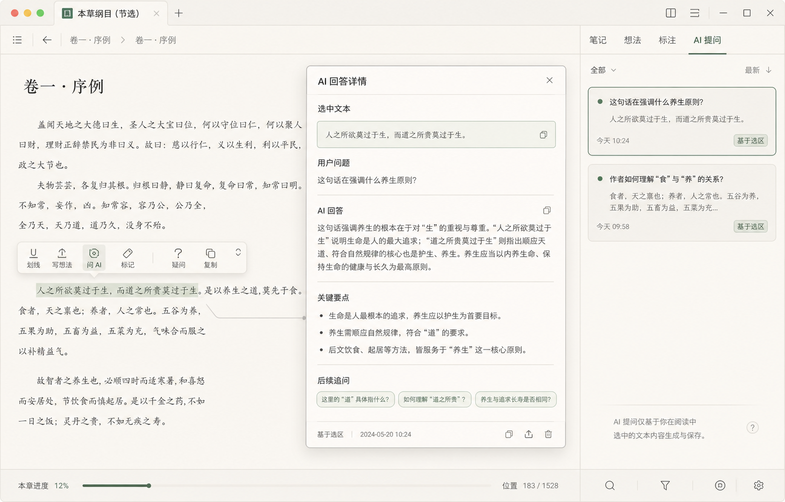

# 本地阅读器 AI 提问收纳态改造计划

## 文档状态

- 状态：已完成首轮实现与复查加固。
- 目标范围：本地阅读器内的选区 AI 提问展示、收纳、详情查看和导出结构。
- 关联文档：`docs/local-reader-second-stage-plan.md`、`docs/local-reader-concept-plan.md`。
- 概念稿：`output/local-reader-ai-question-containment.png`。

## 当前实现状态

- 已新增本地 AI 提问记录列表模型，旧单条草稿可迁移为一条 `draft` 记录。
- 阅读器正文仍只通过选区浮层触发“问 AI”，不在章节、分区或段落下默认渲染 AI 模块。
- 右侧 AI tab 已改为摘要列表；无记录时只显示一次空态。
- 摘要卡展示问题、选区摘要、状态、时间和操作按钮，完整内容进入详情弹窗。
- AI 详情弹窗已支持完整选区、问题、回答、要点、追问、复制、定位、继续追问和删除确认。
- Markdown 导出已从单条草稿扩展为本地 AI 提问记录列表。
- 未配置 AI 时，提问面板主按钮收口为“保存记录”；草稿只作为记录状态和旧数据兼容语义出现。
- 新记录列表损坏时可兜底迁移旧草稿；一旦新记录列表存在，就优先新列表，避免旧草稿重复迁移。
- 验证已通过：`npx tsc --noEmit --pretty false`、`npx vitest run src/lib/local-reader-ai-drafts.test.ts src/lib/local-reader-markdown.test.ts`、`npx playwright test tests/e2e/local-reader.spec.ts`、`npm run build`。



## 背景问题

当前本地阅读器已经支持用户选中文本后向 AI 提问，并且请求边界已经收口为“只发送选区、选区前后文窗口和问题”。但展示层如果把 AI 提问默认渲染在每个章节、分区或正文段落下，会带来几个问题：

- 阅读页会从正文阅读变成 AI 工作台，干扰连续阅读。
- 每个分区默认出现 AI 模块，会造成重复空态和视觉噪音。
- 长问题、长选区或长回答容易撑大卡片，破坏侧栏和正文布局。
- 用户可能误解为应用会自动读取章节、分区或整本书给 AI。
- AI 记录和划线、想法的层级关系会变模糊，后续导出也更容易混乱。

结论：AI 提问不应作为章节或分区的默认模块渲染。它应该是“用户主动选区后的附属记录”，默认被收纳，只在用户需要时展开详情。

## 改造目标

一句话目标：

```text
AI 提问只在用户主动选区后出现入口，回答结果默认收纳为侧栏摘要卡，完整内容通过详情弹窗查看，不干扰正文阅读，不撑大卡片，不扩大到整书 AI 数据输入范围。
```

具体目标：

- 默认阅读态不显示 AI 大卡片。
- 正文每个章节、分区、段落下不默认渲染 AI 提问模块。
- 选中文本后，在正文附近小浮层显示“问 AI”入口。
- 提问后，右侧 AI tab 只显示摘要列表，不平铺完整回答。
- 点击 AI 摘要卡后打开详情弹窗，承载完整选区、问题、回答、要点和追问。
- 长选区、长问题、长回答都不能撑大侧栏卡片或造成横向溢出。
- 未配置 AI 时只允许保存草稿态记录或复制，不展示假回答。

## 非目标

- 不做整本书 AI 问答。
- 不做章节自动总结。
- 不做每个分区默认 AI 面板。
- 不把 AI 回答插入正文成为常驻内容。
- 不把本地 AI 提问进入微信读书笔记列表。
- 不修改本地书和微信读书来源隔离策略。
- 不做移动端阅读器适配。

## 设计结论

### AI 是选区附属记录

AI 提问记录必须归属于一次明确的本地正文选区，而不是归属于章节、分区或整本书。

推荐心智：

```text
选区 -> 问题 -> 回答 -> 本地 AI 提问记录
```

不推荐心智：

```text
章节 -> AI 模块 -> 默认问题 -> 默认回答
```

### 默认收纳，不默认展开

AI 记录的默认展示层级：

```text
正文：只显示选区标记和轻提示
侧栏 AI tab：显示摘要卡列表
详情弹窗：显示完整内容
```

正文不承担完整回答展示；侧栏不承担长文本阅读；弹窗负责完整查看和后续操作。

### 空态只出现一次

没有 AI 记录时，只在右侧 AI tab 内显示一次空态。章节、分区、正文段落、划线卡片下都不重复渲染“暂无 AI 提问”。

## 信息架构

### 正文区域

职责：

- 承载阅读正文。
- 承载用户选区。
- 承载划线、想法、标记和 AI 提问入口。
- 在已有 AI 记录的选区附近显示轻量状态，例如“已提问 1”。

不承载：

- 完整 AI 回答。
- AI 问题列表。
- AI 历史版本。
- 每章 AI 空态。

### 选区浮层

选中文本后出现正文附近浮层，保持紧凑：

- 划线。
- 写想法。
- 问 AI。
- 标记。
- 复制。

当选区已有 AI 记录时，浮层可以显示轻量状态：

- `AI 1` 或 `已提问 1`。
- 点击后打开对应 AI 详情或侧栏 AI tab。

浮层不展示完整回答，也不展示多张回答卡。

### 右侧 AI tab

右侧栏 AI tab 是 AI 记录的默认收纳位置。

每张摘要卡只展示：

- 问题摘要。
- 选中文本摘要。
- 回答状态：草稿、生成中、已回答、失败。
- 创建时间。
- `基于选区` 标签。
- 可选的定位原文按钮。

摘要卡限制：

- 问题最多 2 行。
- 选区摘要最多 2 行。
- 回答摘要最多 3 行，或者不在摘要卡展示回答正文。
- 长 URL、连续英文 token、长数字串必须换行或截断。
- 卡片高度应稳定，不能因一条长回答撑开整个侧栏。

### AI 详情弹窗

点击摘要卡后进入详情弹窗。

弹窗展示：

- 书名和本地版本标识。
- 选区原文。
- 用户问题。
- AI 回答全文。
- 回答要点。
- 建议追问。
- 创建时间和状态。

弹窗操作：

- 复制选区。
- 复制问题。
- 复制回答。
- 定位原文。
- 继续追问。
- 删除记录。

弹窗边界：

- 弹窗内部滚动，不撑大页面。
- 长选区和长回答分区滚动或折叠。
- 连续长 token 不造成横向溢出。
- 删除需要确认，避免误删阅读资产。

## 交互状态

### 默认阅读态

- 正文只展示内容、划线和想法标记。
- 右侧栏默认可停留在目录、划线、想法或 AI tab。
- AI tab 未选中时，不在正文或其他 tab 渲染 AI 空态。

### 选区态

- 用户选中文本后出现小浮层。
- 用户点击“问 AI”后打开紧凑提问面板。
- 面板应贴近正文选区，不移到侧边栏作为主要输入。

### 提问中

- 提问面板显示提交中状态。
- AI tab 可以同步出现一条生成中摘要卡。
- 正文区域不插入大块加载卡片。

### 已回答

- 选区附近可出现轻量状态提示。
- AI tab 出现一张摘要卡。
- 点击摘要卡进入详情弹窗查看完整回答。

### 失败态

- 摘要卡显示失败原因摘要和重试入口。
- 失败详情在弹窗中展示。
- 不把失败状态散落到每个章节或分区。

### 未配置 AI

- “问 AI”入口可以引导用户保存问题草稿或前往配置。
- 不展示虚假的回答、赞同、反对或追问建议。
- 不调用 Provider。

## 数据边界

继续沿用当前第二阶段边界：

- 只发送用户选中文本、选区前后文窗口和问题，不发送整本书。
- 只发送用户主动输入的问题。
- 可以发送书名、作者和选区 offset。
- AI 记录归属 `source: "local"`。
- AI 回答缓存归属本地阅读器选区问答。

禁止发送：

- 整本书正文。
- 当前章节全文。
- 未被用户选择的相邻段落。
- 本地文件路径。
- 数据库路径。
- 文件 hash。
- API Key。
- 微信读书凭据。
- 微信读书笔记正文。

## 建议数据模型

当前已从旧单条草稿升级为列表记录模型，但不引入复杂资产库。

```ts
type LocalReaderAiQuestionRecord = {
  id: string;
  bookId: string;
  source: "local";
  selection: {
    startOffset: number;
    endOffset: number;
    text: string;
  };
  question: string;
  answer?: {
    summary: string;
    content: string;
    keyPoints: string[];
    followUps: string[];
  };
  status: "draft" | "pending" | "answered" | "failed";
  errorMessage?: string;
  createdAt: string;
  updatedAt: string;
};
```

模型约束：

- `bookId + source` 决定本地归属。
- `selection` 使用本地正文 offset，不复用微信读书锚点。
- `answer.summary` 用于侧栏摘要，`answer.content` 只在详情弹窗展示。
- `question` 和 `selection.text` 必须有摘要工具统一裁剪，避免 UI 各处重复实现截断逻辑。

## 实施拆分

### 1. AI 记录列表存储（已完成）

- 新增本地 AI 提问记录存储工具，或将现有草稿存储升级为列表模型。
- 保留旧草稿迁移路径：旧数据可作为一条 `draft` 记录读取。
- 按 `bookId` 读取当前书的 AI 记录。
- 支持创建、更新、删除、定位原文。

验收：

- 同一本书可保存多条 AI 提问记录。
- 旧草稿不丢失。
- 不同本地书之间记录隔离。

### 2. 正文选区入口收敛（已完成）

- 保留正文附近选区浮层的“问 AI”。
- 移除章节、分区或段落下默认 AI 模块。
- 已有 AI 记录只显示轻量计数或状态，不展示完整卡片。

验收：

- 无 AI 记录时，正文和每个分区下都没有 AI 卡片。
- 选中文本后仍能提问。
- 已有记录的选区可定位和打开详情。

### 3. 右侧 AI tab 摘要列表（已完成）

- AI tab 内只展示空态、生成中摘要卡、已回答摘要卡和失败摘要卡。
- “继续追问”不新增顶层摘要卡；追问归入原 AI 提问记录的线程。
- 摘要卡只展示顶层问题、选区摘要、状态、时间和轮次摘要，例如 `2 轮`。
- 摘要卡点击打开详情弹窗。
- 卡片内文本统一裁剪，长 token 不溢出。

验收：

- AI tab 空态只出现一次。
- 多条记录不会撑大侧栏。
- 同一选区的多轮追问不会让右侧顶层 AI 卡片数量增加。
- 长问题、长选区、长回答摘要仍保持卡片高度稳定。

### 4. AI 详情弹窗（已完成）

- 复用划线和想法详情弹窗的边界处理经验。
- 完整选区、问题和回答在弹窗内分区展示。
- 继续追问作为当前 AI 记录下的线程展示，不归入“想法”，也不创建新的顶层 AI 记录。
- 弹窗主体作为主滚动容器，AI 回答自然展开，不再让回答正文自己出现局部滚动。
- 选中文本和追问线程保留局部滚动，避免超长原文或多轮追问抢占整个弹窗。
- 面板最大高度扣除顶部偏移和底部安全距，矮屏下底部操作区不被内容挤出视口。
- Chromium/WebKit 滚动条使用细条兜底，隐藏滚动条按钮，避免绿色滚动箭头贴近正文。
- 支持复制、定位、追问和删除。

验收：

- 点击摘要卡能查看完整内容。
- 长回答跟随弹窗主体滚动，不产生回答区内部滚动条。
- 超长选区和多轮追问仍有局部滚动边界；追问线程长列表不会把详情面板无限撑高。
- 底部操作区固定在弹窗第三段，不被正文挤压。
- 删除有确认。

### 4.1 AI 详情弹窗可视化分析补充

问题判断：

- 截图中的割裂感主要来自“回答正文内部滚动”与“弹窗主体滚动”同时存在，用户阅读时会误以为回答被裁切。
- 右侧绿色滚动箭头贴近正文，是局部滚动容器暴露了浏览器默认滚动条控件，视觉上比正文内容更抢眼。
- 原面板高度只按 `100vh - 76px` 约束，没有扣除右侧 sidecar 面板的顶部偏移，矮屏时 footer 仍有贴底风险。

修正策略：

- 只保留弹窗 body 作为主阅读滚动层，让 AI 回答、要点和依据说明组成一段连续内容。
- 只对“选中文本”和“追问线程”这两类天然可能很长、但不是主阅读内容的区域保留局部滚动。
- 面板高度使用“视口高度 - 顶部偏移 - 底部安全距”的公式，保证 header、body、footer 三段关系稳定。

Playwright 回归补充：

- 视觉脚本在长回答 + 10 条追问数据下复现了回答区被压缩的问题：弹窗 body 仍继承通用 `display: grid`，在有限高度内会压缩后续 section，导致回答正文和追问区视觉重叠。
- 修正后 AI 详情 body 改为普通文档流滚动；回答正文显式 `overflow: visible`，不再成为局部滚动容器。
- 已用 1280 x 720、1120 x 560、390 x 720 三组视口验证：面板和 footer 均在视口内，无横向溢出；回答区无内部滚动；选中文本和追问线程仍保留局部滚动。

### 5. Markdown 导出更新（已完成）

- 导出已从旧单条草稿扩展为 AI 提问记录列表。
- 每条记录保留选区、问题、回答状态和回答内容。
- 同一记录下的追问线程随该 AI 提问记录导出，不拆成新的顶层 AI 提问，也不导出到想法分区。
- 仍然只导出本地来源，不读取微信读书笔记。

验收：

- 多条 AI 记录可以稳定导出。
- 草稿、失败、已回答状态能区分。
- 导出 front matter 仍保留 `source_kind: local`。

## UI 规则

- AI 提问入口跟随选区，不跟随章节。
- AI 回答详情跟随弹窗，不跟随侧栏卡片。
- 侧栏只做摘要收纳，不做长文本阅读。
- 空态只在 AI tab 出现一次。
- 不使用大面积提示文案解释功能。
- 不增加未实现的筛选、排序和批量操作。
- 所有长文本容器必须有最大高度、换行和溢出策略。

## 测试计划

### 单元测试

- AI 记录按 `bookId` 隔离。
- 旧单条草稿迁移为记录列表。
- 继续追问以线程 turn 写入同一 AI 记录。
- 损坏的追问线程数据会被过滤或降级，不阻塞记录列表读取。
- 追问线程有数量上限，避免坏缓存拖垮 UI。
- 长问题摘要裁剪。
- 长选区摘要裁剪。
- 长回答摘要裁剪。
- 连续英文 token 和 URL 不破坏摘要。
- Markdown 导出多条 AI 记录。

### 前端组件测试

- 无记录时 AI tab 只显示一个空态。
- 摘要卡展示问题、选区、状态、时间和标签。
- 点击摘要卡打开详情弹窗。
- 详情弹窗展示完整选区、问题和回答。
- 删除记录需要确认。

### E2E 测试

- 默认进入阅读器时，章节或分区下不渲染 AI 提问卡片。
- 选中文本后出现“问 AI”入口。
- 未配置 AI 时不展示假回答。
- 配置 AI 后，提交问题才发起请求。
- 回答完成后侧栏只出现摘要卡。
- 继续追问后侧栏仍只保留同一条摘要卡，并显示轮次摘要。
- 点击摘要卡打开详情弹窗。
- 长回答不会撑开侧栏或页面。
- 追问线程长列表在详情内局部滚动，不横向溢出。
- Markdown 导出包含本地 AI 提问记录，不包含微信读书字段。

## 验收标准

- [x] 正文和每个章节/分区下不默认显示 AI 提问模块。
- [x] AI tab 无记录时只显示一次空态。
- [x] 选区浮层仍可问 AI。
- [x] AI 摘要卡不展示完整长回答。
- [x] 点击 AI 摘要卡可打开详情弹窗。
- [x] 长选区、长问题、长回答不撑大侧栏卡片。
- [x] 继续追问归入同一 AI 记录线程，不新增顶层卡片。
- [x] 多轮追问在线程区局部滚动，不撑高详情面板。
- [x] 未配置 AI 时不展示假回答和假反馈控件。
- [x] 配置 AI 后只发送用户选区、前后文窗口和问题。
- [x] AI 记录归属本地来源，不进入微信读书笔记列表。
- [x] Markdown 导出支持多条本地 AI 提问记录。

## 风险和应对

### 阅读器变成工作台

风险：AI 入口过度常驻，阅读页失去正文优先。

应对：AI 默认收纳，正文只保留选区入口和轻量状态。

### 长文本撑破布局

风险：长回答或长选区让侧栏卡片高度异常。

应对：侧栏只展示摘要，完整内容进入弹窗；所有摘要使用统一裁剪工具。

### 用户误解 AI 输入范围

风险：用户以为 AI 读取了章节或整本书。

应对：提问面板保留轻量边界提示，详情弹窗不再常驻整块硬编码边界说明；请求层继续禁止整书输入。

### 数据来源混淆

风险：本地 AI 记录进入微信读书笔记或跨来源导出。

应对：记录必须保留 `source: "local"`，导出和列表查询按来源过滤。

## 工程原则

- KISS：只改 AI 提问展示链路，不重做阅读器信息架构。
- YAGNI：不提前做全文问答、章节总结、向量库或跨书追问。
- DRY：摘要裁剪、长文本换行和详情弹窗边界复用现有划线/想法能力。
- SOLID：AI 记录存储、请求构造、摘要展示、详情弹窗和 Markdown 导出分层，避免 UI 直接拼 Provider payload。
