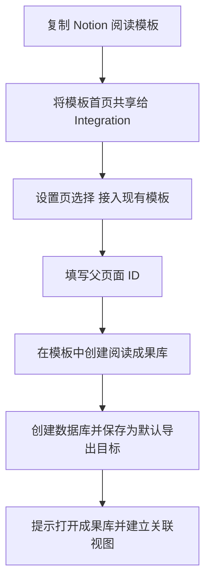

# Notion 现有模板接入设计

## 1. 背景与问题

当前 Notion 设置页只有一个模板初始化入口：`创建 Notion 工作台`。它会在指定父页面下创建新的 `微信读书知识库` 首页和 `阅读成果库` 数据库。

这个路径适合没有现成 Notion 首页的用户，但不适合已经复制了模板市场阅读模板的用户。此时用户真正需要的是：

> 保留现有模板的首页、书架和视觉设计，只在该页面下创建一个与 wxreadmaster 兼容的 `阅读成果库`，并将它设为默认导出目标。

后端已经实现 `create_notion_reading_library_template`，但设置页未提供入口。这导致功能存在而用户无法完成“模板市场 UI + 一键导出”的预期流程。

## 2. 设计结论

Notion 初始化保留两个互斥的模式，但产品呈现应以“接入现有模板”为主路径：

| 模式 | 面向用户 | 创建内容 | 默认导出目标 |
| --- | --- | --- | --- |
| `从零创建工作台` | 没有现有模板 | 首页 + `阅读成果库` | 新建的 `阅读成果库` |
| `接入现有模板` | 已复制 Notion 模板 | 仅 `阅读成果库` | 新建的 `阅读成果库` |

两条路径复用同一份数据库字段、Notion 凭据和导出适配器，不新增第二套数据模型。

内置工作台不是主推的视觉方案，而是没有模板时的可控兜底。这样既能给用户成熟的 Notion 前端，也不会把核心初始化能力绑定到第三方模板市场。

## 3. 目标

- 用户能理解“完整工作台”和“现有模板接入”的区别。
- 用户复制任意兼容阅读模板后，可在该模板页面下创建 `阅读成果库`。
- 创建成功后，后续 Notion 导出自动写入新数据库。
- 不要求用户把模板原有的书库数据库改造成导出数据库。
- 不影响已有 Notion 目标配置、Obsidian 导出和双目标导出。

### 3.1 名称约定

无论通过哪种初始化方式创建，应用创建的唯一导出数据库名称统一为 `阅读成果库`。

`wxreadmaster 阅读库` 不再作为新建数据库名称使用。统一名称使模板接入说明、关联视图配方、成功反馈和实际 Notion 对象保持一致。

## 4. 非目标

- 不自动改造第三方模板的属性、公式、关联或视图。
- 不自动创建 linked database 视图。
- 不把第三方模板自带书库直接作为导出目标。
- 不实现 Notion 双向同步。
- 不重构既有 Notion 导出协议或数据库 schema。

## 5. 用户与使用场景

### 5.1 新用户

用户没有 Notion 阅读模板，只想快速得到可用的知识库。

默认先复制推荐模板；若不希望使用模板，再选择 `没有模板？创建基础工作台`，由应用创建首页和成果库。

### 5.2 模板市场用户

用户已复制 Books Tracker、Reading Dashboard、Book Notes 等模板，希望沿用其视觉设计。

选择 `接入现有模板`，填写已共享给 Integration 的模板首页 ID。应用只创建 `阅读成果库`，不创建第二个首页。

### 5.3 高级用户

用户已经手动建好了符合字段约定的 Notion 数据库。

继续使用现有“高级目标”区域手动配置目标 ID、目标类型和封面策略；该路径不变。

## 6. 信息架构与界面

Notion 设置卡片按“先选路径，再执行”的顺序组织。

```text
Notion 阅读库导入
  状态：Token / 导出目标
  Integration Token

  推荐模板
    Books Tracker by VPM [复制模板]

  初始化方式
    [接入现有模板]
      保留模板首页，只创建阅读成果库
    [没有模板？创建基础工作台]
      创建首页 + 阅读成果库

  父页面链接或 ID
  主操作按钮（随模式变化）

  高级目标
    目标 ID / 目标类型 / 封面策略
```

### 6.1 模式选择控件

使用分段控件或两个并列的选择卡片，不使用下拉框。

原因：两种模式的结果差异显著，需要在点击前可见地表达创建范围。

| 选择项 | 标题 | 辅助说明 | 创建结果 |
| --- | --- | --- | --- |
| `workspace` | 从零创建工作台 | 适合没有现成模板的用户。 | `微信读书知识库` + `阅读成果库` |
| `existingTemplate` | 接入现有模板 | 保留当前模板首页，只增加导入数据库。 | `阅读成果库` |

默认值：`existingTemplate`。

默认理由：用户对 Notion 前端的第一诉求是成熟、可持续使用的视觉体验。推荐模板提供书架、仪表盘和笔记入口；应用只负责创建兼容的成果库和持续导入。内置工作台仍可作为不依赖外部模板的备用路径。

### 6.1.1 推荐模板入口

在模式选择之前提供一个不抢占操作区的模板推荐行：

```text
推荐模板：Books Tracker by VPM
适合作为书架与阅读仪表盘；wxreadmaster 会把成果写入独立的阅读成果库。
[复制模板]
```

`复制模板` 仅打开官方模板页面，不记录用户的 Notion 内容，也不代表应用购买或分发第三方模板。P0 使用本地常量维护推荐链接；确实出现多模板运营需求时，再评估配置化。

### 6.2 模板接入模式的说明

在 `existingTemplate` 模式下，父页面链接或 ID 下方显示短说明：

```text
将复制后的模板首页共享给 wxreadmaster Integration。可直接粘贴页面链接或页面 ID；应用会在此页面下新建“阅读成果库”，不会修改模板原有书库或视图。
```

不在页面展示长教程。首次创建成功后，通过成功 Toast 和结果链接提供下一步。

### 6.3 主操作文案

| 状态 | workspace | existingTemplate |
| --- | --- | --- |
| 可执行 | `创建基础 Notion 工作台` | `在模板中创建阅读成果库` |
| 执行中 | `创建基础工作台中` | `创建成果库中` |
| 缺少父页面链接或 ID | 禁用 | 禁用 |
| 缺少 Token | 允许输入 Token 后执行；保存失败时提示 | 相同 |

主按钮必须和选择模式一一对应，避免“创建工作台”实际只创建数据库的歧义。

## 7. 交互流程

### 7.1 接入现有模板



### 7.2 创建调用

1. 前端接收 Notion 页面链接或纯页面 ID，提取并校验唯一的页面 UUID；输入无效时不发起网络请求。
2. 若用户本次输入了 Token，先保存 Token，再调用创建命令。
3. 若已有默认 Notion 导出目标，先展示确认提示，明确“创建后，后续导出会改为写入新的阅读成果库”。用户确认后再继续。
4. 调用 `create_notion_reading_library_template(parentPageId)`。
5. 成功后以响应中的 `databaseId` 更新前端 `notionParentId`，将类型切换为 `database`。
6. 保留用户当前的封面策略；创建数据库不得覆盖为 `pageCover`。后端状态只刷新实际保存后的配置。
7. 清空临时父页面输入，显示创建结果面板。

该流程与完整工作台创建保持一致，差异仅是调用命令和成功反馈内容。

### 7.3 重复创建与结果未知

Notion 创建数据库没有可用的幂等键。P0 不自动重试创建请求：

- 请求进行中必须禁用两种创建操作，防止连续点击创建多个数据库。
- 明确的权限、输入或 Token 错误可在修复后重试。
- 网络中断、超时或响应解析失败属于“结果未知”。提示用户先在模板首页确认是否已经出现 `阅读成果库`；已创建时应从高级目标配置该数据库 ID，而不是再次创建。
- 创建成功后立即保存默认导出目标，避免应用重新打开后重复初始化。

这比在客户端猜测远端是否已创建更可靠，也避免因未知结果产生不可见的重复数据库。

## 8. 数据与职责边界

### 8.1 前端

- 维护仅用于初始化的 `notionTemplateParentPageId`。
- 新增 `notionInitializationMode`，值为 `workspace | existingTemplate`。
- 根据模式调用已有的不同 API 函数。
- 解析 Notion 页面链接，向后端传递规范化页面 ID。
- 不解析、修改或迁移第三方模板数据库。

### 8.2 后端

- `create_notion_reading_workspace_template`：保留，创建首页和数据库。
- `create_notion_reading_library_template`：复用，创建名称为 `阅读成果库` 的数据库并保存默认导出目标。
- 导出适配器：不改动，继续向 `阅读成果库` 写入正文、封面和可匹配字段。

创建服务不得重置已有 `NotionCoverMode`。初始化动作只改变默认导出目标，封面策略仍由用户在设置中控制。

### 8.3 Notion 模板

- 模板原有 `Book Library`、`Reading List` 等数据库由用户保留和维护。
- `阅读成果库` 仅承接 wxreadmaster 的书籍笔记、书籍复盘、阅读路线、统计复盘和选书决策。
- 用户可在模板首页手动添加 `阅读成果库` 的关联视图。

这保证模板展示层与应用导入层解耦，避免字段冲突。

## 9. 成功与失败反馈

### 9.1 成功

接入现有模板成功时显示：

```text
阅读成果库已创建，后续 Notion 导出将自动写入此数据库。
```

成功后在设置页保留本次创建结果面板，直到用户离开当前页面：

- `打开阅读成果库`：使用响应中的数据库 URL。
- `复制视图配方`：复制四个首页关联视图的筛选和排序说明。
- `已设为默认导出目标`：明确说明后续 Notion 导出的去向。

Toast 仅用于通知，不承担配置教程或链接入口。

### 9.2 可恢复失败

| 情况 | 提示 | 恢复方式 |
| --- | --- | --- |
| 未填或无法解析父页面链接 / ID | `请输入已共享给 Integration 的 Notion 页面链接或页面 ID。` | 修正输入后重试 |
| Token 未保存或失效 | 显示后端安全错误，不回显 Token | 保存有效 Token 后重试 |
| 父页面未共享给 Integration | 提示检查 Notion 页面连接权限 | 在 Notion 为页面添加 Integration 后重试 |
| 明确创建失败 | 保留父页面输入与当前模式 | 修复权限或网络后重试 |
| 网络超时或结果未知 | 不自动重试 | 先在模板中检查是否已有 `阅读成果库`，必要时从高级目标配置 |

失败时不得清空 `notionTemplateParentPageId`，避免用户重复复制页面链接或 ID。

## 10. 模板市场接入指引

推荐以 Books Tracker、Reading Dashboard、Book Notes 等“首页 + 书架/笔记”类模板作为展示层。

接入后的最小人工配置：

1. 在模板首页添加 `阅读成果库` 的关联数据库视图。
2. 建立“最近导入”视图：按 `导出时间` 倒序。
3. 建立“书籍复盘”视图：筛选 `资产类型 = 书籍复盘`。
4. 建立“待整理”视图：筛选 `导入状态 = 待整理`。
5. 建立“行动优先”视图：筛选 `行动数 > 0`。

模板原书库不需要删除。建议将其用于想读清单或候选书架，而不是应用导出的成果库。

### 10.1 Books Tracker by VPM 的最小适配

`Books Tracker by VPM` 适合作为推荐展示模板，但只做页面级拼接，不改造其数据模型。

| 模板区域 | 处理方式 | 责任归属 |
| --- | --- | --- |
| 首页封面、书架和仪表盘 | 保留 | 模板 |
| Book Library | 保留，可改名为“候选书架”或“手动书库” | 用户 / 模板 |
| 阅读目标、进度、书评、笔记区 | 保留；不作为应用导出目标 | 用户 / 模板 |
| `阅读成果库` | 在模板首页下新建 | wxreadmaster |
| 微信读书导入区域 | 在首页新增关联数据库视图 | 用户一次性配置 |

不修改模板原有关系、公式、汇总、封面字段和状态字段。这样模板升级、用户自定义或停止使用应用时，都不会影响原来的书架数据。

### 10.2 首页插入位置

在模板现有仪表盘之后、原始书库之前加入一个独立分区：

```text
微信读书导入
  最近导入
  书籍复盘
  待整理
  行动优先

原有 Book Library / Currently Reading / Reading Goals
```

该分区使用模板已有的标题层级、分隔线和数据库视图样式；不新增装饰性说明卡片。用户打开首页时先看到正在阅读和最新导入，向下仍可进入原模板的书库与目标。

### 10.3 关联视图配方

四个视图的数据源均为 `阅读成果库`：

| 视图 | 推荐布局 | 过滤 | 排序 | 作用 |
| --- | --- | --- | --- | --- |
| 最近导入 | Table | 无 | `导出时间` 倒序 | 检查最新导出是否成功 |
| 书籍复盘 | Gallery | `资产类型 = 书籍复盘` | `导出时间` 倒序 | 浏览有封面和完整正文的单书成果 |
| 待整理 | List | `导入状态 = 待整理` | `导出时间` 倒序 | 处理需要二次标记的成果 |
| 行动优先 | List | `行动数 > 0` | `行动数` 倒序，再按 `导出时间` 倒序 | 从复盘、路线和决策中找下一步 |

首版由用户按配方创建视图。Notion API 对复杂 linked database 视图的可控性不足，不把自动创建作为接入成功的前置条件。

### 10.4 可选的轻量文案

分区标题下可保留一条说明：

```text
微信读书导出内容会进入阅读成果库；模板原书库继续用于手动管理想读与在读书籍。
```

该说明应使用普通小字或折叠块，不能替代数据库视图，也不应占据首页视觉焦点。

## 11. 实施范围

### P0

- 在设置页引入初始化模式选择，默认 `existingTemplate`。
- 展示一个由本地常量维护的推荐模板入口及其使用边界。
- 暴露 `createNotionReadingLibraryTemplate` 调用。
- 新增仅创建成果库的事件处理器、加载状态和 Toast 文案。
- 支持 Notion 页面链接与纯 ID 输入，并覆盖提取与无效输入测试。
- 当已有导出目标时，创建前要求用户确认切换目标。
- 按模式切换主按钮文本与辅助说明，并在成功后展示结果面板与视图配方入口。
- 统一仅建库与完整工作台创建出的数据库名称为 `阅读成果库`。
- 创建服务保留用户的封面策略。
- 更新设置页相关测试和本设计文档。

### P1

- 根据用户反馈增加第二个或更多推荐模板，但不改变导出数据库 schema。

### 不做

- 购买、下载或自动复制第三方模板。
- 自动往第三方首页写入块内容。
- 自动创建 Notion linked database 视图。

## 12. 验收标准

- 设置页默认突出“接入现有模板”，并能清晰切换到“创建基础工作台”。
- 推荐模板入口只负责打开外部模板页面，不影响 Token、目标 ID 和导出配置。
- 选择后主按钮、辅助说明、加载状态均随模式变化。
- 接入模式调用 `create_notion_reading_library_template`，不会创建 `微信读书知识库` 首页。
- 推荐模板接入不修改 `Books Tracker by VPM` 的原有数据库、属性、公式或关联。
- 模板首页可按配方添加四个指向 `阅读成果库` 的关联视图。
- 成功后默认导出目标为新建 `阅读成果库` 的 database ID。
- 两种初始化方式创建的数据库名称均为 `阅读成果库`。
- 创建数据库不会重置用户已选择的封面策略。
- 输入支持完整 Notion 页面链接和纯页面 ID；无效输入不发送 Notion 请求。
- 已有导出目标时，用户必须确认后才允许创建并切换默认目标。
- 网络结果未知时，不自动重试创建请求，并给出检查已有数据库的恢复指引。
- 成功后可直接打开成果库，并获得四个关联视图的配置说明。
- 完整工作台模式仍调用 `create_notion_reading_workspace_template`，现有行为不变。
- Token、父页面权限或网络失败时，用户输入的父页面 ID 不丢失。
- 现有高级目标保存、Notion 导出、Obsidian 导出及双目标导出无回归。

## 13. 设计原则

- KISS：两个模式共用一张设置卡片和同一份父页面输入，不新增向导页。
- YAGNI：不自动改造第三方模板，也不提前支持任意模板字段映射。
- DRY：复用现有创建命令、状态刷新和导出配置写入逻辑。
- SOLID：初始化模式只决定资源创建策略；导出目标适配、凭据管理和 UI 状态职责保持分离。
