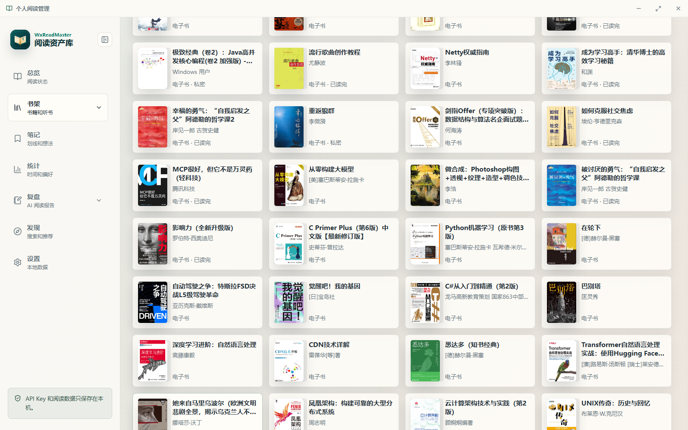
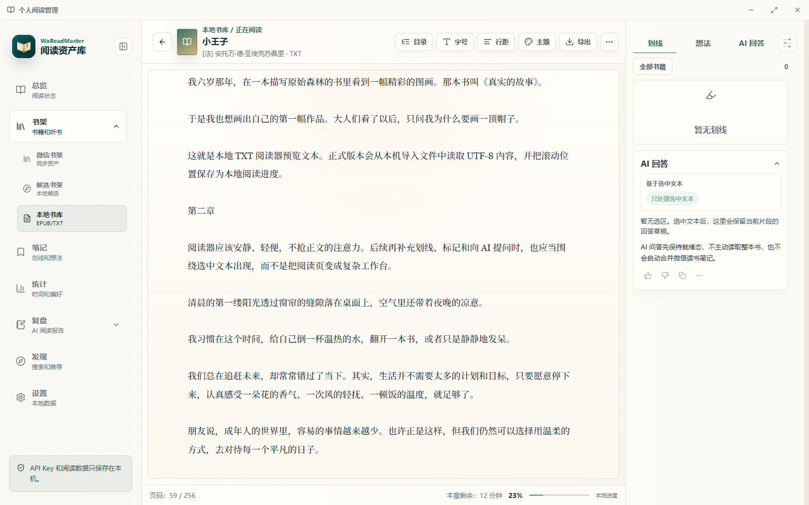
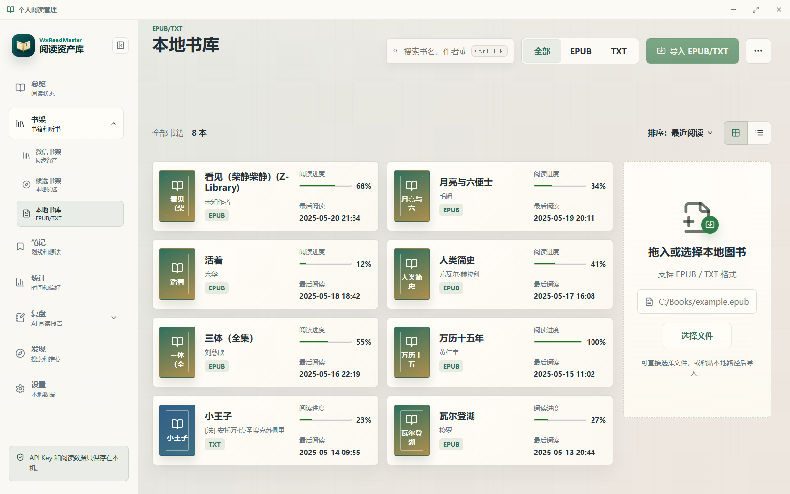

# WxReadMaster 使用教程

适用版本：`v1.0.16`

这份教程按“先配置、再同步、后整理、最后导出”的顺序写，尽量对应软件里的真实入口。

## 功能索引：按目标找入口

| 你的目标 | 推荐入口 | 说明 |
| --- | --- | --- |
| 第一次连接微信读书 | `设置 > 账户与同步` | 保存 API Key 后再同步 |
| 更新书架、笔记或统计 | `书架`、`笔记`、`统计` | 各页面分别同步对应数据 |
| 找下一本书 | `发现` | 搜索、推荐、相似书都从这里开始 |
| 暂存想读书单 | `候选书架` | 候选数据保存在本机 |
| 导入 EPUB、TXT 或 Markdown | `本地书库` | 导入后进入本地阅读器 |
| 边读边划线和写想法 | `本地阅读器` | 选中文本后操作 |
| 整理一本书的阅读成果 | `书籍详情 > AI 复盘` 或 `复盘` | 需要已同步的笔记或本地缓存 |
| 制定下一步阅读顺序 | `书籍详情 > 本书阅读指南` | 可从单本扩展到候选书路线 |
| 查看长期阅读趋势 | `统计` | 总计、年度、月度、周度均可下钻 |
| 导出 Markdown | `笔记`、`复盘`、`本地阅读器` | 使用当前设置中的导出目录 |
| 备份或迁移本机数据 | `设置 > 高级维护` | 操作前建议先导出备份 |
| Android 同步排障 | `我的 > 代理与网络诊断` 或 `设置 > 账户与同步` | 只影响微信读书同步网络 |

## 0. 15 分钟快速上手

1. 先去 `设置 > 账户与同步` 保存微信读书 API Key。
2. 再去 `设置 > AI 设置` 填好 AI Provider、模型和 Key。
3. 回到 `书架` 点击 `同步书架`，把微信读书数据拉到本机。
4. 打开 `笔记`，挑一本“有想法”的书进去看。
5. 在书籍详情或笔记页先试一次 `本书阅读指南`。
6. 再试一次 `AI 复盘`，最后确认导出目录是否正确。

## 1. 先弄懂三类数据

1. 微信读书数据：书架、笔记、统计、发现结果，先同步到本机。
2. 本地图书数据：EPUB、TXT、Markdown 导入后独立管理。
3. AI 阅读资产：复盘、阅读指南、阅读报告、选书决策、助手对话，都会保存在本机。

## 2. 首次使用

1. 从 GitHub Releases 安装并启动。
2. 先到 `设置 > 账户与同步` 保存微信读书 API Key。
3. 如需同步不稳定，在同页填写微信读书网络代理。
4. 到 `设置 > AI 设置` 配置 AI Provider、模型和 API Key。
5. 到 `设置 > 导出设置` 选好导出目录。
6. 如果你暂时不想用 AI，也可以先只完成同步和本地阅读，后面再补配置。

## 3. 主页面怎么用

### 总览

- 看最近同步状态、阅读人格、今日可做事项和最近队列。
- 适合先判断“今天该继续读、复盘还是整理”。

### 书架

- `微信书架`：同步后的主书架。
- `候选书架`：保存过的候选书，只保存在本机。
- `本地书库`：自己导入的 EPUB/TXT/Markdown。

### 笔记

- 看每本书的划线、想法和书签。
- 支持单本查看和批量导出。

### 统计

- 看周度、月度、年度和总计阅读统计。
- 支持下钻到更细周期，并生成阅读报告图片。

### 复盘

- 管理单本复盘、阅读指南和阅读报告。
- 这里是 AI 阅读资产的总入口。

### 发现

- 搜索书、看推荐、找相似书。
- 适合把新书加入候选池。

### 设置

- 管理账号、AI、导出、更新、备份和诊断。

### 我的（移动端）

- 这是移动端的低频入口，集中放同步、统计、发现、本地书库、设置和本地安全相关功能。
- 如果你主要在 Android 上使用，可以把它当成“快捷控制台”。

### 界面预览

| 总览 | 书架 | 笔记 | 本地阅读器 |
| --- | --- | --- | --- |
|  |  |  |  |
| 先看今天该做什么 | 先同步和筛书 | 先找可复盘材料 | 选中文字后直接记和问 |

| 本地书库 | 设置 |
| --- | --- |
|  |  |
| 导入本地书和关联版本 | 配置账号、AI、导出和备份 |

### 页面速查表

| 页面 | 你进去主要做什么 | 关键结果保存到哪里 |
| --- | --- | --- |
| 总览 | 看今天该做什么、最近同步和阅读人格 | 本地缓存 |
| 书架 | 同步、筛选、保存候选、进入详情 | 本地缓存和候选书架 |
| 笔记 | 看划线、想法、建议复盘、批量导出 | 本地缓存和导出目录 |
| 统计 | 同步统计、切换周期、生成报告 | 本地缓存和导出目录 |
| 复盘 | 看书籍复盘、阅读指南、阅读报告 | 本地 AI 资产缓存 |
| 发现 | 搜索、推荐、相似书、保存候选 | 候选书架和本地搜索历史 |
| 本地阅读器 | 阅读本地书、划线、写想法、问 AI | 本地阅读数据和 Markdown 导出 |
| 设置 | 配置凭据、AI、导出、更新、备份、诊断 | 本机安全存储和本地数据库 |

## 4. 书架功能

### 微信书架

1. 在 `书架` 页点击 `同步书架`。
2. 用 `全部 / 电子书 / 有声书 / 文章收藏`、分类和书单缩小范围。
3. 搜索框支持书名、作者和分类关键词，适合快速定位目标书。
4. 在书卡菜单里可复制书名、去发现页搜索、保存候选。
5. 电子书卡片通常更适合进入详情、复盘和阅读指南；文章收藏更适合先当作素材浏览。

### 候选书架

1. 先在 `发现` 页把书保存成候选。
2. 回到 `候选书架` 里确认、移除或搜索书源。
3. 如果候选是 AI 推荐，还可以先确认它在微信读书里是否能搜到。
4. 需要决策时，点 `推荐下一本` 进入选书决策。
5. 候选池越干净，后面的选书决策越好读。

### 本地书库

1. 在 `本地书库` 选择文件或粘贴路径。
2. 支持 `EPUB`、`TXT`、`Markdown`。
3. 可切换网格/列表视图，并把本地书和微信读书版本关联起来。
4. 关联后的版本只是帮助你确认“同一本书的两个来源”，不会自动合并数据。
5. 导入完成后可以直接打开本地阅读器继续读。

## 5. 本地阅读器

1. 从本地书库打开书。
2. 用目录、字号、行距、主题和搜索调整阅读体验。
3. 选中文本后可直接：
   - 划线
   - 写想法
   - 问 AI
4. 右侧侧栏可查看划线、想法和 AI 提问记录。
5. 导出按钮可输出 Markdown。
6. 本地书和微信书默认隔离，适合边读边记，不会影响微信读书原始数据。

本地阅读器中的 AI 提问需要在桌面应用中执行；如果当前是 Web 预览或不支持本地命令的环境，仍可阅读和整理已有内容，但不能发起新的本地阅读器 AI 请求。

## 6. 笔记与批量导出

### 单本笔记

1. 进入某本书的笔记页。
2. 在卡片视图和章节视图之间切换。
3. 需要整理时，先看“建议复盘”。
4. 可以导出 Markdown，或直接进入 AI 复盘。
5. 如果你只是想先看材料密度，笔记页的统计条就足够判断这本书值不值得整理。

### 批量导出

1. 在笔记页点 `批量导出`。
2. 先预检本地缓存。
3. 选择导出策略和并发数。
4. 需要的话只导出选中的书，或排除无划线/想法的书。
5. 预检通过后再执行，能避免把空书、无内容书和不需要的条目一起导出。

## 7. 统计与阅读报告

1. 在 `统计` 页先同步当前周期。
2. 用 `总计 / 年度 / 月度 / 周度` 切换视角。
3. 总计页可以继续下钻到年份，年度页可以继续到月份。
4. 点 `生成阅读报告` 或 `生成长期复盘`。
5. 图片可导出、保存到相册或分享。
6. 周度更适合看短期节奏，月度适合看主题波动，总计适合看长期结构。

## 8. 复盘中心

### 书籍复盘

- 把单本笔记整理成结构化复盘。
- 包含主题、关键观点、行动项、代表性摘录和复盘问题。
- 适合在读完一章、一本书或一个阶段后做一次收束。

### 阅读指南

- 给当前书生成下一步阅读路线。
- 加入候选后还能生成跨书路线图。
- 它更像“这本书接下来怎么读”的路线图，不是单纯的摘要。

### 阅读报告

- 按周期查看已经生成的阅读成果。
- 可回看、更新、导出 Markdown。
- 如果统计数据变化了，可以重新生成，旧版本会留在历史里。

## 9. 书籍详情

1. 先看书籍信息和本地整理状态。
2. 可标记 `待复盘`、`已整理`、`已读完` 等状态。
3. 可进入：
   - `AI 复盘`
   - `本书阅读指南`
   - `找相似`
4. 还能看热门划线、公开书评和划线下读后感。
5. 如果你还没决定要不要整理，先把状态标成 `待复盘` 通常最稳。

## 10. 发现页

1. 输入书名、作者或主题词。
2. 选择搜索范围。
3. 也可以直接看推荐和相似书。
4. 找到合适的书后，保存为候选。
5. 这里更像“找下一批书”，不是单纯的检索页。

## 11. AI 阅读助手

1. 从右下角或相关页面打开。
2. 选择上下文范围：
   - 全局
   - 当前书
   - 笔记
   - 统计
   - 候选书
   - AI 资产
   - 本地选区
3. 可切换个性化上下文、阅读记忆、原始笔记和历史保存。
4. 支持查看历史线程、继续追问、清空对话历史。
5. 还能把 AI 推荐的新书直接加入候选池。
6. 如果你不想让模型看到原始笔记，保持原始笔记关闭即可。

注意：AI 阅读助手需要在桌面应用中使用。Android 或 Web 只读预览可以查看已经缓存或导出的结果，但不能依赖它们生成新的助手回答；需要生成时请回到桌面应用，并确认 AI 设置有效。

## 12. 设置页

### 账户与同步

- 保存微信读书 API Key。
- 配置 Android 代理。
- 查看凭据状态和同步状态。
- 微信读书代理只影响同步，不影响 AI 或应用更新。

### AI 设置

- 选择 Provider 预设。
- 输入或刷新模型。
- 保存 AI API Key。
- 测试连通性和兼容性。
- 如果刷新模型失败，也可以直接手动输入模型名继续使用。

### 导出设置

- 修改 Markdown、复盘、诊断等文件的导出目录。
- 只会影响之后新生成的文件，不会搬动旧文件。

### 应用更新

- 检查 GitHub Releases 更新。
- 先看摘要，再安装。

### 备份与诊断

- 可导出本地备份、恢复备份、导出诊断信息、查看数据库路径。
- 备份只包含本地数据库和辅助文件，不包含 API Key。

#### 备份与恢复的正确顺序

1. 进入 `设置 > 高级维护`，先执行 `导出本地备份`。
2. 将备份包放到不会被清理的位置，例如专用备份目录或外部磁盘。
3. 需要恢复时选择本地备份包，再确认恢复操作。
4. 恢复成功后完全退出并重新启动应用，让所有页面重新读取数据库。
5. 重启后先检查书架、笔记和复盘，再继续同步或导出。

恢复备份不会把 API Key 放进备份包；凭据仍由本机安全存储管理。恢复前后的应用版本差异较大时，先升级到兼容版本，并保留原备份包。

#### 数据目录迁移

当系统盘空间不足，或希望把本地数据库放到其他磁盘时，可在高级维护中选择目标数据目录并执行迁移。迁移完成后需要重启；API Key 会继续保留在本机安全存储中。迁移过程中不要强制退出应用，也不要把目标目录选到临时下载目录。

## 13. Android 使用差异

- Android 使用顶部栏和侧边抽屉导航，桌面窗口控制不会显示；低频入口集中在 `我的` 页面。
- 书架、笔记、统计、发现和本地书库仍按相同功能划分；找设置时优先打开 `我的 > 设置`。
- 微信读书同步失败时，优先在 `我的 > 代理与网络诊断` 或 `设置 > 账户与同步` 检查代理。代理地址应使用代理工具实际提供的 HTTP 或 SOCKS 端口。
- 阅读报告图片支持保存到系统相册或通过系统分享；桌面端通常使用文件导出或下载。
- Android 不支持应用内下载安装更新，需要前往 GitHub Release 下载最新 APK，并按系统安装流程完成更新。
- AI 阅读助手和本地阅读器 AI 提问需要桌面应用；Android 适合查看同步数据、阅读本地内容和查看已生成资产。

## 14. 导出产物说明

| 产物 | 入口 | 内容边界 |
| --- | --- | --- |
| 单本笔记 Markdown | `笔记 > 某本书` | 划线、想法/点评和章节信息；不含书签正文 |
| 批量笔记 Markdown | `笔记 > 批量导出` | 按预检和筛选结果导出多本书的本地缓存 |
| 书籍复盘 Markdown | `书籍详情 > AI 复盘` 或 `复盘` | 只导出已经生成的本地复盘，不会因导出自动请求 AI |
| 阅读指南 Markdown | `复盘 > 阅读指南` | 已生成的单本或候选书阅读路线 |
| 阅读报告 PNG | `统计` 或 `复盘 > 阅读报告` | 周报、月报、年报或总计复盘的图片 |
| 本地阅读器 Markdown | `本地阅读器` | 本地书的划线、标记、想法和本地 AI 提问记录 |
| 诊断信息 | `设置 > 高级维护` | 用于排障的环境和状态信息，不应包含 API Key |
| 本地备份包 | `设置 > 高级维护` | 本地数据库和辅助文件，不包含 API Key |

导出目录可在 `设置 > 导出设置` 统一修改。文件名和具体子目录由应用生成；修改目录不会搬动历史文件，建议每次导出后根据成功提示记录实际路径。

## 15. 推荐工作流

1. 先同步微信书架和笔记。
2. 在发现页扩充候选书。
3. 对当前书生成阅读指南。
4. 读完后生成 AI 复盘。
5. 定期看统计和阅读报告。
6. 需要整理输出时再批量导出。

## 16. 你最常用的三条进阶路线

### 路线一：从书架到复盘

1. 同步书架。
2. 找到值得继续读的书。
3. 先开 `本书阅读指南`，确认下一步读法。
4. 读完后进 `AI 复盘`。
5. 最后导出 Markdown。

### 路线二：从发现到选书

1. 在 `发现` 页搜索主题。
2. 把合适的书保存成候选。
3. 去 `候选书架` 做取舍。
4. 进入 `推荐下一本`。
5. 把决策结果保留在本地，后面按这个结论继续读。

### 路线三：从阅读到输出

1. 在本地阅读器里划线、写想法、问 AI。
2. 回到 `笔记` 看材料密度。
3. 进入 `复盘` 整理成结构化结果。
4. 再去 `统计` 看长期趋势。
5. 需要对外分享时导出图片或 Markdown。

## 17. 常见问题

### 同步失败或提示需要升级

1. 进入 `设置 > 账户与同步`，确认 API Key 已保存；页面不会显示密钥正文，只显示凭据状态。
2. Android 上确认代理工具正在运行，再填写工具提供的 HTTP 或 SOCKS 地址，例如 `http://127.0.0.1:7890` 或 `socks5://127.0.0.1:1080`。
3. 保存代理后重新执行对应页面的同步。代理只影响微信读书接口，不影响 AI Provider 或应用更新。
4. 如果错误提示明确要求升级 Skill 或接口版本，按提示升级后再重试；反复失败时先使用本地已有缓存或已导出的 Markdown。

### AI 无法生成或模型列表为空

1. 确认在 `设置 > AI 设置` 中保存了 Provider、模型和 API Key。
2. 先执行连通性或兼容性测试，再重新生成。
3. 模型列表刷新失败不代表不能使用；可根据服务商文档手动填写模型名。
4. 如果只有某本书失败，先检查该书是否有本地笔记缓存，并尝试从书籍详情重新进入生成流程。
5. 不要把 API Key 粘贴到笔记、诊断信息或 Markdown 文档中。

### 导出失败、找不到文件或导出内容为空

1. 进入 `设置 > 导出设置`，确认当前目录存在且应用有写入权限。
2. 修改目录后点击保存；新目录只影响之后生成的文件，不会移动历史导出物。
3. 批量导出前先执行预检，排除无划线、无想法或没有复盘缓存的书。
4. 文件被其他程序占用时，关闭正在编辑该文件的程序后重试。
5. 微信读书接口只提供书签数量，不提供书签正文，因此导出通常包含划线和想法，不包含书签正文。

### Android 保存图片或分享失败

报告预览中的 `保存到相册` 和 `分享` 会调用系统能力。请先允许应用访问照片/媒体或文件权限，再重试；如果系统不弹权限框，可到 Android 应用设置中手动开启权限。桌面端则使用文件导出或系统下载能力。

### 设置保存超时或页面状态没有更新

先等待当前操作结束并再次打开设置页；Android 上反复出现时完全退出应用后重新启动。如果仍未恢复，先导出诊断信息，再联系维护者，并附上应用版本、平台和复现步骤，不要附带 API Key。

### 本地书和微信读书版本混在一起

这是预期行为：本地导入的版本与微信读书版本分别保存进度、划线、章节位置和 AI 缓存。书库中的“关联版本”只是帮助识别同一本书，不会自动合并数据。

### Web 预览里不能生成或导出

Web 预览是只读入口，只能查看已导出的统计缓存和已缓存复盘。请在桌面应用中生成复盘、阅读指南或执行导出，再回到 Web 预览查看结果。

## 18. 数据安全与使用边界

- API Key 和 AI API Key 由用户自行配置，按应用设计只在本机使用，不写入 Markdown 导出和诊断信息。
- 删除微信读书凭据不会删除已经同步到本机的书架、笔记和统计缓存。
- 导出和备份前请确认目标目录的访问权限；不要把包含个人阅读记录的文件放到公开共享目录。
- 本工具用于整理和导出自己合法获取的阅读数据，不用于获取他人数据、绕过付费内容或批量盗号。
