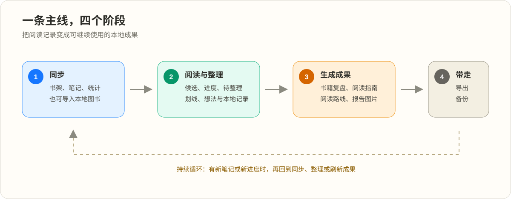
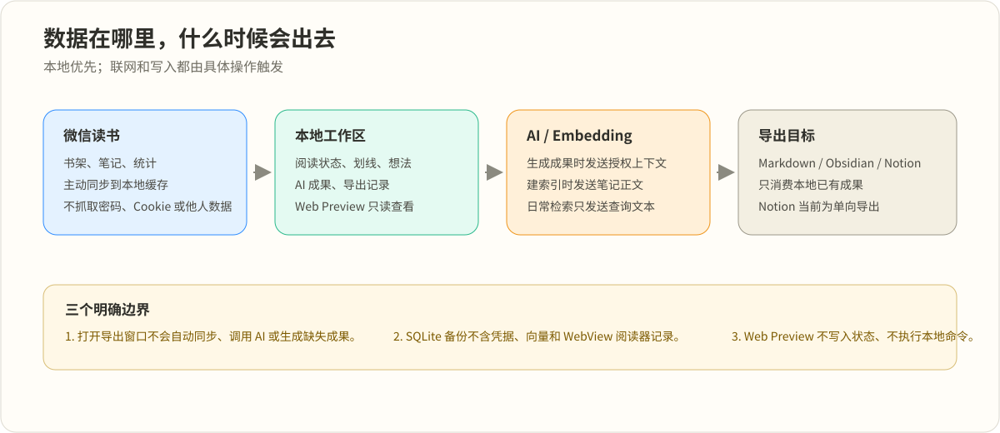

# WxReadMaster 用户指南

> **状态**：current
> **适用版本**：`v1.0.19`
> **术语依据**：[GLOSSARY.md](./GLOSSARY.md)

这份指南按“我要完成什么”组织。第一次使用按第 1 节走完最小闭环；已经熟悉应用时，直接跳到对应任务即可。

## 0. 先看这一张图



你可以把应用理解成四步：

1. **同步**：把微信读书数据或本地图书带入本地工作区。
2. **阅读与整理**：维护候选、进度、整理状态、划线和想法。
3. **生成成果**：主动生成书籍复盘、阅读指南、阅读路线、周期复盘或报告图片。
4. **导出与备份**：把已有成果带到 Markdown、Obsidian、Notion，或按预览边界发布到 IMA，再执行本地备份。

有新笔记或新进度时，回到前面的阶段刷新即可。导出不是同步，生成成果也不会在后台自动发生。

## 1. 第一次使用：完成最小闭环

### 1.1 选择运行环境

| 能力 | Windows 桌面端 | Android | Web Preview |
| --- | --- | --- | --- |
| 查看已同步内容 | 支持 | 支持 | 查看已准备数据 |
| 微信读书同步 | 支持 | 支持 | 不支持 |
| 微信书架、候选书架 | 支持 | 支持 | 只读查看 |
| 本地书库与阅读器 | 完整能力 | 移动阅读优先 | 不支持本地命令 |
| 主动生成成果 | 支持 | 以当前入口和配置为准 | 不支持 |
| 文档导出 | 支持 | 按移动端能力 | 不支持桌面导出 |
| SQLite 备份与恢复 | 支持 | 按移动端能力 | 不支持 |
| 应用更新 | 应用内更新或下载安装包 | 下载 APK 后按系统安装 | 不适用 |

Web Preview 只能查看已经准备好的阅读数据和成果，不能写入阅读状态、执行导出、调用 AI 或执行本地命令。

### 1.2 安装和配置凭据

1. 从 [GitHub Releases](https://github.com/RHZHZ/wereadmaster/releases) 下载 Windows x64 安装包或 Android 签名 APK。
2. 打开 `设置 > 账户与同步`。
3. 按微信读书官方页面获取并保存 API Key。
4. 确认页面显示凭据状态正常。
5. 不要把 API Key 放入笔记、诊断信息、截图或导出文档。

页面只显示凭据状态，不显示已保存的 Key 正文。删除凭据不会自动删除已经同步到本机的书架、笔记和统计缓存。

### 1.3 同步第一批数据

1. 进入 `书架`，点击 `同步书架`。
2. 需要划线和想法时，进入 `笔记` 执行笔记同步。
3. 需要阅读趋势时，进入 `统计` 同步当前周期数据。
4. 等待结果提示完成，再开始生成成果。

同步结果进入本地缓存。没有远端数据变化时，仍可继续查看已经同步的内容。

### 1.4 配置 AI（可选）

如果要生成书籍复盘、阅读指南、阅读路线、周期复盘、选书决策或使用 AI 阅读助手：

1. 打开 `设置 > AI 设置`。
2. 选择 Provider 预设，或配置自定义 Provider。
3. 填写模型和 API Key。
4. 先测试连通性，再测试结构化输出兼容性。
5. 模型列表刷新失败时，可以按照服务商文档手动填写模型名称。

AI 只在你主动触发具体动作时处理对应上下文，不会在后台自动生成。

### 1.5 先完成一次最小成果

推荐选择一本已经有划线或想法的书：

1. 在 `书架` 或 `笔记` 中打开书籍详情。
2. 确认笔记数量和材料内容已经可见。
3. 点击 `本书阅读指南`，确认下一步读法。
4. 进入 `书籍复盘`，生成一次 `快速复盘（抽样）`。
5. 在成果页查看结果，并尝试导出一份 Markdown。

## 2. 看懂数据来源和保存位置



应用中有三类容易混淆的数据来源：

| 数据类型 | 来源 | 典型内容 | 默认保存方式 |
| --- | --- | --- | --- |
| 微信读书数据 | 你的微信读书账号 | 书架、笔记、统计、发现结果 | 同步到本地数据库或缓存 |
| 本地图书数据 | 你导入的文件 | EPUB、TXT、Markdown、进度、划线、想法 | 本地书库与浏览器/WebView 存储 |
| AI 阅读成果 | 你主动生成或记录 | 书籍复盘、阅读指南、阅读路线、周期复盘、选书决策、助手对话 | 本地成果缓存和导出目录 |
| IMA 发布内容 | 你主动选择 IMA 导出的快照 | IMA 笔记，以及可选的知识库关联 | 写入 IMA 远端；不会自动回写本地 |

本地图书与微信书架是两个来源版本：

- 可以人工关联，用于识别“可能是同一本书”；
- 不会自动合并进度、划线、想法或 AI 缓存；
- 本地图书的阅读记录不会写回微信读书。

三个关键边界：

- 打开导出窗口不会自动同步、调用 AI 或生成缺失成果。
- SQLite 备份不包含凭据、语义向量、索引任务记录和 WebView 阅读器记录。
- Web Preview 不写入状态、不执行本地导出、不触发 AI。

## 3. 管理书架和阅读状态

### 3.1 微信书架

1. 进入 `书架 > 微信书架`。
2. 用类型、分类、书单和关键词筛选。
3. 搜索书名、作者或分类。
4. 打开详情查看阅读状态、笔记和成果入口。
5. 根据需要标记阅读状态或整理状态。

支持的书架范围以当前应用页面为准，通常包括电子书、有声书和文章收藏等类型。

### 3.2 候选书架

候选书架只保存本机的候选关系，不写回微信读书。

推荐流程：

1. 在 `发现` 中搜索书名、作者或主题词。
2. 查看推荐、相似书或搜索结果。
3. 将合适的书保存到候选书架。
4. 在 `候选书架` 中确认、移除或搜索书源。
5. 需要做下一本取舍时，点击 `生成选书决策`。

### 3.3 本地书库

本地书库用于导入自己拥有的 EPUB、TXT 和 Markdown 文件：

1. 进入 `书架 > 本地书库`。
2. 选择文件或粘贴路径。
3. 导入后使用网格或列表视图浏览。
4. 打开书籍进入本地阅读器。
5. 如需识别同一本书，可关联微信读书版本，但不要把关联理解为自动合并。

### 3.4 三维阅读状态

一本书的状态拆成三个互不覆盖的维度：

| 维度 | 回答的问题 | 示例 |
| --- | --- | --- |
| 候选关系 | 是否保留为候选，以及候选来源 | AI 推荐、用户保存、已确认书源 |
| 阅读生命周期 | 现在处于什么阅读阶段 | 想读、在读、暂停、读完、暂缓 |
| 整理进度 | 笔记或成果是否完成整理 | 无、待整理、已整理 |

因此：

- 标记“读完”不等于“已整理”；
- 标记“已整理”不会移除候选关系；
- 加入候选不会覆盖当前阅读进度；
- 修改一个维度不会清除另外两个维度。

推荐使用方式：

- 还没决定是否阅读：保留候选关系，生命周期设为想读。
- 正在阅读：生命周期设为在读；有内容需要处理时，再标记待整理。
- 已读完但还没整理：生命周期设为读完，整理进度仍为待整理。
- 成果已经确认并保存：整理进度改为已整理。
- 暂时不再继续：使用暂缓，不要把暂缓当作物理删除。

## 4. 使用本地阅读器

从本地书库打开书后，可以使用：

- 目录跳转；
- 字号和行距调整；
- 阅读主题；
- 正文搜索；
- 工具侧栏。

Markdown 图书支持标题、引用、列表、分隔线和代码块等基础渲染。

选中文本后可以执行划线、写想法或向 AI 提问。右侧侧栏可以查看已有记录；导出按钮可以把本地阅读记录输出为 Markdown。

这些记录默认独立保存在本地，不会影响微信读书原始数据。Web Preview 只能查看已经准备好的内容，不能执行新的本地写入。

## 5. 生成阅读成果

### 5.1 书籍复盘

书籍复盘把单本书的本地笔记整理成结构化成果，通常包含主题概览、关键观点、行动项、代表性摘录和复盘问题。

书籍复盘页提供两种模式：

- **快速复盘（抽样）**：最多使用 80 条划线和 20 条想法，并按章节稳定抽样。适合快速查看主题和行动，不代表覆盖全部笔记。
- **完整复盘（快照）**：先创建不可变本地笔记快照，再按批次处理。适合生成可归档的完整成果；“完整”表示覆盖该快照，不表示一次性发送整本书正文。

两种模式通过页面顶部切换。切换只改变展示，不会取消任务、重复发送笔记或重新创建快照。

### 5.2 完整复盘（快照）

1. 打开一本书的 `书籍复盘` 页面。
2. 查看本地笔记数量和预计批次数。
3. 勾选授权确认，同意将本次任务快照中的原始笔记正文发送给当前 AI Provider。
4. 点击 `创建本地快照`，确认快照数量、批次和 Provider。
5. 点击 `开始发送并归纳`。
6. 查看已处理数量、批次进度和当前模型。
7. 中断后点击继续；失败时只重试失败批次；需要时取消任务。

任务使用创建时的快照。之后新增或修改的笔记不会悄悄混入当前任务；要纳入新笔记，请创建新的快照任务。

### 5.3 阅读指南和阅读路线

阅读指南回答“这本书接下来怎么读、怎么整理、什么时候适合复盘”。从书籍详情点击 `本书阅读指南`。

阅读路线用于安排多本书之间的顺序和关系：

1. 在发现页找到相关书籍。
2. 保存到候选书架。
3. 在阅读指南中选择候选书。
4. 生成阅读路线。
5. 回到 `成果 > 阅读指南` 查看和继续使用。

### 5.4 周期复盘和报告图片

进入 `统计` 或 `成果 > 阅读报告`：

1. 选择总计、年度、月度或周度。
2. 查看阅读时长、书籍数量和主题趋势。
3. 按需要生成周期复盘。
4. 生成报告图片并保存或分享。

## 6. 配置语义索引和笔记搜索

语义索引用于理解相近表达，而不仅是匹配相同字词。它独立于聊天 AI，Embedding 模型、接口和 Key 按独立配置处理。

### 6.1 配置 Embedding

进入 `设置 > AI 设置 > 语义索引`：

- OpenAI-compatible：填写 Embedding Base URL、模型和独立 API Key，应用使用 `/v1/embeddings` 协议。
- 本机 Ollama：Base URL 填写 `http://localhost:11434/api/embed`，模型填写已安装的向量模型，例如 `qwen3-embedding:4b`，API Key 留空。

然后：

1. 勾选“允许发送笔记正文生成向量”。
2. 在确认弹窗中明确授权。
3. 保存设置并点击 `测试 Embedding 连接`。
4. 确认返回模型向量维度。
5. 点击 `开始构建`。
6. 中断时点击 `继续构建`，不需要从头开始。

构建时会把本机笔记正文分批发送给配置的 Embedding Provider；使用本机 Ollama 时数据只发送到本机 Ollama 服务。生成的向量只保存在本机，默认不进入备份。

更换向量模型、Base URL 或模型维度后，应清除并重建索引，不能混用旧向量。

### 6.2 搜索当前书的笔记

在 AI 阅读助手中选择当前书或笔记范围后，可以直接提问：

- `找出与宽恕有关的笔记`
- `我关于专注力有哪些想法？`
- `只看我的想法`
- `包含“宽恕”的所有笔记`

结果会显示 `混合检索`、`词法检索` 或 `本地词法回退`：

- 普通查询在索引就绪时融合本地词法和语义召回。
- 精确短语、要求全部匹配、分页续查时优先使用本地词法检索。
- Embedding Provider、索引或配置不可用时，自动回退到本地词法检索，不中断搜索。
- 原始笔记正文是否显示，仍由阅读助手的独立授权控制。

## 7. 导出成果

### 7.1 单项导出

单本笔记、书籍复盘、周期复盘、阅读指南、阅读路线和选书决策使用统一导出流程：

1. 在当前成果页点击对应的 `导出…` 按钮。
2. 独立选择 Markdown、Obsidian、Notion、Ima 中至少一个已配置目标。
3. 核对导出目录、Vault 或 Notion 数据库摘要。
4. 开始导出。
5. 在结果页按目标查看成功、失败、跳过、警告、文件路径或 URL。
6. 部分失败时使用 `重试失败项`，不要重复提交已经成功的目标。

导出弹窗中的目的地摘要是只读的。长期配置前往 `设置 > 导出设置`。

### 7.2 批量导出笔记

1. 进入 `笔记 > 批量导出`。
2. 等待本地缓存预检完成。
3. 选择导出策略和并发数。
4. 选择要导出的书，或排除没有划线和想法的书。
5. 核对预检结果后开始导出。

批量导出只处理本地已有缓存，不会自动同步微信读书，也不会自动生成书籍复盘。

### 7.3 批量导出书籍复盘

1. 进入 `成果 > 书籍复盘`。
2. 点击 `导出书籍复盘`。
3. 搜索、筛选并选择已经生成书籍复盘的书。
4. 在设置页选择一个或多个导出目标。
5. 点击 `开始导出`。
6. 在结果页查看每个“书籍 × 目标”的结果。
7. 失败时点击 `重试失败项`，只重试精确失败的目标。

执行期间不能通过关闭按钮、背景点击或 Escape 取消底层任务。关闭受控界面不等于底层任务已取消。

### 7.4 Obsidian 导出：从零配置

Obsidian 导出不需要 API Key。应用直接把 Markdown 笔记和封面附件写入你本机的 Obsidian Vault，因此需要一个已经存在、并且当前用户有写入权限的 Vault 根目录。

#### 第一步：准备 Obsidian Vault

如果还没有 Vault：

1. 安装并打开 Obsidian。
2. 在 Vault 选择页点击 `Create`，创建一个新的 Vault，或选择已有 Vault。
3. 记住这个 Vault 的根目录位置。这里要选择包含 `.obsidian` 文件夹的那一级目录，不要选择某一篇笔记、`wxreadmaster` 子目录或单独的附件目录。

如果你已经在 Obsidian 中打开了 Vault，也可以在 Vault 列表或 Vault 管理入口查看其本地文件夹位置。应用只需要这个本地路径，不需要填写 Obsidian 账号、同步密码或插件配置。

#### 第二步：在应用中选择 Vault

打开 `设置 > 导出设置`，找到 **Obsidian > Vault 导出**：

1. 点击 `选择 Vault`，在文件夹选择器中选中 Vault 根目录；也可以直接填写本地文件夹路径。
2. 确认路径指向可写文件夹。应用保存设置时会检查路径是否存在并尝试写入临时测试文件。
3. 选择 **附件目录**：
   - `笔记同级附件`：每篇笔记旁边创建 `<笔记名>.assets/`，封面和笔记放在一起，迁移单篇笔记时更方便；
   - `中央 assets 目录`：统一写入 `<Vault>/wxreadmaster/assets/`，适合希望集中管理封面图片的 Vault。
4. 如需导出完成后自动打开生成的笔记，勾选 `导出后自动打开笔记`。
5. 点击 `保存 Obsidian 设置`。

默认笔记目录固定为：

```text
<Vault 根目录>/wxreadmaster/书籍笔记/
```

例如 Vault 是 `D:/Notes/Reading`，一本书的笔记可能写入：

```text
D:/Notes/Reading/wxreadmaster/书籍笔记/深度工作-100.md
```

不要把 `D:/Notes/Reading/wxreadmaster/书籍笔记` 填成 Vault 路径，否则应用会继续在它下面追加 `wxreadmaster/书籍笔记`。

#### 第三步：首次导出并在 Obsidian 中核对

建议先导出一本已经有划线或想法的书：

1. 打开书籍详情或笔记页面，点击 `导出…`。
2. 选择 `Obsidian`，确认导出摘要中显示正确的 Vault 路径。
3. 点击开始导出。
4. 在结果页确认状态为成功，并记录生成的文件路径。
5. 回到 Obsidian，等待文件列表刷新，打开 `wxreadmaster/书籍笔记/` 下的 Markdown 文件。
6. 检查标题、章节、划线、想法、来源链接和封面是否正常显示。

导出会生成标准 Markdown 文件。封面默认优先下载为本地附件，并把笔记中的图片引用改为相对路径；如果封面地址无法访问，笔记仍会写入，但结果页会显示 warning，并保留远程图片引用。

#### 第四步：批量导出

配置完成后，以下入口可以选择 `Obsidian`：

- `笔记 > 批量导出`：按书批量导出本地已有笔记；
- `成果 > 书籍复盘 > 导出书籍复盘`：批量导出已经生成的书籍复盘；
- 书籍详情、笔记页、阅读指南、阅读路线和选书决策页面的 `导出…`：导出当前成果。

批量导出前建议先完成本地缓存预检，排除没有划线、想法或成果缓存的书。批量任务只处理本地已有内容，不会自动同步微信读书，也不会自动生成缺失成果。

#### Obsidian 文件结构

以 `笔记同级附件` 为例：

```text
<Vault>/
└─ wxreadmaster/
   └─ 书籍笔记/
      ├─ 深度工作-100.md
      └─ 深度工作-100.assets/
         └─ 深度工作-100-cover.jpg
```

以 `中央 assets 目录` 为例：

```text
<Vault>/
└─ wxreadmaster/
   ├─ 书籍笔记/
   │  └─ 深度工作-100.md
   └─ assets/
      └─ 深度工作-100-cover.jpg
```

应用不会删除 Vault 中的其他文件，也不会自动移动历史导出文件。修改附件策略只影响之后的新导出。

### 7.5 Notion 导出：从零配置

Notion 导出需要两个东西：

1. 一个 Notion **Internal Connection**（内部连接）的 `Internal Integration Token`；
2. 一个已经共享给这个连接的 Notion 数据库，或一个已经共享给这个连接的父页面。

应用不会替你登录 Notion，也不会自动发现未共享的数据库。第一次配置建议按下面顺序操作。

#### 第一步：在 Notion 创建 Internal Connection

1. 登录网页版 Notion，打开左侧 `Settings`。
2. 进入 `Connections`。
3. 在页面底部选择 `Develop your own connections`。如果看不到这个入口，通常是当前账号不是工作区 Owner，请联系工作区管理员。
4. 在打开的连接管理页面点击 `+ New connection`。
5. 填写连接名称，例如 `WxReadMaster`，选择正确的 `Associated workspace`，然后创建。
6. 回到连接列表，点击这个连接旁边的 `•••`，选择复制 `Internal Integration Token`。

Token 通常以 `ntn_` 或 `secret_` 开头。它就是应用设置页中 **Integration Token** 要填写的内容，不是 Notion 页面链接、数据库 ID，也不是你的 Notion 登录密码。

官方入口：[Notion API connections](https://www.notion.com/help/create-integrations-with-the-notion-api)。Token 只应粘贴到应用的密码输入框，不要发到聊天、截图或提交到 Git。

#### 第二步：把数据库或父页面共享给连接

创建连接后，还需要在 Notion 中明确授权它访问目标，否则应用即使 Token 正确，也会在检查数据库时提示无权访问。

**连接已有数据库：**

1. 在 Notion 打开要接收阅读成果的数据库页面。
2. 点击页面右上角 `Share`。
3. 在邀请或添加连接的位置搜索刚创建的 `WxReadMaster` 连接，并确认添加。
4. 确认这个数据库本身已经共享给连接，而不是只把数据库所在的普通页面共享给了连接。
5. 复制数据库页面链接备用。

**创建标准阅读成果库：**

1. 在 Notion 打开希望存放新数据库的父页面。
2. 点击父页面右上角 `Share`，把同一个连接添加进去。
3. 复制这个父页面链接备用。
4. 应用会在该父页面下创建标准 `阅读成果库`，不会删除现有数据库，也不会创建额外工作台。

#### 第三步：在应用中保存 Token 并验证

打开 `设置 > 导出设置`，找到 **Notion 导出** 区域：

1. 把刚复制的值粘贴到 **Integration Token**。
2. 点击 `验证连接`。
3. 看到 `Token 已保存` 后，Token 配置完成。
4. 如果应用已有旧 Token，输入框可以留空；留空并保存其他设置会继续使用已保存的 Token。

验证连接只验证 Token 是否能访问 Notion API，不代表某个数据库已经授权。数据库还需要按下一步单独检查。

#### 第四步 A：连接已有数据库

如果你已经有自己的阅读数据库：

1. 在 Notion 导出设置中找到 **连接已有数据库**。
2. 将数据库链接粘贴到 **数据库链接或 ID**。也可以填写数据库的 32 位 ID；带连字符的 UUID 也可以，应用会自动规范化。
3. 点击 `检查数据库`。
4. 等待应用读取数据库名称、标题字段和属性兼容性。
5. 如果检查结果不是无效状态，在 **字段映射** 中确认：
   - `标题`：必填，必须选择数据库的标题属性；
   - `作者`、`封面`、`Book ID`、`资产类型`、`来源`、`导出时间`、`导入状态`、`阅读状态`、`阅读阶段`、`阅读进度`、`标签`、`微信读书链接`、`Obsidian 路径`、`行动数`、`划线数`、`想法数`、`书签数`：按需要选择对应属性；不需要的可选择 `不导出`；
   - 字段显示名称可以不同，应用按属性 ID 保存映射，因此之后给字段改名仍可继续导出。
6. 点击 `保存数据库连接`。
7. 看到 `数据库已连接` 后，再从书籍、笔记或成果页点击 `导出…`，选择 `Notion`。

如果数据库缺少标题字段、字段类型不兼容或连接没有权限，先按检查结果修正 Notion，再重新点击 `检查数据库`，不要直接反复点击导出。

#### 第四步 B：创建标准阅读成果库

如果你没有现成数据库：

1. 在 **没有现成数据库？创建标准阅读成果库** 区域粘贴已共享的父页面链接或 ID。
2. 点击 `创建标准阅读成果库`。
3. 在确认提示中确认父页面和创建动作。
4. 等待创建结果。应用会创建带推荐字段的数据库、保存字段映射，并尝试初始化四个推荐 Table 视图。
5. 如果结果显示部分视图失败，点击 `重试缺失视图`；如果创建结果状态不确定，先回 Notion 检查父页面，再按页面提示继续处理。
6. 点击 `打开成果库` 核对数据库已经出现在正确的父页面下。
7. 之后导出目标会自动切换到这个数据库。

#### 第五步：执行一次小范围导出

首次使用建议只导出一本已经生成成果的书：

1. 打开书籍详情、笔记或成果页，点击 `导出…`。
2. 选择 `Notion`，确认目标名称和数据库摘要。
3. 点击开始导出。
4. 在结果页确认状态为成功，并打开返回的 Notion 页面 URL。
5. 确认标题、作者、正文、标签、进度和封面符合预期后，再使用批量导出。

Notion 当前是单向导出：

- 可以连接已经共享给 Integration 的数据库；
- 可以创建标准阅读成果库；
- 可以写入阅读成果、标签和封面；
- 可以在结果页重试失败目标；
- 不会把 Notion 内容同步回本地；
- 不会后台改造已有数据库的视图和结构；
- 切换数据库不会删除原数据库或已经导出的内容。

### 7.6 IMA 笔记与知识库导出：从零配置

IMA 导出需要把已经同步到本机的阅读内容，主动发布为 IMA 笔记；如果你选择知识库，还会在创建笔记后把这篇笔记加入指定知识库和文件夹。它不是后台同步，也不会把 IMA 的修改回写到本地。

IMA 的配置入口是 `设置 > 导出设置 > Ima 笔记与知识库导出`。当前页面使用两个凭据字段：`Client ID` 和 `API Key`，两者必须同时具备。不要把微信读书 API Key、AI Provider API Key 或 Embedding API Key 填到这里。

#### 第一步：获取 IMA 凭据

1. 打开 IMA 官方配置中心：<https://ima.qq.com/agent-interface>。
2. 按页面提示登录或进入你的 IMA 账号配置页面。
3. 选择 `获取 API Key`，按 IMA 页面要求创建或复制 API Key。官方页面当前明确将 API Key 说明为调用 IMA 账号的密钥。
4. 准备当前 IMA 接入流程提供的 `Client ID`。Client ID 不是 API Key、IMA 页面链接、账号密码或知识库 ID；如果配置中心将它和 API Key 一起展示，直接复制对应的 Client ID。
5. 如果当前配置中心只显示 API Key、没有显示 Client ID，不要用 API Key 重复填写两个字段，也不要自行生成字符串。请按配置中心或 IMA 服务方给出的接入说明取得 Client ID；在两个值都拿到前不要保存配置。

官方配置中心的页面名称和字段可能随 IMA 服务端更新。应用只需要把两个值分别填入对应字段，不要求用户把凭据发给 WxReadMaster、聊天窗口或诊断文件。凭据只保存在当前设备的安全存储中。

#### 第二步：在应用中保存并验证凭据

打开 `设置 > 导出设置 > Ima 笔记与知识库导出`：

1. 将 Client ID 填入 **Client ID**。
2. 将 IMA 配置中心提供的 API Key 填入 **API Key**。
3. 点击 `验证并读取目标`。
4. 等待应用读取 IMA 笔记本、可添加知识库和知识库内的文件夹。
5. 点击 `重新检查版本`，确认版本状态显示为 `版本已确认兼容`。
6. 选择默认笔记本和需要使用的知识库目标后，点击 `保存 Ima 设置`。

`验证并读取目标` 主要验证凭据是否能访问 IMA，并刷新目标列表；它不等于每个历史知识库都一定可写，真正导出时仍会再次检查目标权限。`重新检查版本` 用于检查本地 IMA 适配器与服务端版本是否一致。显示 `版本不兼容，已阻止写入` 时，应按 IMA 官方更新说明处理；显示 `版本状态未确认` 时，先重新检查版本，不要反复点击导出。

保存已有凭据时，Client ID 和 API Key 输入框可以留空，页面会继续使用已安全保存的凭据。更换或移除凭据后，旧的笔记本、知识库和文件夹目标需要重新读取和选择。移除凭据只清除本机凭据和目标发现缓存，不会删除 IMA 中已经创建的笔记或知识库资料。

#### 第三步：准备笔记本和知识库目标

IMA 的两个目录选择器不是同一个概念：

- **笔记本**：决定新建 IMA 笔记放在哪个 IMA 笔记文件夹中，对应页面上的 `默认笔记本`。
- **知识库**：决定是否把已创建的 IMA 笔记加入某个可写知识库，对应页面上的 `默认知识库`。
- **知识库文件夹**：决定知识库内的分类目录。它和笔记本目录属于不同命名空间，不能互换。

建议先在 IMA 中手动创建一个知识库，并按资产类型建立文件夹，例如：

```text
微信读书
├─ 原始笔记
├─ 书籍复盘
├─ 阅读路线
├─ 周期复盘
└─ 选书决策
```

应用不会自动创建 IMA 文件夹。创建完成后回到应用，点击 `验证并读取目标` 刷新列表。没有子文件夹时，可以直接选择 `知识库根目录`；需要使用子文件夹时，在 `知识库文件夹` 区域点击文件夹名称选择目标，点击右侧箭头浏览子文件夹，再用面包屑返回上一级。

目标配置建议：

1. 在 `配置范围` 选择 `全局默认`。
2. 在 `默认笔记本` 中选择笔记文件夹；不选择时使用 IMA 默认位置。
3. 如果只想创建 IMA 笔记，不加入知识库，在 `默认知识库` 中选择 `不选择知识库`。
4. 如果要加入知识库，选择 `默认知识库`，勾选 `创建笔记后加入知识库`，再选择知识库根目录或已创建的知识库文件夹。
5. 点击 `保存 Ima 设置`。

#### 第四步：按资产类型设置独立路由

默认情况下，未单独配置的资产继承全局默认目标。需要把原始笔记和总结分开时：

1. 在 `配置范围` 选择资产类型：`微信读书笔记`、`书籍复盘`、`阅读统计复盘`、`阅读路线` 或 `选书决策`。
2. 勾选 `为此资产使用独立目标`。
3. 选择该资产的 `资产笔记本`。
4. 如果该资产需要入库，选择 `资产知识库`、勾选 `创建笔记后加入知识库`，再选择知识库文件夹。
5. 点击 `保存 Ima 设置`。

推荐的使用方式是：原始划线和想法放在 `原始笔记`，书籍复盘和阅读路线放在各自的总结文件夹；阅读统计复盘和选书决策是否加入知识库，应根据内容是否仍然具有长期参考价值决定。没有启用独立目标的资产会继续继承全局默认目标。`选书决策` 默认只创建 IMA 笔记，只有明确启用独立目标并打开知识库发布后才加入知识库。

#### 第五步：单本导出

首次配置建议只导出一本已有划线或想法的书：

1. 打开书籍详情、笔记页或对应成果页，点击 `导出…`。
2. 选择 `Ima`，核对笔记本、知识库、知识库文件夹以及将要发送的内容数量。
3. 按页面要求确认本次会把划线、想法和相关元数据发送到 IMA。
4. 选择仅创建 IMA 笔记，或选择创建笔记后加入知识库。
5. 点击开始导出。
6. 在结果页确认 IMA 笔记创建成功；如果选择了知识库，再确认结果中显示已加入目标知识库和文件夹。
7. 打开 IMA 检查标题、正文、来源和分类是否符合预期，再开始批量导出。

每次导出使用一个不可变本地快照。内容没有变化且目标范围相同，应用可以提示内容未变化并跳过重复发布；内容发生变化时，会创建带新时间和版本标识的新 IMA 笔记。应用不会通过标题猜测旧笔记，也不会自动覆盖、合并或删除 IMA 中的旧版本。

#### 第六步：批量导出

1. 进入 `笔记 > 批量导出`，等待本地缓存预检完成。
2. 选择要导出的书，排除没有划线和想法的书。
3. 在导出目标中选择 `Ima`，核对默认目标和资产路由。
4. 确认批量任务涉及的内容范围后开始导出。
5. 在结果页按“书籍 × 目标”查看成功、跳过、失败、部分成功或状态未知的项目。
6. 对确定失败的项目使用 `重试失败项`；已经成功的项目不会重复提交。

批量导出只处理本地已有缓存，不会自动同步微信读书，也不会自动生成缺失的书籍复盘。若某项笔记已经创建成功但加入知识库失败，结果可能是部分成功：先修正知识库权限或目标，再重试关联。若网络中断导致远端状态无法确认，不要立即重复导出；先在 IMA 中按结果页显示的快照标题检查是否已经创建，再决定取消或创建新版本。

#### IMA 导出的数据边界

- 发送到 IMA 的是你主动确认导出的笔记、成果和相关元数据，不包含 Client ID、API Key、应用数据库路径或原始接口响应。
- IMA 导出是单向发布。本应用不会把 IMA 中人工修改的内容同步回本地，也不会调用 IMA 内置 AI 替你生成内容。
- 本地数据库仍是阅读数据和导出快照的事实源。删除或移除本机 IMA 凭据，不代表删除 IMA 远端内容。
- IMA 当前不提供本产品所需的稳定覆盖更新、删除和解除关联流程，因此旧版本可能继续留在 IMA 知识库中；需要清理时请在 IMA 中人工处理。
- 文件夹只是组织方式，不是权限边界，也不保证 IMA 检索只在该文件夹内进行。需要严格隔离内容时，使用不同知识库，不要只依赖文件夹分类。

## 8. AI 阅读助手

AI 阅读助手可以从右下角或相关页面打开。可选上下文包括：

- 全局；
- 当前书；
- 笔记；
- 统计；
- 候选书；
- AI 阅读成果；
- 本地选区。

使用前确认：

- 是否使用个性化上下文；
- 是否使用阅读记忆；
- 是否发送原始笔记；
- 是否保存对话历史。

助手支持历史线程、继续追问、删除线程和清空本地对话记录。AI 推荐的新书可以加入候选书架，必要时再通过发现页确认书源。

## 9. 设置、备份与恢复

### 9.1 账户与同步

用于保存微信读书 API Key、配置 Android 微信读书网络代理、查看凭据状态和同步状态。

Android 代理入口通常是：

```text
我的 > 微信读书代理设置
```

或：

```text
设置 > 账户与同步 > 微信读书网络代理
```

支持应用实际使用的 HTTP 或 SOCKS 地址，例如 `http://127.0.0.1:7890` 或 `socks5://127.0.0.1:1080`。该代理只影响微信读书同步，不影响 AI Provider 或应用更新。

### 9.2 导出设置

用于设置 Markdown、复盘和诊断信息导出目录，配置 Obsidian Vault 和附件策略，以及配置 Notion Integration、数据库和字段映射、IMA 凭据和发布目标。

修改导出设置只影响之后的新导出，不会移动历史文件，也不会迁移已有 Notion 页面。

### 9.3 SQLite 备份范围

本地备份包含：

- SQLite 主数据库；
- 存在时的 WAL 文件；
- 存在时的 SHM 文件。

不包含：

- 微信读书、AI、Embedding 和 Notion 凭据；
- 语义向量索引和索引任务记录；
- 其他系统安全存储文件；
- 本地阅读器的划线、想法、AI 提问；
- 阅读器偏好和人工版本关联。

本地阅读器内容请另外导出 Markdown 或保留原始数据目录，不要只依赖 SQLite 备份。

### 9.4 正确的备份与恢复

备份：

1. 打开 `设置 > 高级维护`。
2. 点击 `导出本地备份`。
3. 将备份包放到专用备份目录或外部磁盘。
4. 不要把备份包放在临时下载目录或会被自动清理的位置。

恢复：

1. 打开 `设置 > 高级维护`。
2. 选择本地备份包并确认恢复。
3. 等待恢复完成，不要强制退出应用。
4. 完全退出并重新启动应用。
5. 先检查书架、笔记、阅读状态和成果，再继续同步或导出。
6. 保留原备份包，直到确认恢复结果正常。

不要手工删除数据库列、迁移备份表或直接覆盖真实用户数据库进行回退。

## 10. Android 使用差异

- 使用顶部栏和侧边抽屉导航，不显示桌面窗口控制。
- 低频入口集中在 `我的` 页面。
- 查找设置时优先进入 `我的 > 设置`。
- 微信读书同步失败时，检查 `我的 > 微信读书代理设置` 或 `设置 > 账户与同步`。
- 报告图片可以保存到系统相册或通过系统分享。
- 应用更新从 GitHub Release 下载 APK，不使用桌面端 updater。
- AI、导出、本地阅读器写入等能力以当前 Android 应用实际显示的入口、配置状态和错误提示为准。

## 11. 常见问题

### 同步失败或提示需要升级

1. 检查 `设置 > 账户与同步` 中的凭据状态。
2. Android 检查代理工具是否运行，以及代理地址和端口是否正确。
3. 保存代理后重新执行对应页面的同步。
4. 如果提示需要升级微信读书 Skill 或接口版本，按提示处理后重试。
5. 反复失败时，先使用本地已有缓存或已经导出的文件。

### AI 无法生成或模型列表为空

1. 检查 Provider、模型和 API Key 是否保存。
2. 先测试连通性和结构化输出兼容性。
3. 模型刷新失败时手动填写模型名。
4. 如果只有某本书失败，确认该书已经有可用的本地笔记缓存。
5. 不要把 API Key 粘贴到笔记、诊断信息或导出文档中。

### 导出失败、找不到文件或内容为空

1. 检查 `设置 > 导出设置` 中的目录是否存在且可写。
2. 修改目录后保存；新目录不会移动历史导出物。
3. 批量导出前先完成预检。
4. 排除没有划线、想法或对应成果缓存的书。
5. 关闭占用目标文件的其他程序后重试。
6. 查看结果页的目标级错误，不要只看总体状态。

### Obsidian 找不到 Vault 或没有生成笔记

1. 确认填写的是 Vault 根目录，而不是 `wxreadmaster/书籍笔记`、某个 Markdown 文件或附件目录。
2. 确认该文件夹真实存在，并且当前用户有创建和修改文件的权限；应用保存时会执行写入测试。
3. Windows 路径可以直接使用文件夹选择器，避免手工输入错误；不要给路径加引号。
4. 导出后在文件管理器中检查 `<Vault>/wxreadmaster/书籍笔记/`，再回 Obsidian 等待文件列表刷新。
5. 如果结果页是成功但 Obsidian 没有立即显示，关闭并重新打开 Vault，或在 Obsidian 中刷新文件列表。

### Obsidian 封面没有下载到本地

正文笔记仍可能已经成功写入。查看结果页 warning，并确认当前设备可以访问封面远程地址。封面下载失败时，应用会保留 Markdown 中的远程图片引用，不会因为封面失败而重复写入整篇笔记。

### 切换 Obsidian 附件目录后旧附件不见了

附件策略只影响之后的新导出，不会自动移动历史文件。请分别检查：

- `笔记同级附件`：`<笔记名>.assets/`；
- `中央 assets 目录`：`<Vault>/wxreadmaster/assets/`。

不要直接删除旧附件；确认没有其他笔记引用后再由用户自行整理。

### Notion Token 验证失败或数据库检查无权限

按以下顺序排查：

1. 确认粘贴的是 Internal Integration Token，而不是 Notion 登录密码、页面链接或数据库 ID；通常以 `ntn_` 或 `secret_` 开头。
2. 确认 Token 属于当前 Notion 工作区，创建连接时选择的 `Associated workspace` 没有选错。
3. 回 Notion 打开目标数据库或父页面，在 `Share` 中确认已经添加同一个 Internal Connection。
4. 如果使用的是数据库视图链接，改为复制数据库页面链接，或从链接中确认只包含一个数据库 ID。
5. 回到 `设置 > 导出设置`，再次点击 `验证连接` 或 `检查数据库`。

### Notion 标签写入失败

确认 Integration 已共享给目标数据库，`标签` 仍映射到 Multi-select 属性，数据库字段映射没有失效，并且 Notion 允许当前 Integration 创建或编辑页面。然后在结果页查看具体失败目标，必要时补充选项后使用 `重试失败项`。

### Notion 封面没有显示

Notion 封面写入依赖 Notion 可以访问的有效 HTTP(S) 图片地址。正文导出成功不代表属性封面和页面封面都一定成功：

1. 先打开结果页查看是否有封面 warning。
2. 确认数据库的 `封面` 字段映射为 Files & media 类型。
3. 如果是已有成果页，进入 `设置 > 导出设置 > Notion 导出` 的封面维护区域，先执行预检，再确认回填；回填只补空值，不会覆盖人工封面。
4. 封面失败时不要重复创建同一篇成果，先重试精确失败目标或单独执行封面回填。

### IMA 提示 Client ID 或 API Key 缺失

1. 确认 `Client ID` 和 `API Key` 都已填写；IMA 要求两个值同时存在。
2. API Key 从 IMA 官方配置中心的 `获取 API Key` 入口取得，不要填写微信读书、AI Provider 或 Embedding 的 API Key。
3. Client ID 使用当前 IMA 接入流程提供的 Client ID；不要用 API Key、账号密码、配置中心链接或知识库 ID 代替。
4. 如果旧凭据已经保存，输入框留空表示继续使用已保存凭据；需要更换时同时输入新的 Client ID 和 API Key，再点击 `验证并读取目标`。

### IMA 验证成功，但没有看到笔记本或知识库

1. 确认账号和凭据属于同一个 IMA 配置范围。
2. 点击 `验证并读取目标`，等待读取完成，不要只点击 `保存 Ima 设置`。
3. 没有知识库时，可以先只保存为 IMA 笔记；需要入库时，在 IMA 中准备可写知识库后重新读取。
4. 没有子文件夹时选择 `知识库根目录`；应用不会自动创建文件夹。
5. 目标名称相同也不要手工互换 ID。笔记本目录 ID 和知识库文件夹 ID 来自不同目标列表，应在对应选择器中重新选择。

### IMA 提示版本不兼容或版本状态未确认

- `版本已确认兼容`：本地适配器和 IMA 服务端版本已取得明确匹配结果，可以继续配置和导出。
- `版本不兼容，已阻止写入`：按 IMA 官方更新说明处理，服务端和本地适配器可能有一方需要更新。
- `版本状态未确认`：点击 `重新检查版本`。网络超时或服务端没有返回可确认版本时，不要把它理解为“已兼容”。

### IMA 笔记创建成功，但没有加入知识库

这是部分成功，不代表整次导出失败。IMA 笔记正文已经存在，但知识库关联可能因为权限、目标文件夹无效或服务端错误没有完成：

1. 在 IMA 中确认笔记正文已经创建。
2. 回到应用检查知识库、文件夹和写入权限。
3. 对明确失败的关联使用结果页的 `重试失败项`，或修正目标后重新选择关联。
4. 如果页面提示远端状态无法确认，不要立即重复关联；先按结果中的快照标题在 IMA 中检查，再决定取消或创建新版本。

### IMA 重复导出会不会覆盖旧笔记

不会。应用使用本地不可变快照和内容哈希：内容未变化且目标范围相同，可以跳过重复发布；内容变化时创建带新时间和版本标识的新 IMA 笔记。应用不会自动覆盖、合并或删除旧版本。需要清理旧版本时，请在 IMA 中人工处理。

### 本地书和微信读书版本看起来混在一起

这是预期的数据边界。两个版本可以被人工关联，但分别保存进度、划线、想法和 AI 缓存，不会自动合并。

### Web Preview 里不能生成或导出

这是预期行为。Web Preview 是只读入口。请回到具备对应本地能力的桌面或移动应用，并确认凭据、AI Provider 和导出设置有效。

### 设置保存超时或页面没有更新

等待当前操作结束后重新打开设置页。Android 上可以完全退出应用后重启。如果问题仍然存在，导出诊断信息，记录版本、平台和复现步骤；联系维护者时不要附带 API Key。

## 12. 数据安全与使用边界

- 微信读书、AI、Embedding 和 IMA 的凭据按应用设计保存在本机，不写入 Markdown、Obsidian、Notion、IMA 发布内容或诊断信息。
- 删除微信读书凭据不会删除已经同步到本机的书架、笔记和统计缓存。
- 导出和备份前确认目标目录权限，不要把个人阅读记录放到公开共享目录。
- 本工具用于整理和导出自己合法获取的阅读数据，不用于获取他人数据、绕过付费内容或批量盗号。
- 如果平台规则或接口发生变化，优先保留本地缓存和已导出文件，并通过设置页的错误提示和诊断信息排查问题。
