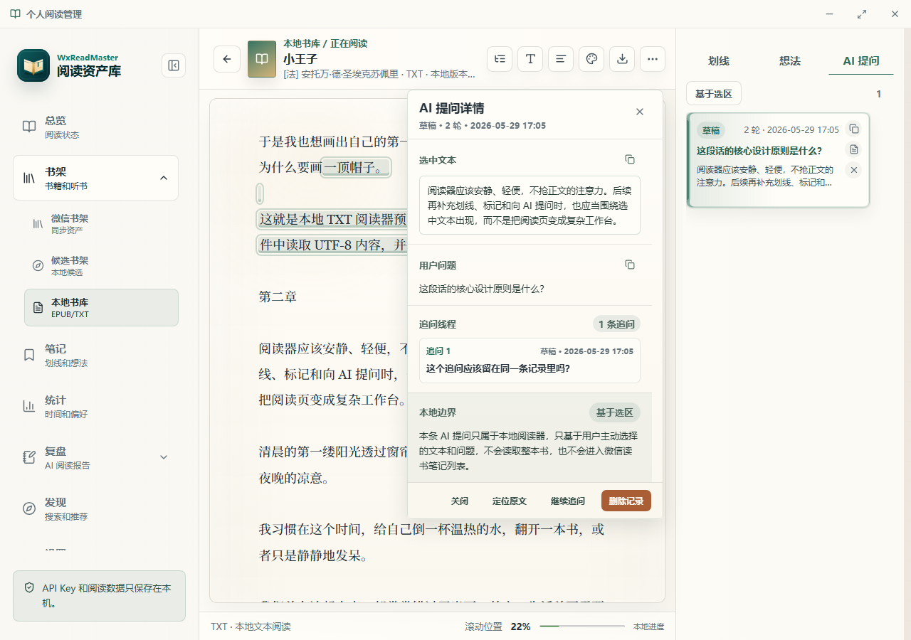

# WeReadMaster v1.0.10 微信公众号推广文案

> 版本提示：此稿已被 `v1.0.11` 版本稿替代。最新公众号文案请使用 [wechat-promo-v1.0.11.md](wechat-promo-v1.0.11.md)。

> 推荐标题：我把微信读书做成了一个本地阅读工作台：书架、笔记、统计和 AI 助手都能沉淀下来
>
> 备用标题 1：读过的书，别只剩进度条：这个工具能把微信读书变成你的个人阅读资产库
>
> 备用标题 2：微信读书笔记太散？我做了一个本地优先的阅读管理工具
>
> 备用标题 3：新版 WeReadMaster：让 AI 只围绕你的阅读问题工作
>
> 摘要：WeReadMaster v1.0.10 已发布。本次更新新增 AI 阅读助手、候选书确认工作流、热门划线与公开书评面板，继续坚持本地优先和用户自备 Key 的边界设计。

你有没有遇到过这种情况：

- 微信读书里读了很多书，但回头只记得“我好像读过”。
- 划线和想法越积越多，真正整理时却要一本本翻。
- 想复盘一本书，却发现进度、笔记、摘录、统计都散在不同入口。
- 想让 AI 帮忙，但又不希望它脱离你的真实阅读上下文空泛总结。

我自己长期被这些问题卡住，所以做了一个桌面端工具：**WeReadMaster，微信读书个人阅读管理**。

它不是另一个阅读 App，也不是一个单纯的数据面板。更准确地说，它是一个本地优先的阅读工作台：把微信读书里的书架、笔记、统计、复盘和 AI 辅助整理到一个稳定入口里，让读过的东西可以被保存、被回看、被导出，也可以继续变成写作和知识管理材料。

这次发布的是 **v1.0.10**。新版本最核心的变化是：AI 阅读助手不再只是“问一句答一句”，而是开始接入你的阅读场景。

## 这次新版，重点解决什么问题

很多 AI 阅读工具容易走向两个极端：

一种是只会总结。你丢进去一本书，它给你一篇漂亮的摘要，但和你的阅读进度、划线、想法没有太多关系。

另一种是过度自动化。它看起来什么都能做，但用户很难知道它用了哪些数据，也很难控制什么时候发送内容、发送多少内容。

WeReadMaster 的思路更克制：AI 不替你读书，也不在后台自动处理你的笔记。它只在你明确触发时，围绕当前阅读场景提供帮助。

你可以把新版里的 AI 阅读助手理解成三个能力：

1. 在全局范围里，帮你回看整体阅读状态。
2. 在当前书范围里，帮你围绕一本书提问、整理和复盘。
3. 在候选书架范围里，帮你讨论下一本书该怎么选。

## AI 阅读助手：只围绕阅读上下文工作

新版增加了右下角 AI 阅读助手入口。

它支持全局、当前书、候选书架三种上下文范围。你可以打开或关闭上下文，也可以看到回答依据的大致范围，避免 AI 把一个简单问题扩展成不可控的大段内容。

它还支持流式输出、取消生成、线程历史、删除单个线程和清空本地对话历史。

这意味着它更像一个随手可用的阅读助理：

- 读到一半，可以问：“这本书目前我应该重点看哪部分？”
- 复盘之前，可以问：“根据我的划线，帮我整理三个值得继续思考的问题。”
- 选下一本书时，可以问：“这些候选书里，哪一本更适合作为下一阶段主题阅读的入口？”
- 写文章前，可以问：“把这本书的行动项整理成一份输出提纲。”

这里的重点不是“AI 很聪明”，而是它终于能被限定在阅读任务里工作。

## 推荐新书以后，不急着直接入库

v1.0.10 还补了一条很关键的工作流：**AI 推荐新书后，可以先进入本地候选书架，再通过微信读书搜索确认书源**。

这解决了一个很实际的问题：AI 推荐的书名、作者、版本有时并不稳定。如果直接保存，很容易让候选书架变成一堆来源不明的条目。

现在的处理方式更清楚：

- AI 推荐书会以结构化卡片展示。
- 你可以先加入本地候选书架，作为轻量待读记录。
- 也可以通过微信读书搜索确认书源，再保存为已确认候选。
- 候选书架会区分微信读书已确认、AI 推荐未确认和手动轻管理候选。

这个设计看起来多了一步，但它让阅读资产更可靠。读书记录不是临时聊天结果，应该能长期解释来源。

## 书籍详情页，也更适合做阅读判断了

新版在书籍详情里补充了热门划线、公开书评和划线下读后感面板。

这几个信息不适合替代自己的阅读判断，但很适合做辅助参考：

- 阅读前，看这本书是否真的符合当前主题。
- 阅读中，看别人关注的段落和自己是否一致。
- 复盘时，补充外部视角，避免只困在自己的笔记里。

如果微信读书 Skill 版本需要升级，应用也会保留专门提示，不会把接口问题伪装成普通空状态。

## 它仍然坚持本地优先

我一直希望 WeReadMaster 的边界足够清楚。

读取微信读书数据时，它走的是 **微信读书官方 Skills HTTP 接口**。用户需要在官方页面扫码获取自己的 API Key，然后在本地应用里填写。

它不做这些事：

- 不要求输入微信账号密码。
- 不抓 Cookie。
- 不托管你的微信读书账号。
- 不绕过付费内容。
- 不读取别人的数据。
- 不在后台自动把笔记发给 AI。

AI Provider 也由用户自己配置，可以使用 OpenAI 兼容服务、DeepSeek、通义千问、Kimi 或本地兼容服务。应用只在用户手动触发时请求，不做中转，不收集你的 Key。

阅读记录、AI 输出、导出文件和本地状态都优先留在你的设备里。对于笔记、复盘、行动项这类带有个人判断的内容，我更愿意把默认权利交还给用户。

## 不只微信读书，本地图书也能管理

除了微信读书，WeReadMaster 也支持导入 EPUB、TXT 和 Markdown 本地图书。

本地图书和微信读书书架默认隔离保存。即使书名相同，阅读进度、划线、想法和 AI 提问记录也不会被强行合并。

这不是偷懒，而是为了让数据可靠。不同来源的书，章节、排版、位置都可能不一样。阅读资产最怕的不是少一点自动化，而是多年以后你已经不知道一条笔记到底从哪里来。

## 适合哪些人

如果你只是偶尔看书，微信读书原 App 可能已经足够。

但如果你符合下面任意一种情况，WeReadMaster 会更有价值：

- 长期使用微信读书，书架和笔记已经积累很多。
- 希望把阅读记录导出到 Markdown、Obsidian、Notion、博客或自己的知识库。
- 想定期复盘阅读，但不想每次从零整理。
- 希望 AI 帮忙总结、提问、规划下一本书，但不想把所有内容交给中转平台。
- 希望有一个更稳定、更私密的桌面端阅读管理入口。

## 当前版本有什么

v1.0.10 的主要变化包括：

- 新增 AI 阅读助手，支持全局、当前书、候选书架三种上下文范围。
- 支持流式输出、取消生成、上下文开关、线程历史和本地清空。
- AI 新书推荐可加入本地候选，也可通过微信读书搜索确认书源。
- 候选书架支持来源识别和筛选。
- 书籍详情新增热门划线、公开书评和划线下读后感。
- 总览、书籍详情、候选书架、AI 助手和空状态的信息密度更清晰。
- Windows 桌面端支持应用内检查更新，Android 用户可下载签名 APK。

## 怎么开始使用

当前正式发布面向 Windows x64，并提供 Android 签名 APK。

使用步骤很简单：

1. 打开 GitHub Releases 页面，下载最新安装包。
2. 安装并启动应用。
3. 在设置页配置微信读书 API Key。
4. 如果需要 AI 功能，在 AI 设置里选择 Provider 并填写自己的 Key。
5. 同步书架、笔记和统计，开始整理你的阅读资产。

项目地址：

https://github.com/RHZHZ/wereadmaster

下载地址：

https://github.com/RHZHZ/wereadmaster/releases

## 最后

我做这个工具的初衷很简单：读过的书，不应该只剩一个进度条；划过的线，也不应该永远散在 App 里。

阅读本来就是长期积累。一个好的工具，不需要替你读书，但应该帮你把读过的东西留下来、整理好，并在需要的时候重新变成可用的知识。

如果你也在用微信读书，也希望把书架、笔记、统计、复盘和 AI 辅助都沉淀到自己手里，可以试试新版 WeReadMaster。
