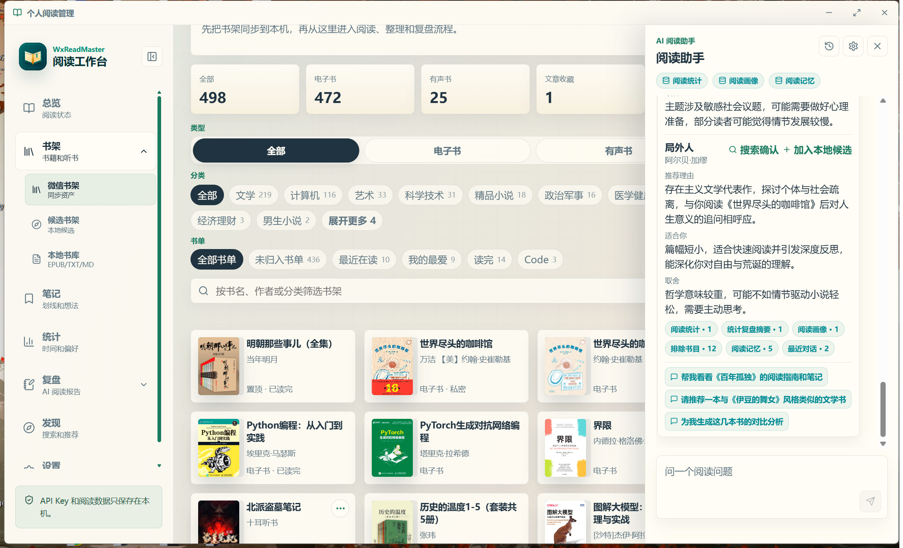

# WeReadMaster v1.0.11 微信公众号更新文章

> 推荐标题：WeReadMaster v1.0.11：让 AI 真正进入你的阅读上下文
>
> 备用标题 1：新版 WeReadMaster：AI 阅读助手上线，读书复盘不再从零开始
>
> 备用标题 2：微信读书笔记太散？新版 AI 阅读助手帮你围绕上下文提问和复盘
>
> 摘要：WeReadMaster v1.0.11 已发布。这次更新重点不是再做一个聊天窗口，而是让 AI 围绕你的书架、当前书、单本笔记、统计和候选书架工作，帮助你更自然地完成提问、复盘和选书。

上次介绍 WeReadMaster 时，我更多讲的是它“是什么”：一个把微信读书的书架、笔记、统计和复盘沉淀到本地的阅读工作台。

这次 v1.0.11，我想单独讲一个变化：**AI 阅读助手上线了**。

不过它不是为了再做一个通用聊天窗口。

我一直觉得，阅读场景里的 AI 如果只是“你问一句，它答一段”，价值其实有限。真正麻烦的地方不是没有回答，而是回答没有上下文：它不知道你现在读到哪里，不知道你划过哪些线，也不知道你下一本书到底想解决什么问题。

所以新版里，我更关注一件事：让 AI 尽量围绕真实阅读上下文工作。

## 不是开放聊天，而是阅读助手

v1.0.11 新增了右下角 AI 阅读助手入口。

它会跟随你当前所在的阅读场景工作：

1. **全局范围**：适合回看整体阅读状态，比如最近读了什么、哪些主题出现得多。
2. **当前书范围**：适合围绕一本书提问、整理、复盘。
3. **单本笔记范围**：适合基于已有划线和想法追问。
4. **统计范围**：适合解释阅读节奏、分类偏好和长期投入方向。
5. **候选书架范围**：适合讨论下一本书怎么选、某个主题应该如何延展。

你也可以手动开关上下文。也就是说，AI 不会默认把所有内容都拿去处理，而是在你明确触发时，基于你选择的范围工作。

新版还补齐了几个聊天细节：普通问答和新书推荐支持流式输出，可以取消生成；模型状态放在输入框里，不再占用聊天主区域；最后一条用户消息可以编辑后重新生成；历史页也支持搜索、场景筛选和只看当前对象。

这比“接一个 AI 聊天框”更克制，也更符合阅读管理的需求。

## 读到一半，也可以问下一步

很多时候，一本书最难的不是读完，而是读到一半时不知道怎么继续。

这时你可以在当前书范围里问：

- 这本书目前我应该重点看哪部分？
- 根据已有划线，哪些问题值得继续追？
- 如果我要写一篇读书笔记，可以先整理哪些主题？
- 这本书适合读完再复盘，还是边读边整理？

AI 阅读助手不会替你读书，它更像一个整理者：把你已经留下的线索重新组织起来，帮你看清下一步。

## 复盘前，不必每次从零开始

很多人都有划线，但真正复盘时还是会卡住。

卡住的原因通常不是材料太少，而是材料太散：摘录在一处，想法在一处，阅读进度在一处，最后还要自己重新归类。

新版里，你可以围绕当前书直接提问：

- 帮我从这些划线里整理三个核心问题。
- 哪些摘录最适合作为文章开头？
- 这本书有哪些可以落地的行动项？
- 如果我要继续研究这个主题，下一步该读什么？

对我来说，AI 在这里不应该变成“自动生成一篇读后感”的机器，而应该成为复盘前的结构化工具。它帮你把材料摆开，但判断仍然属于你。

## AI 推荐新书后，先确认书源

这次还有一个很实用的变化：AI 推荐的新书，可以先进入本地候选书架，也可以通过微信读书搜索确认书源后再保存。

为什么要多这一步？

因为 AI 推荐书时，书名、作者、版本有时并不稳定。如果直接入库，候选书架很快就会变成一堆来源不明的条目。

现在候选书会区分来源：

- 微信读书已确认。
- AI 推荐未确认。
- 手动加入的轻管理候选。

这样做的好处是，你可以先保留灵感，但不会把灵感误当成已经确认过的阅读资产。

## 书籍详情页也多了外部线索

v1.0.11 还在书籍详情里补充了热门划线、公开书评和划线下读后感。

这些内容不是为了替代自己的判断，而是帮你补充外部视角：

- 阅读前，可以看这本书是否符合当前主题。
- 阅读中，可以比较别人关注的段落和自己是否一致。
- 复盘时，可以避免只困在自己的笔记里。

我更愿意把它看作“阅读判断的辅助线索”，而不是评分系统。

## 仍然是本地优先

这次加了 AI，但 WeReadMaster 的边界没有变。

微信读书数据仍然通过官方 Skills HTTP 接口读取，用户自己扫码获取 API Key；AI Provider 也由用户自己配置。应用不托管账号，不抓 Cookie，不在后台自动上传笔记，也不做 AI 中转。

AI 调用由用户手动触发，阅读记录、AI 输出、导出文件和本地状态仍然优先留在本机。

这点对我很重要。笔记和复盘都是很个人的东西，默认就应该先属于用户自己。

## 适合怎么用

如果你已经在用 WeReadMaster，可以试试这个节奏：

1. 先同步书架、笔记和统计。
2. 打开一本正在读或刚读完的书。
3. 用当前书上下文问几个具体问题。
4. 如果是在统计或笔记页，也可以直接围绕当前统计和笔记追问。
5. 把 AI 推荐的新书加入候选书架。
6. 对候选书再做微信读书搜索确认。
7. 最后把复盘内容导出到自己的知识库。

这个流程不追求一次性自动完成所有事，而是把阅读中的“下一步”变得更清楚。

## 下载地址

项目地址：

https://github.com/RHZHZ/wereadmaster

下载地址：

https://github.com/RHZHZ/wereadmaster/releases

如果你也在用微信读书，并且希望把书架、笔记、统计和复盘沉淀到自己手里，可以试试 v1.0.11。

这次的重点不是“AI 更会聊天了”，而是：它终于能围绕你的阅读现场工作了。
